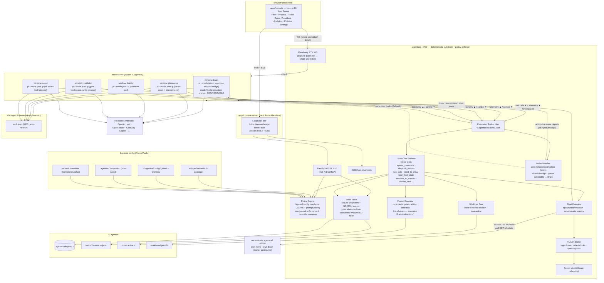
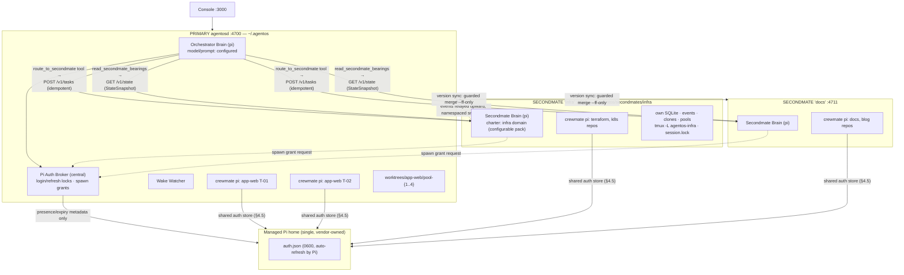

# Agent OS — Fused Master Plan

> **Provenance:** FUSED MASTER PLAN produced by the FUSION agent from two independent plans:
> **[A]** = PLAN A (`plan-a-fable.md`, architect: Claude Fable 5, thinking high) · **[B]** = PLAN B (`plan-b-sol.md`, architect: GPT-5.6 Sol, medium).
> **[CONSENSUS]** marks positions both plans reached independently. **[R2]** marks the Pi single-harness revision; **[R3]** marks the LLM-Brain + full-configurability revision; **[R4]** marks the Captain's decisions revision; **[R5]**/**[R5.1]** mark the live quota & balance metering revision and its detection-driven amendment; **[R6]** marks the guided onboarding wizard + Claude Agent SDK subscription-billing revision; **[R7]** marks live pipeline visibility + auto-balancer roadmap; **[R8]** marks the configurable per-model harness (reverses Pi-only) + external-review remediation (all Captain's directives). Divergences are resolved inline with attribution and a one-to-two-sentence rationale; materially contested losers are preserved as "Rejected alternative" notes. A mandatory **Consensus & Divergence** ledger closes the document.
> **Status:** Revision 8 — configurable per-model harness (R8) + R7 roadmap, 2026-07-26.

---

## Table of Contents

1. [Product Definition](#1-product-definition)
2. [System Architecture](#2-system-architecture)
3. [Monorepo Layout](#3-monorepo-layout)
4. [Provider Connection Subsystem](#4-provider-connection-subsystem)
5. [Fleet Orchestration Subsystem](#5-fleet-orchestration-subsystem)
6. [Fusion Engine](#6-fusion-engine)
7. [Console UI Spec](#7-console-ui-spec)
8. [API Surface](#8-api-surface)
9. [On-Disk Data & State Model](#9-on-disk-data--state-model)
10. [Security Model](#10-security-model)
11. [Phased Delivery Roadmap](#11-phased-delivery-roadmap)
12. [Testing Strategy](#12-testing-strategy)
13. [Risks, Open Questions, Assumptions](#13-risks-open-questions-assumptions)
14. [Consensus & Divergence](#14-consensus--divergence)

---

## 1. Product Definition

### 1.1 What Agent OS becomes

**[CONSENSUS]** Agent OS is a **single-user, local-first agentic orchestration product**. The user connects existing AI subscriptions (ChatGPT Plus/Pro, Claude Pro/Max, xAI Grok/X Premium+, GitHub Copilot) and API keys (OpenRouter, Vercel AI Gateway, xAI, Kimi, …) as **provider connections**, registers local git projects, and talks to one **Orchestrator**. The Orchestrator dispatches clean-room crewmate agents into pooled git worktrees inside visible tmux sessions, supervises them with an event-driven zero-token-classification watcher, and applies fusion-harness rigor at every lifecycle stage: multi-family independent planning fused with attribution, an acceptance gate written by an independent VALIDATOR *before* the build and proven RED at baseline, and a builder that is never graded by its own model family. Deliverables are PRs, local branches, and scout reports — with evidence artifacts, never model prose alone. **[CONSENSUS]**

**[R3] The Orchestrator Brain (Captain's directive #1):** the Orchestrator **is an LLM agent** — one long-lived Pi process (the "first mate" Brain, model fully user-configurable) that makes **all judgment calls** through a typed tool surface exposed by the daemon: intake and task shaping, dispatch (which provider/model/thinking for every role, guided by user-editable natural-language dispatch profiles), wake handling, escalation, fusion instructions, secondmate routing, and captain communication. This merges Rev-1/Rev-2's separate "Liaison Agent" and "deterministic LLM-free Orchestrator Core" into Firstmate's actual shape — one mind, many hands — and **dissolves Rev-1 divergence D11** (ledger, §14). The daemon (`agentosd`) demotes to a **deterministic execution substrate + policy enforcer**: it spawns, records, validates, and enforces; it decides nothing. *Deterministic substrate, LLM decisions.*

**[R3] Configurable-first (Captain's directive #2):** every behavior this plan previously fixed is a **policy with a shipped default** — Brain model and system prompt, fusion casts and profiles, every prompt template, dispatch rules, supervision cadences, validation budgets, pool sizes, modes, budgets, console layout. Configuration is layered (shipped defaults → global → per-project → per-task), human-editable on disk, fully editable in the Console, and zod-validated. Fusion-harness's principle is adopted verbatim: **tune the harness by editing files, not code.** Safety invariants are also policy — defaulting ON, changeable only by the Captain, enforced *mechanically* by the substrate, with every weakening override evidence-stamped into run artifacts. See §2.6.

**[R2 → R8] Harness model:** every agent seat — the Brain, planners, builder, validator, fusion, scout, secondmate workers — runs through a **worker harness**. **[R2]** established Pi (`@earendil-works/pi-coding-agent`, badlogic/pi-mono) as that harness: one auth store (`~/.pi/agent/auth.json`, 0600, auto-refresh), 15+ API-key providers plus custom providers, and a full **extension API** (lifecycle hooks, streaming events, tool interception, message injection) as the live channel. **[R8] supersedes exclusivity:** Pi remains the **default** and the **capability baseline**; the Captain chooses harness per model (Claude Code, Codex CLI, Kimi CLI, OpenCode, or Pi) via Phase 12 adapters that **declare** what they cannot do. Until Phase 12 ships, every seat is still Pi. See §11 Phase 12 and §14 R8; the historical R2 rejection of vendor CLIs is §13.4.

**One-line pitch [A, revised R3; harness wording R8]:** *Firstmate's LLM first mate + fusion-harness's cross-family rigor + all your subscriptions through a configurable harness (Pi by default) — every knob yours, behind one localhost console.*

The system consists of five pieces **[CONSENSUS on the shape; roles revised R3]**:

1. **`agentosd`** — the execution substrate: process spawning, tmux, worktrees, the Pi auth broker, SQLite projection, append-only events, the extension socket hub, the **policy engine** (config resolution + mechanical enforcement), and the **tool surface** the Brain calls. It validates every state transition and enforces every configured invariant; it makes no judgment calls. **[R3 demotion of Rev-2's "Orchestrator Core".]**
2. **The Orchestrator Brain** — a long-lived Pi process making all decisions via the tool surface; also the Captain's single conversation partner (the ⌘K chat). **[R3]**
3. **`apps/console`** — a Next.js 16 App Router localhost operations console. **[CONSENSUS]**
4. **`agentos`** — a thin CLI for setup, doctor, daemon lifecycle, task dispatch, config editing, `/afk`, `/ahoy`, `/bearings`, `/stow`, and self-update. [B]
5. **The `agent-os` Pi extension** **[R2]** — injected into every spawned Pi (`-e`): streams lifecycle telemetry to `agentosd` over per-session Unix sockets, receives control injections, registers tools (the Brain's tool surface bridge; crewmates' `report_status`/`ask_captain`), and enforces role tool policies by blocking forbidden `tool_call`s.

Plus **`~/.agentos/`** — the durable home: SQLite projection, event logs, run artifacts, the managed Pi home, worktree pools, session sockets, and the **layered config tree** (§9). API-key secrets live in the OS credential store; subscription OAuth lives in Pi's vendor-owned auth store, treated as opaque. **[CONSENSUS + R2]**

### 1.2 What Agent OS is NOT

**[CONSENSUS]** — retained in full:

- **Not a SaaS.** Loopback-only, one OS user, no multi-tenancy; a future hosted variant would be API-key/OIDC connections only.
- **Not a token extractor.** Subscription credentials live in Pi's auth store and are consumed only by Pi processes for inference; Agent OS makes no model API calls of its own and never parses secrets out of `auth.json` — with the single bounded [R5] exception of the quota-probe module's read-only usage/balance GETs against a code-baked endpoint allowlist (§4.9, §10.2 #1). **[R2 + R5]**
- **Not a chat app.** Chat exists only as the Brain's captain-facing surface. [A]
- **No** Kubernetes, containers-per-worker, remote runners, plugin marketplace, autonomous merge by default, or hidden chain-of-thought normalization. [B]
- **macOS 14+ only in v1** (tmux 3.3+). **[R4 — Captain's decision]** Linux joins Windows on the post-v1 backlog (§11); the no-Windows position was **[CONSENSUS]**, the Linux descope is [R4].
- **[R3] Not a rule engine.** Agent OS does not pretend deterministic heuristics can orchestrate: judgment lives in the Brain; determinism lives exactly where it earns its keep — state recording, policy enforcement, gates, and secrets.

### 1.3 Personas

| Persona | Profile | Primary loops |
|---|---|---|
| **The Captain** (primary) | Senior IC / solo founder, 2–5 active repos, ChatGPT + Claude + SuperGrok subs, OpenRouter/Gateway keys. Wants to dispatch overnight work and wake to reviewed PRs. | Dispatch SHIP, review fusion runs, `/afk`, merge PRs [A] |
| **The Skeptic** | Burned by single-model agents hallucinating "done"; adopts Agent OS for cross-family auto-validate. | SCOUT reports, gate inspection, consensus/divergence review [A] |
| **The Fleet Operator** | 5–15 repos across domains; needs secondmates. | Fleet dashboard, dispatch profiles, secondmate provisioning [A] |
| **The Researcher** | Asks multiple families, compares disagreement, read-only findings. | SCOUT, `/opinion`, plan fusion, divergence artifacts [B] |
| **The Tinkerer** **[R3]** | Wants the harness to fit their hand: custom prompts, casts, cadences, Brain personality. | Policies page, prompt-pack editing, per-project overrides |

No "team lead / enterprise admin" persona in v1. [A]

### 1.4 Definition of v1

v1 is shipped when all of the following are true (each restated as an executable gate in §11) **[CONSENSUS on substance; items 2 and 8 revised R3]**:

1. All Pi-managed provider connections (subscription OAuth via `/login` and API-key) connect, health-check, and meter usage from the Console — with **Anthropic extra-usage per-token billing surfaced honestly** (§4.4).
2. A SHIP task dispatched from Console or CLI runs a Pi worker in a pooled worktree inside tmux, is monitored with **zero LLM tokens spent on wake classification** (benign wakes absorbed in code; only actionable wakes reach the Brain), and lands a PR, a pipeline-validated PR, or a local branch.
3. A SCOUT task returns a structured report and **provably writes nothing** — extension `tool_call` write-block + git audit.
4. `/opinion`, `/fusion`, and `/auto-validate` work as Brain commands and lifecycle stages, with the cross-family invariant enforced mechanically by the substrate as configured policy, expressed as Pi `provider/model` strings.
5. Plan-fusion with ≥2 families produces a fused plan with `[A]`/`[B]` attribution and a Consensus & Divergence section, visible in the Console with live extension-fed columns.
6. `kill -9 agentosd` mid-task; on restart the fleet reconciles — Pi sessions re-adopted, orphans classified, no task silently vanishes, no duplicate workers. A **killed Brain** reconciles the same way: a fresh Brain session reads `read_fleet_state` and resumes command without losing any task. **[R3]**
7. Zero TypeScript `any`; zero deprecated dependencies; both CI-gated.
8. **[R3]** Every configurable surface in §2.6 is editable via file *and* Console, layered overrides resolve correctly (project beats global, task beats project), invalid config is rejected with a typed error, and any weakened safety policy is evidence-stamped and visibly badged.

**Secondmates are v1.x (Phase 7), not v1.0.** [A]

### 1.5 The marketing site's fate — DECIDED

**[A] chosen over [B].** Preserved **verbatim as `apps/marketing`**, a separate Next.js app sharing `packages/ui`; deploys publicly; never imports orchestrator code. *Rationale:* a localhost-only console must never share a deployable with a public site. *Adopted from [B]:* the honesty pass. *Rejected alternative [B]:* `/site` fold-in with redirects.

**[R5→R6.2→R6.3] Design-system mandate (Captain's directives, current form):** **[R6.3]** the UI's single source of truth for the **product app** is the Captain's Figma file — *"AgentOS — AI Agent Orchestration Dashboard"* (`Ria7UpyEPRd9jNlF9B6xgF`); every product screen must **exactly replicate** its corresponding Figma frame (§7). `packages/ui` remains the shared token/component home, now sourced from **both** origins: the marketing site's promoted components (`SiteHeader`/nav, `GlassCard`, `MagneticButton`, motion primitives — marketing keeps rendering identically; that parity gate stands) **and** the Figma file's tokens/components (dark charcoal surfaces, slim icon rail, top bar, stat cards with delta chips, teal→green charts, status pills) for the product app. **Where the two conflict on product screens, Figma wins.** The R6.2 rule against bespoke lookalikes stands: components come from `packages/ui`, built once against the Figma spec. Ad-hoc styling in `apps/console` is a review defect.

---

## 2. System Architecture

### 2.1 Canonical decisions (contradictions resolved)

| Concern | Decision | Attribution & rationale |
|---|---|---|
| Platform | **macOS 14+ only (v1)** — launchd packaging; Linux and Windows on the post-v1 backlog (§11) | **[R4]** — Captain's decision; drops Rev-1–3's macOS+Linux scope. |
| Runtime | **Node.js 24 LTS**, strict TypeScript, ESM | [B]. |
| Daemon name / port | **`agentosd` on `127.0.0.1:4700`**; secondmates `:4710+n` | [A]. |
| Home dir | **`~/.agentos/`** (0700); secondmates under `~/.agentos/secondmates/<name>/` | [A]+[B]. |
| **Decision-making** | **The Orchestrator Brain — a long-lived Pi process** calling a typed daemon tool surface; the daemon is a deterministic **substrate + policy enforcer** that validates transitions and enforces configured policy but decides nothing | **[R3]** — supersedes Rev-1/2's "deterministic, LLM-free Orchestrator Core makes dispatch/supervision decisions" and dissolves D11. *Rejected alternative [A, Rev-1/2]:* rule-engine core + chat-only liaison — preserved in the ledger; its testability benefit survives because the substrate (which is what's unit-testable) remains deterministic. |
| **Configuration** | **Layered Policy Packs** (§2.6): shipped defaults → `~/.agentos/config/` → per-project `.agentos/` → per-task; **JSON5** files + prompt-template `.md` packs; zod-validated; Console-editable; hot-reload where safe | **[R3]** — JSON5 chosen over TOML: zod schemas map 1:1 onto JSON structures, deep nesting and arrays of rule objects (dispatch profiles, casts) are natural, comments/trailing commas keep it human-editable, and one parser serves daemon + console. TOML's array-of-tables syntax is hostile to exactly the nested rule shapes this system is made of. |
| Worker harness | **Default: Pi coding agent, pinned exact version**; headless via `pi --mode json -p`; live channel via the `agent-os` extension. **[R8] Phase 12:** Captain-selectable harness per model (Claude Code, Codex CLI, Kimi CLI, OpenCode, Pi) via `HarnessAdapter` + capability declaration; absent capabilities render as stated absence | **[R2]** default + baseline; **[R8]** choice supersedes Pi-only exclusivity (§13.4 historical rejection; Phase 12 reopens with declared degradation). |
| Model I/O | **Through the seat's configured harness** (default Pi until Phase 12); no raw AI SDK in the substrate | **[R2]** as-built; **[R8]** multi-harness route. |
| HTTP server | **Fastify 5.x**; PTY WebSocket via `ws` on the same HTTP server's upgrade path (loopback + exact-origin) | **[CONSENSUS]** + **[Phase 6 as-built]** |
| Semantic events transport | **SSE** (ULID ids, `Last-Event-ID` replay); **WebSocket only for the terminal attach channel** | [B]. |
| Daemon ⇄ worker channel | **Per-session Unix domain sockets**, NDJSON frames zod-validated **both ways** at runtime (`PROTOCOL_VERSION` `1.3.0`); the Brain's tool surface rides the same channel | **[R2]+[R3]+[Phase 13]**. |
| Console↔daemon auth | **Next Route Handlers as loopback BFF**; PTY via single-use **30 s** tickets (minted over REST; spent on WS upgrade) | [B]; TTL tightened as-built. |
| Schema/validation | **zod 4.x** in `packages/protocol` — REST, SSE, socket frames, tool surface, **config schemas** | **[CONSENSUS]**; tool + config schemas added [R3]. |
| State | **SQLite (WAL) via `better-sqlite3`** projection + **append-only NDJSON event logs** as truth | **[CONSENSUS]** |
| ORM/migrations | **drizzle-orm** [A] + forward-only checksummed SQL migrations with pre-migration backup [B] | Fused. |
| Session backend | **tmux (hard dependency)**, socket `-L agentos`; Pi processes (incl. the Brain) are children of tmux, **not** the daemon | **[CONSENSUS]** |
| Browser terminal attach | **Read-only WS** (`ws` on HTTP upgrade): mint `POST /v1/sessions/:id/attach-ticket`, redeem once on `WS /v1/pty?ticket=`; pane content polled via `tmux capture-pane` (send-on-change). **Not** node-pty; client keystrokes get an explicit read-only notice. Take-over = Captain runs the display-only attach command in their own terminal | **[Phase 6 fourth slice]** — deliberate trade vs node-pty / pipe-pane (no native addon, no write path) |
| Process spawning | **`execa` 9.x**, `shell: false`, allowlist-built env (§4.8) | [A]+[B]. |
| Secrets | **`@napi-rs/keyring` against the macOS Keychain only** for API keys + daemon token; Pi's auth store vendor-owned and opaque | [A]+[R2]; **[R4]** drops the libsodium encrypted-file fallback (a headless-Linux accommodation) to the post-v1 backlog with Linux itself. |
| Gate runtime | **`uv` (hard v1 dependency)** — gates run as `gate.py` via `uv run` with PEP 723 inline metadata; `gate.ts` per-project override | **[R4]** — flips Rev-1 D5 to [B] on new evidence (§6.4). |
| Quota & balance metering | **Live per-provider probes** (`quota-probes/` module) with three honesty tiers — `live` / `best-effort` / `estimate` — every metric carrying tier + source label + synced-at; narrow read-only exception to auth-store opacity (§4.9/§10) | **[R5]** — Captain's directive; prior art cclimits/openusage. |
| Claude subscription billing | **`claude-agent-sdk-pi` (pi.dev, exact-pinned, source-reviewed)** — MANDATORY for `subscription-sdk` billing; LLM calls via the official Claude Agent SDK, **tools still executed by Pi**; models as `claude-agent-sdk/*` (family: anthropic) | **[R6]** — Captain's mandate; the 2026-06-15 Agent SDK credit pool is the legitimate subscription path (§4.4). |
| Claude Code CLI | **Two roles, do not conflate.** **[R6]** On the Pi + `subscription-sdk` path it is the SDK's **auth substrate** only (one-time `npx @anthropic-ai/claude-code` login; tools still execute in Pi). **[R8] Phase 12** also offers Claude Code as an optional **worker harness** (Anthropic-family models only — valid pairs, not free combination). R6 auth-substrate use is unchanged by R8. | **[R6]** + **[R8]** |
| Logging | **pino** with redaction + regex token scrubbing | **[CONSENSUS]** |
| IDs | **ULID** | **[CONSENSUS]** |
| Monorepo tooling | **pnpm 10 workspaces + Turborepo 2.x** | [A]. |
| Terminal UI | Session Detail: monospace read-only pane surface (capture text); `@xterm/xterm` remains the planned surface for a future interactive attach if one ships | **[Phase 6 fourth slice as-built]**; xterm deferred with interactivity |
| Tests | Vitest + Playwright | **[CONSENSUS]** |

**Dependency policy [B, retained]:** exact pins (including Pi), zero-deprecated gates, audit-clean, strict TS flags, `no-explicit-any: error`. **Pi upgrade policy [R2]:** pinned + weekly canary CI with report; deliberate upgrades only.

### 2.2 Component architecture (mermaid)

Revised: the Brain replaces Liaison+Core; the daemon exposes a tool surface and a policy engine **[R3]**:



### 2.3 Cross-family auto-validate lifecycle (mermaid)

Skeleton retained ([A] cast/halt-cap + [B] gate protocol + [R2] Pi channels); the decision-maker is now the Brain, the substrate validates and executes **[R3]**:

```mermaid
sequenceDiagram
    autonumber
    actor U as Captain
    participant BR as Orchestrator Brain (pi, tool bridge)
    participant S as Substrate (agentosd: tool surface + policy engine)
    participant P1 as PLANNER A — pi -p anthropic/claude-fable-5
    participant P2 as PLANNER B — pi -p openai/gpt-5.6-sol (thinking high)
    participant V as VALIDATOR — pi -p anthropic/… (≠ builder family)
    participant G as Gate runner (deterministic, not Pi)
    participant B as BUILDER — pi -p (tmux crewmate)
    participant W as Wake Watcher (zero-token classifier)

    U->>BR: "Ship: <intent>"
    BR->>S: create_task(SHIP, mode, profile) [tool call, Idempotency-Key]
    S->>S: validate vs policy: builder.family ≠ validator.family,<br/>≥2 planner families (configured invariants) —<br/>violating cast → typed TOOL ERROR, never scheduled
    BR->>S: dispatch_fusion(plan-fusion, cast, fusion instruction)<br/>cast chosen BY THE BRAIN per dispatch profiles (editable)
    par independent clean-room spawns (substrate executes)
        S->>P1: pi --mode json -p … -e agent-os.ts
        S->>P2: same flags, family Y model
    end
    P1-->>S: planner-a.md (agent_settled)
    P2-->>S: planner-b.md (agent_settled)
    W-->>BR: wake digest: PLANNERS_SETTLED (actionable → Brain)
    BR->>S: dispatch_fusion(merge, fusion cast per profile —<br/>default: architect family, fable-5 high [R4];<br/>instruction from editable template)
    S-->>BR: fused-plan.md (hash frozen)
    BR->>S: author_gate(validator cast)  — gate BEFORE build
    V-->>S: gate script + gate-manifest.json (EXPECTED_RED named)
    BR->>S: run_gate(baseline)
    S->>G: execute at ao/baseline/<taskId>
    alt semantic RED (no GATE_ERROR)
        G-->>S: RED ✓ (gate hash recorded)
    else exit 0 or GATE_ERROR
        G-->>S: GATE DEFECT
        W-->>BR: wake: GATE_DEFECT → Brain decides (rewrite ≤2, then escalate)
    end
    BR->>S: spawn_crewmate(builder cast, leased worktree)
    Note over B,W: Watcher classifies wakes in code — zero tokens;<br/>benign absorbed per configured rules; actionable → Brain
    loop attempts ≤ maxValidations (configured, default 6)
        B-->>S: report_status(BUILD_COMPLETE) + agent_settled
        W-->>BR: wake digest: BUILD_COMPLETE
        BR->>S: run_gate(candidate)   — same gate hash, enforced by substrate
        alt GREEN
            G-->>S: PASS evidence
            BR->>S: deliver_task(mode tail)  — push/PR per configured mode
        else FAIL
            G-->>S: verbatim FAIL lines
            BR->>S: send_to_crew(builder, verbatim FAIL lines)<br/>(verbatim-ness enforced: substrate injects gate output,<br/>Brain cannot paraphrase it away — policy)
        end
        opt attempt == triageAt (configured, default 3)
            BR->>S: send_to_crew(validator, TRIAGE request + evidence)
            V-->>S: GATE_DEFECT patch or BUILD_DEFECT verdict
            BR->>S: run_gate(baseline) — repaired gate MUST re-prove RED
        end
    end
    BR->>S: escalate_to_captain(halt ledger)   — at cap; +yolo cannot override (policy)
    S-->>U: NEEDS_CAPTAIN + attempt ledger · or PR/branch + artifacts
```

Invariants (all retained; enforcement locus clarified **[R3]**):

- Planner candidates never see each other before submitting. **[CONSENSUS]**
- Role sessions keyed `{projectId, role, provider/model}`; no cross-model transcript replay — structural via Pi session dirs. **[CONSENSUS + R2]**
- VALIDATOR repo-read-only; BUILDER one worktree, cannot touch gate artifacts, never runs the gate as authority — **only the substrate's gate run counts, and the gate never trusts any LLM, including the Brain**. **[CONSENSUS + R3]**
- Corrections are verbatim FAIL lines: the substrate injects gate output directly on `send_to_crew(gateFail)` — the Brain routes, it cannot rewrite. **[CONSENSUS, enforcement R3]**
- Baseline RED must be semantic; `GATE_ERROR` never counts as RED and **does not consume a validation attempt** (infrastructure failure proves nothing about the code — run result carries an explicit `infrastructureError` flag). Final PASS is only meaningful against a RED-proven **gate source hash**. [B]+[Phase 5]
- RED proof is keyed to the sha256 of the gate **source** (HMAC-signed, daemon memory + `gate.red_proven` log replay — never seat-writable disk alone). Editing the gate invalidates the proof; revisions must re-prove RED before a candidate run. **[Phase 5]**
- Turn ends are structural (`agent_settled`), never guessed. **[R2]**
- Halt at `maxValidations` → `VALIDATION_EXHAUSTED` from **BUILDING or VALIDATING** (a candidate can FAIL directly from BUILDING); `+yolo` does not override (policy default; weakening it is possible only by the Captain and is evidence-stamped). **[CONSENSUS + R3 + Phase 5]**
- **[R3]** Task/gate **state remains a typed state machine** recorded by the substrate: events are the source of truth, transitions are validated, illegal transitions are rejected as typed tool errors. The Brain chooses *which* legal transition to take; it cannot invent transitions.
- Cross-family builder≠validator is enforced at **`resolve_cast` and again at spawn** (family re-derived server-side from the model string); Captain overrides are evidence-stamped in `policyOverrides` and honoured at both sites. **[Phase 5]**

### 2.4 Fleet / secondmate topology (mermaid)

Unchanged from Rev 2 except each secondmate now runs its **own charter-configured Brain** **[R3]**:



Rules retained: full-daemon isolation per secondmate [A]; no credential copies — broker spawn grants [B]+[R2]; FF-only version sync **[CONSENSUS]**; structured `/bearings` [B]. **[R3]:** a secondmate's **charter** (domain, routing hints, capacity, Brain model, escalation posture) is a config pack under `~/.agentos/secondmates/<name>/config/`, editable like everything else.

### 2.5 Process tree / session layout (ASCII)

```
launchd (user scope)                                # macOS-only v1 [R4]
└── agentosd (node 24, :4700, AGENTOS_HOME=~/.agentos, daemon.lock)
    ├── fastify http listener (127.0.0.1:4700) — REST (+ /v1/config/*) + SSE
    ├── pty WS upgrade (/v1/pty; single-use tickets; capture-pane poll; read-only)
    ├── extension socket hub — ~/.agentos/sockets/<sessionId>.sock per spawn
    ├── policy engine — layered config resolution + mechanical enforcement
    ├── brain tool surface — typed tools, transition-validated, policy-checked
    ├── wake watcher (zero-token classify; absorb benign; queue actionable → Brain)
    ├── pi auth broker (login flows, refresh locks, auth.json mtime watch)
    └── [ephemeral] execa helpers: git, gh, tmux control, gate runners (shell: false)

tmux server (socket: -L agentos)                    # survives agentosd restarts
└── session: agentos
    ├── window 0  "ctl"                              – idle shell, human attach point
    ├── window 1  "brain"
    │     └── pi --mode json -e ~/.agentos/extension/agent-os.ts   (persistent)
    │            model/thinking/system prompt ← config/brain.json5 + prompts/brain/*.md
    │            ext registers TOOL BRIDGE: create_task, spawn_crewmate, dispatch_fusion,
    │            run_gate, send_to_crew, read_fleet_state, escalate_to_captain, …
    │            env: AGENTOS_SOCKET=…/sockets/brain.sock, AGENTOS_ROLE=brain
    ├── window 2  "T-01K3 app-web planner-a"
    │     └── pi --mode json -p @role-prompt.md      # rendered from editable template
    │            --model anthropic/claude-fable-5 --thinking high   # cast: Brain-chosen
    │            --no-skills --no-extensions --no-context-files
    │            -e ~/.agentos/extension/agent-os.ts   # telemetry-only, allowed
    │            cwd: ~/.agentos/worktrees/app-web/pool-2
    │            pipe-pane → ~/.agentos/tasks/T-01K3/terminal.log   (fallback)
    ├── window 3  "T-01K3 app-web validator"   (gate workspace; writes tool-blocked)
    ├── window 4  "T-01K3 app-web builder"
    └── window 5  "T-01K6 api scout"           (ALL write tools blocked)

tmux server (socket: -L agentos-infra)              # secondmate 'infra'
└── session: agentos — window "brain" + windows per crewmate pi ...
agentosd (:4710, AGENTOS_HOME=~/.agentos/secondmates/infra)
```

**Key invariants:** Pi processes (including the Brain) are children of **tmux**, not `agentosd` — daemon crashes don't kill the fleet or the Brain; reconciliation re-adopts both (§5.8). **[CONSENSUS + R3]** Children are clean-room except the telemetry extension. **[R2]**

### 2.6 Policy Packs — the configuration system **[R3]**

**Principle (adopted verbatim from fusion-harness): tune the harness by editing files, not code.**

**Layering** (highest wins):

1. **Shipped defaults** — inside the package, versioned, never edited in place.
2. **Global** — `~/.agentos/config/*.json5` + `~/.agentos/config/prompts/**/*.md`.
3. **Per-project** — `.agentos/` in the repo (config + prompt overrides). **Trust-gated:** repos are untrusted (§10); project overrides take effect only after the Captain acknowledges them (content-hash acknowledgment; changed files re-prompt). A project override may never *weaken* a safety policy below the global setting — weakening is global/task-scope only, Captain-authenticated.
4. **Per-task** — overrides supplied at dispatch from Console/CLI/Brain chat (persisted into `task.json`).

**Format:** JSON5 for structured config (rationale in §2.1); Markdown with `{{VAR}}` interpolation for prompt templates. All schemas live in `packages/protocol/src/config.ts` (zod); the daemon validates on load and on every `/v1/config` write; invalid config is rejected with a typed, path-precise error — never silently ignored. **Hot-reload where safe** (supervision cadences, budgets, dispatch rules, prompt templates, console prefs — applied at next use); **restart-required** flagged per key (port, home, tmux socket); **config-locked** (§below) requires file edit + restart by design.

**The configurable surfaces** (each ships a default; every one editable via file and Console):

| # | Surface | File (global layer) | Shipped default | Hot-reload |
|---|---|---|---|---|
| 1 | Brain: model, thinking, system prompt, personality, fallback preference order, handoff target + threshold | `brain.json5` + `prompts/brain/system.md` | **[R4]** best Anthropic model on the Claude Pro/Max OAuth connection, auto-detected from Pi (§5.11); thinking high; handoff at 80% of the applicable Claude window/budget | next Brain session (handoff: immediate, recorded) |
| 2 | Fusion casts & profiles: planner count/families, per-role model+thinking, fusion instruction text | `fusion/profiles/*.json5` + `prompts/fusion/*.md` | **[R4]** `default-cross-family`: planners `anthropic/claude-fable-5`@high + `openai/gpt-5.6-sol`@high; fusion on the architect family (`fable-5`@high, disclosed) (§6.2) | next run |
| 3 | **All prompt templates** ({{VAR}}): role prompts, plan/fusion/opinion instructions, gate-authoring brief, triage brief, nudges, escalation reports | `prompts/**/*.md` | shipped pack, version-stamped | next render |
| 4 | Dispatch profiles: ordered natural-language rules (Firstmate `crew-dispatch.json` style) | `dispatch.json5` | sensible cross-family defaults | yes |
| 5 | Supervision: heartbeat, per-role stale thresholds, escalation ladder steps, respawn cap, **watcher absorb rules** (which wake classes are benign) | `supervision.json5` | 30 s / 5 m API / 12 m build / 3-step ladder / respawn 1 / absorb {PROGRESS, TURN_SETTLED-mid-stage, CONTEXT<70%} | yes |
| 6 | Validation loop: `maxValidations`, `triageAt`, gate language/runner (`validation.gateLanguage`) | `validation.json5` | **[R4]** 6 / 3 / `gate.py` via `uv run` (PEP 723); `gate.ts` per-project override | next task |
| 7 | Worktrees: pool size, reclaim policy (verified-reset vs quarantine-always), network policy | `worktrees.json5` | 4 / verified-reset / fetch-allowed | next lease |
| 8 | Project modes & `+yolo` scope | `projects.json5` + per-project | `pipeline`; yolo boundaries per §5.2 | next task |
| 9 | Budgets & ceilings: per-connection soft/hard USD, per-task ceiling, Claude extra-usage daily cap, Brain token budget | `budgets.json5` | Gateway $25 hard; Claude extra-usage $10/day; task $5; Brain 200k tok/day (open Q) | yes |
| 10 | Console layout preferences: default page, column density, wake-queue visibility | `console.json5` | as wireframed | yes |
| 11 | Secondmate charters: domain, capacity, Brain model, routing acceptance | under secondmate home: `secondmates/<name>/config/charter.json5` (not primary global config) | none (created on provision) | on sync (live Brain model when running) |
| 12 | **Safety policies (default ON, Captain-only changes, mechanically enforced, overrides evidence-stamped):** cross-family builder≠validator; distinct planner families; RED-baseline gate requirement; scout read-only; verbatim-FAIL delivery; halt-cap-not-overridable-by-yolo; destructive-git denial | `policies.json5` | all ON | policy version bump; applies next task |
| 13 | **Config-locked (not configurable in v1):** loopback-only bind; secret redaction; **quota-probe endpoint URLs [R5]** (exfiltration vector if configurable) | — | always on | — |
| 14 | **[R5]** Quota probes: polling cadence, per-provider enable, best-effort feature flags (e.g. Grok consumer endpoint), threshold levels for `quota.threshold`, courtesy limits (min interval, jitter, back-off) | `quota.json5` | 5 min + on-demand + post-task; **probes auto-enabled per detected Pi connections at onboarding [R5.1]** (Grok best-effort ON when a Grok credential is detected); thresholds 80/95% + low-balance | yes |

**Configurable ≠ unenforced (the critical nuance):** whatever is configured is enforced **mechanically by the substrate** — the Brain cannot bypass configured policy, silently or otherwise; only the Captain can change policy (Console auth or config file on disk, which only the OS user can write). Any run executed under a weakened safety policy carries `policyOverrides[]` in `summary.json` (what, when, by which config layer) and the Console badges it. **Config-locked justification:** loopback-only and secret redaction protect the *machine and credentials themselves*, not workflow preferences — a workflow knob misconfigured wastes tokens; these two misconfigured expose the host. They are defensible as non-configurable and remain so in v1.

**Prompt-template upgrade story** (risk R19): every shipped template carries a version header; user-customized templates are detected by hash; on upgrade, the daemon never overwrites customizations — it installs the new default alongside and serves three-way diff data via `GET /v1/prompts/diff` (`shippedAtInstall` = hash of the bytes the copy was installed from — original text is not retained; `shippedNow` / `yours` = full text). The Policies page renders that data (Phase 6 UI); the Captain merges or keeps. `agentos config doctor` lists drifted templates.

---

## 3. Monorepo Layout

pnpm workspaces + Turborepo (§2.1). Marketing lives at `apps/marketing` (verbatim migration from the former root `src/`); shared design-system primitives live in `packages/ui`. [A]

**Phase 6 as-built** (Console completion — fifth slice closes the §11 remainder except open soak/wizard/fidelity items below). **First slice:** `GET /v1/analytics` derives usage/cost/throughput from the append-only event log (no second accounting store); Fleet Dashboard + Analytics bind to that snapshot with honesty rules (underivable → null/`—` with reason; cost coverage distinguishes absent vs zero); Notifications is live on the wake queue (including ABSORBED); Task Detail ships fusion side-by-side (`promptsIdentical` + shared hash), validation evidence (FAIL vs GATE_ERROR), and a Brain decision lane; shared empty/error/`not-found` treatments. **Second slice:** Session Detail at `/sessions/[id]` (Figma Agent Detail `41:2` + Agent Logs `41:456`) — seat spawn facts, live status, measured usage, worktree, every extension-reported frame, and a **display-only** attach command (copy affordance; daemon never attaches on the Captain's behalf); Task Detail session cards link through; Run History at `/runs/history` (Pipeline Runs `41:5136` + Workflow Run History `41:7213`) reconstructs each task's gate/fusion journey from the durable log with FAIL and GATE_ERROR counted separately; event-store projects an indexed `session_id` column (mirroring `task_id`) with session-scoped queries whose `truncated` flag is **session-scoped only**; REST `GET /v1/sessions/:id`, `GET /v1/sessions/:id/events`, `GET /v1/runs/history`. **Third slice:** Providers quota cards complete §7.3 card anatomy (primary metric + sub-rows for session windows / model caps / extra-usage / credit splits, each with bar, `RESETS IN` from `resetsAt`, and a per-metric honesty badge when the tier differs); percent metrics render "N% used" with "N% left" so bar and numeral never disagree about direction; currency amounts are verbatim as the vendor reported them (no FX, §13.1 R21). Recent Alerts at `/alerts` (Figma `41:5674`) — actionable frames only (`quota.threshold`, Captain escalations, billing mismatches, SCOUT write violations, brain-down, session loss, rejected config); backed by type-filtered `GET /v1/events/replay?types=` (matching-frames-only newest-first so sparse alert types never misread a mixed window as empty). Model Performance at `/analytics/models` (Figma `41:4355`) — measured provider telemetry only (requests, tokens, avg output, cost where reported); **not** a quality leaderboard. Settings Billing at `/settings/billing` (Figma `41:6309`) — per-connection billing surface, probe amounts, measured spend with `costCoverage` honesty, and Policies ▸ Budgets ceilings; **no** invoice, plan tiers, payment method, or upgrade path (this product has no billing relationship with the user). **Fourth slice:** ticketed **read-only** terminal attach on Session Detail — authenticated `POST /v1/sessions/:id/attach-ticket` mints a single-use 30 s ticket + loopback `wsUrl`; browser opens `WS /v1/pty?ticket=` **directly on the daemon** (BFF cannot proxy WS upgrades; the daemon bearer never enters a query string); upgrade enforces the same loopback-only + exact-origin rules as REST; stream polls `tmux capture-pane` and sends only on change; client writes receive an explicit read-only notice (take-over remains the human attach command beside the view). Schema: `attachTicketResponseSchema` in `packages/protocol`. Implementation: `apps/orchestrator/src/pty/{tickets,server}.ts`, Console `TerminalAttach`. **Fifth slice (remainder):** Network I/O Detail at `/network` + `/network/[id]` (Figma `41:4815`) — backed by real `net.request` frames for every outbound HTTP call the daemon originates (today, the quota probes); credentials redacted **at capture** to last-four (`Bearer ****xxxx`); unmeasured DNS/TCP/TLS/processing/transfer phases render `—` with reason (fetch does not expose them). Policies ◆ mark compares effective vs **shipped** (not "any layer mentions key"); safety toggles need typed confirmation + `x-agentos-confirm-safety` header (daemon 428 without it) and a **persistent** badge when weakened; three-way prompt diff renders install-hash / shipped-now / yours. Usage strip refreshes on `quota.updated` SSE (not only the 30 s poll); Providers four archetypes + `LIMIT REACHED` exclusion reason driven by explicit `$AGENTOS_HOME/fake-quota/<provider>.json` fixture seam (missing/unparseable → real probe). Executable browser gates `tooling/gates/phase-6.mjs` **G1–G14** (G3: Figma placeholders absent; G9: session detail; G10: in-app link reachability; G11: single-use PTY ticket; G12: real net call + redaction; G13: Policies; G14: quota UI). Phase 5 auto-validate substrate and Phase 4 fleet/fusion substrate remain. **Still deferred:** Task Detail embedded terminal + 10‑min no-drop-frame soak, provider wizard E2E, terminal reconnect seq continuity, Figma-fidelity side-by-side gate. Authoritative route inventory: §7–§8. Executable gates: `tooling/gates/phase-{1,2,2b,3,4,5,6,8}.mjs`. Console PR evidence: `docs/screenshots/` via `pnpm screenshots`; Phase 6e pack: `docs/qa/runs/phase-6e-console-2026-07-25/`.

```
agent-os/
├── package.json                      # workspace root, engines: node>=24; gates + screenshots scripts
├── pnpm-workspace.yaml
├── turbo.json
├── tsconfig.base.json                # strict + noUncheckedIndexedAccess + exactOptionalPropertyTypes
├── eslint.config.mjs                 # @typescript-eslint/no-explicit-any: error
├── .github/workflows/
│   ├── ci.yml                        # typecheck/lint/build/test + phase-1…6,8 gates
│   └── pi-canary.yml                 # weekly: harness contract suite vs latest Pi [R2]
├── docs/{plans,qa,screenshots}/
├── apps/
│   ├── marketing/                    # existing site, verbatim; deploys publicly [A]
│   ├── console/                      # [R6.3] Figma dark dashboard (icon rail + top bar)
│   │   ├── public/figma/             # exported Figma assets (icons via CSS masks)
│   │   └── src/
│   │       ├── app/
│   │       │   ├── layout.tsx
│   │       │   ├── page.tsx                    # redirect → /fleet [B]
│   │       │   ├── fleet/page.tsx              # Home Dashboard (live fleet + analytics-derived panels)
│   │       │   ├── runs/page.tsx               # Live Log Stream (SSE; fusion.* + prompt.installed)
│   │       │   ├── runs/history/page.tsx       # Pipeline Runs + Workflow Run History (gate/fusion)
│   │       │   ├── sessions/[id]/page.tsx      # Agent Detail + Agent Logs (one crewmate seat)
│   │       │   ├── policies/page.tsx           # effective config + source-layer chips
│   │       │   ├── settings/page.tsx
│   │       │   ├── settings/billing/page.tsx   # Settings · Billing (probe + spend honesty)
│   │       │   ├── providers/page.tsx          # quota card grid (§7.3 anatomy)
│   │       │   ├── tasks/page.tsx              # Inference Jobs board (`/v1/tasks` + SSE)
│   │       │   ├── tasks/[id]/page.tsx         # task detail (fusion columns, validation, Brain lane)
│   │       │   ├── projects/page.tsx           # project registry (`/v1/projects`)
│   │       │   ├── analytics/page.tsx          # Token Usage (`/v1/analytics`; honesty-bound)
│   │       │   ├── analytics/models/page.tsx   # Model Performance (telemetry only)
│   │       │   ├── network/page.tsx            # Network I/O list (net.request frames)
│   │       │   ├── network/[id]/page.tsx       # Network I/O Detail (Figma 41:4815)
│   │       │   ├── alerts/page.tsx             # Recent Alerts (actionable frames only)
│   │       │   ├── notifications/page.tsx      # wake queue incl. absorbed (zero-token proof)
│   │       │   ├── onboarding/page.tsx
│   │       │   ├── not-found.tsx · error.tsx   # shared empty/error treatments
│   │       │   └── api/agentos/[...path]/      # loopback BFF [B] — bearer never to browser
│   │       ├── components/{shell,fleet,runs,sessions,policies,settings,tasks,projects,providers,analytics,network,alerts,notifications,onboarding}/
│   │       └── lib/{daemon.ts, useEventStream.ts, useTaskEvents.ts, fetchTaskEvents.ts, fetchEventsReplay.ts, selectPrimaryQuotaMetric.ts, useDebouncedRefreshKey.ts}
│   └── orchestrator/                 # agentosd + agentos CLI (colocated)
│       ├── package.json              # bin: { agentos, agentosd }
│       ├── defaults/                 # [R3] shipped Policy Pack: *.json5 + prompts/**
│       ├── assets/launchd/           # macOS-only v1 [R4]
│       └── src/
│           ├── bin/{agentos,agentosd}.ts
│           ├── cli.ts · doctor.ts · daemon.ts · home.ts · version.ts
│           ├── config/               # resolver + service (layered Policy Packs)
│           ├── prompts/              # layered prompt packs + three-way diff + config doctor [Phase 4+8]
│           ├── analytics/            # [Phase 6+8] log-derived snapshot + reconcile/billing/brain breakdowns
│           ├── server/               # fastify: health, config, events SSE, fleet/tasks/projects/tools/fusion/prompts/analytics/attach-ticket/afk
│           ├── pty/                  # [Phase 6] single-use tickets + read-only capture-pane WS (/v1/pty)
│           ├── substrate/            # task-machine.ts, family.ts
│           ├── fleet/                # service, brain, brain-handoff, afk, tool-surface, fusion-runs,
│           │                         # sessions, worktree-pool, tmux, watcher, gate-runner, projects,
│           │                         # secondmates, secondmate-fleet [Phase 7]
│           ├── update/               # [Phase 8] signed self-update + rollback (public key baked into install)
│           ├── pi/                   # manager, auth-broker, cross-process-broker, connections, socket-hub
│           ├── onboarding/           # wizard state
│           ├── quota-probes/         # [R5] allowlist + adapters + scheduler (+ explicit fake-quota seam [Phase 8])
│           └── security/             # env-scrub, auth-store, secret-canary, …
├── packages/
│   ├── protocol/                     # zod: REST, SSE, config, tools, fleet, tasks, sockets, prompts, analytics
│   ├── event-store/                  # NDJSON writer + rebuildable SQLite projection [B]
│   ├── ui/                           # dual-source [R6.3]: promoted marketing components
│   │                                 #   (SiteHeader, GlassCard, MagneticButton, …) + Figma
│   │                                 #   product tokens in theme.css — Figma wins on product
│   ├── pi-extension/                 # telemetry + control + Brain tool bridge; clean-room crew surface [R2]+[R3]+[Phase 4]
│   ├── pi-ext-claude-agent-sdk/      # [R6.1] vendored claude-agent-sdk-pi fork
│   └── fusion-core/                  # pure fusion contract/templates/attribution (no I/O) [B]
├── scripts/
│   ├── verify-no-deprecated.mjs      # zero-deprecated dependency gate (CI)
│   └── verify-gate-cleanup.mjs       # gates must exit after try/finally (CI; prevents orphaned agentosd)
└── tooling/
    ├── gates/phase-{1,2,2b,3,4,5,6,7,8}.mjs # executable phase gates (2b: Phase 2 fixture completion; phase-6/8: Playwright + real daemon where noted; phase-7: secondmates)
    ├── evidence/capture-console.mjs    # full Console proof packs (docs/qa/runs/)
    └── screenshots/capture-console.mjs  # Playwright PR evidence (pnpm screenshots)
```

**[R3] change notes:** `core/` → `substrate/` (decision logic removed; state-machine validation remains); the Brain **tool surface** lives under `fleet/tool-surface.ts` (not a separate `substrate/tool-surface`); shipped defaults live in `apps/orchestrator/defaults/` and are installed to `~/.agentos/config/` templates on init. **Colocation note:** CLI lives under `apps/orchestrator` (`agentos` + `agentosd` bins), not a separate `apps/cli`; event persistence is `packages/event-store` (not an in-daemon `store/`); Brain reconcile + boot recovery live in `fleet/brain.ts` + `fleet/service.ts` (no separate `recovery/` package); Phase 4 ships `dispatch_fusion` executors for opinion / fusion / plan-fusion plus `fleet/fusion-runs.ts`, `fleet/sessions.ts`, and `prompts/service.ts`. **Phase 5** ships lifecycle auto-validate (`gate-runner` + tool-surface RED proofs / FAIL ledgers / seat fences; `tooling/gates/phase-5.mjs` G1–G9). **Phase 6 first slice** ships Console fusion side-by-side columns, auto-validate evidence UI, Fleet/Analytics log-derived panels, Notifications, and empty/error treatments; **second slice** ships Session Detail + Agent Logs, Run History, session-scoped event projection, and `tooling/gates/phase-6.mjs` G1–G9; **third slice** ships §7.3 quota card sub-rows, Recent Alerts, Model Performance, Settings Billing, type-filtered event replay, and G10 in-app link reachability; **fourth slice** ships ticketed read-only terminal attach on Session Detail (`POST …/attach-ticket` + `WS /v1/pty`, capture-pane poll, G11 single-use ticket proof); **fifth slice** ships Network I/O (`/network`, `net.request`, G12), Policies ◆/safety/prompt-diff (G13), and quota archetypes + SSE usage strip (G14; `$AGENTOS_HOME/fake-quota/<provider>.json`). **Phase 8** ships `/afk` FAQ-only auto-answer + `agentos stow`, analytics reconcile ±0 (billing-surface + Brain-token breakdowns), Brain budget handoff (`brain.handoff_triggered` / `brain.handoff_completed`, new session per model), `agentos config doctor`, signed `SelfUpdater` with rollback, soak/canary/fresh-machine/WCAG gates (`tooling/gates/phase-8.mjs` G1–G9), and the Console proof pack under `docs/qa/runs/console-proof-2026-07-25/`. Task Detail embedded terminal / 10‑min soak, provider wizard E2E, and Figma-fidelity side-by-sides stay deferred.
---

## 4. Provider Connection Subsystem

### 4.1 Core model — one harness, two connection kinds **[R2]**

Pi is the only process that talks to model providers; every connected provider/model can serve **any** role. Connections describe *how Pi authenticates*:

- **`pi-oauth`** — subscription auth via Pi `/login`, stored in Pi's auth store (0600, auto-refresh; **auth.json takes priority over env vars**). Supported: **ChatGPT Plus/Pro** (Codex; "Codex for OSS" endorsed), **Claude Pro/Max** (⚠ extra-usage billing, §4.4), **xAI (Grok/X)**, **GitHub Copilot**, **OpenRouter OAuth** (non-expiring key billed from credits), Radius.
- **`pi-api-key`** — 15+ providers (Anthropic, OpenAI, xAI, OpenRouter, Vercel AI Gateway, Google, Groq, Cerebras, Mistral, DeepSeek, Kimi For Coding, MiniMax, Bedrock, Azure, …); custom providers via `models.json` or `pi.registerProvider`.

| Connection | Kind | Billing surface | Families |
|---|---|---|---|
| ChatGPT Plus/Pro | pi-oauth | plan quota | openai |
| Claude Pro/Max | pi-oauth | **extra usage — per-token** ⚠ | anthropic |
| xAI (SuperGrok / X Premium+) | pi-oauth | plan quota | xai |
| GitHub Copilot | pi-oauth | plan quota | multi (per catalog) |
| OpenRouter (OAuth) | pi-oauth | OpenRouter credits | many |
| OpenRouter / Gateway / vendor keys | pi-api-key | per-token | many |

**Family registry rule [B]:** the aggregator is not a family — `openrouter/moonshotai/kimi-k3` is `moonshot`; `anthropic/claude-fable-5` via Gateway is `anthropic`.

### 4.2 API-key custody — DECIDED **[R2]**

**Keychain custody + env injection at spawn.** *Rejected alternative:* writing keys into `auth.json` — duplicates secret storage outside the keychain/redaction perimeter, makes Agent OS a writer of the vendor-owned store, and invites refresh races. **Precedence hazard:** auth.json beats env vars, so an OAuth entry silently overrides an injected key for the same provider — modeled as `effectiveCredentialPath` on the connection, surfaced in the UI, and **observed** at runtime: `before_provider_request` telemetry mismatching the cast raises a `BILLING_MISMATCH` wake.

### 4.3 The auth store is vendor-owned and opaque **[R2]**

Connection setup = the daemon opens a **visible interactive `pi` in a tmux window** and drives/observes `/login <provider>` (Console embeds it read-only; "take over" for the browser/device-code step). Agent OS never parses secrets from `auth.json` — presence/expiry metadata and mtime/hash only (`provider.credential_refreshed` on change, contents never logged). `/logout` is the disconnect flow. Setup terminals are live-only, never recorded. **[CONSENSUS + R2]**

**[R5] One deliberate, narrow exception:** the quota-probe module (§4.9) may **read** stored OAuth bearer tokens for **read-only usage/balance GET endpoints only** — the full boundary is specified in §4.9 and §10.2 #1.

### 4.4 The Anthropic extra-usage caveat **[R2]**

**[R6] Dated timeline (verified 2026-07; pi issue #3372 + pi-claude-code-auth README):** **2026-01-09** — Anthropic began blocking third-party OAuth against Max plans. **2026-04-04** — subscription coverage cut for third-party harnesses: Pi's native Claude OAuth bills per-token from claude.ai **"extra usage", never plan limits** (this confirms and dates the caveat below). **2026-06-15** — subscription Agent SDK / `claude -p` usage moved to a **separate monthly credit pool attached to the subscription** — the legitimate subscription-billing path, which Agent OS supports via the mandatory `claude-agent-sdk-pi` extension (§4.10 Step 2a).

So a Claude connection has **three billing modes** (`billingMode` on the connection, §4.6): **`subscription-sdk`** (Agent SDK monthly credit pool — requires the SDK extension, wizard-enforced), **`extra-usage-oauth`** (Pi native `/login`; per-token extra usage), **`api-key`**. For extra-usage mode, everything below stands: provider card labeled **"extra usage — per-token billing"**; usage records carry non-null `costUsd` figures — **[R5]** `live` where the Claude usage probe works, `catalog-estimate` fallback; budgets apply (daily cap default $10 [R3]); dispatch treats it as *metered*, so [A]'s "prefer subscription for BUILDER" applies only to plan-quota and `subscription-sdk` connections; the wizard requires acknowledgment. **[R6]:** because the timeline shows Anthropic's velocity (three policy changes in six months), all wizard copy and metering labels for Claude billing are **data-driven from config, not hardcoded claims** (risk R24).

### 4.5 Auth-store topology — DECIDED, with a verification gate **[R2]**

**One shared managed Pi auth store** (`~/.agentos/pi/` if Pi honors a config-dir env var — Open Question Q1 — else `~/.pi/agent/` with caveats). **Cross-process file lock** (`auth-broker.lock` beside the store) serialises Agent-OS-local critical sections across primaries and secondmates: login/logout holds (exclusive until auth-store mtime advances or timeout) and spawn-grant resolution. A lock held by a live pid is never stolen; an abandoned lock (dead pid) is reclaimed; a non-holder cannot release someone else's lock. Intra-process: steady-state grants concurrent unless `piStrictSerial: true` or a login is held. In-process mutexes alone are insufficient — primaries and secondmates are separate OS processes. This dissolved Rev-1's D9. Secondmates never copy auth material; spawn grants only (tokens live under primary `runtime/`, never under secondmate homes — fs-audited).

### 4.6 Data model (TypeScript, zod-backed, no `any`)

Unchanged from Rev 2 — `ModelFamily`, `ConnectionKind = "pi-oauth" | "pi-api-key"`, `PiProviderId`, `BillingSurface = "plan-quota" | "extra-usage-per-token" | "api-metered"`, `ConnectionHealth` (+`reasonCode`), `QuotaSnapshot` (never fabricated, confidence-labeled [B]), `UsageSample` (per-request `pi-telemetry` metering, `contextUsedPct`, `priceSnapshotId`), `ProviderConnection` (`authStorePresence`, `effectiveCredentialPath`, `personalUseOnly`, `supportedRoles`). See `packages/protocol/src/providers.ts` as specified in Revision 2; schema text is normative with these deltas:

```ts
export const AgentRole = z.enum([
  "brain", "planner", "builder", "validator", "fusion", "scout", "healthcheck",
]);   // [R3] "liaison" renamed to "brain" — one Orchestrator mind

// [R6] Claude billing is a mode on the connection, chosen in the onboarding wizard (§4.10):
export const ClaudeBillingMode = z.enum([
  "subscription-sdk",    // Agent SDK monthly credit pool (2026-06-15) — REQUIRES claude-agent-sdk-pi
  "extra-usage-oauth",   // Pi native /login; per-token from claude.ai extra usage
  "api-key",
]);
// ProviderConnection gains billingMode: ClaudeBillingMode | null (null for non-Claude);
// BillingSurface gains "sdk-credit-pool" (metered against the subscription's monthly pool).
// PiProviderId gains "claude-agent-sdk" — the provider id registered by the claude-agent-sdk-pi
// extension; its models address as `claude-agent-sdk/<model>` (e.g. claude-agent-sdk/claude-opus-4-5)
// and classify as family "anthropic" in the origin-keyed registry (§6.2).
```

### 4.7 Pi manager contracts **[R2]**

Unchanged from Rev 2: `PiSpawnSpec` (only `pi-manager` builds Pi command lines), `GuardPolicy` (writable roots, blocked tools, `maxTurnSeconds`, `costCeilingUsd` — all values sourced from the policy engine [R3]), `PiAuthBroker` (login/logout flows, opaque presence reads, spawn grants), `ModelCatalog` (origin-keyed `familyOf`, price snapshots).

### 4.8 Env hygiene at spawn

Allowlist-built env (never a `process.env` spread), ≤1 provider key matching the cast, `assertSingleProviderKey`, `shell: false`, absolute `pi` path recorded, redacted env manifest, cwd path-jail. Spawned Pi sees only intended credentials; auth.json priority observed via telemetry (`BILLING_MISMATCH` on mismatch). **[CONSENSUS + R2]**

**SSH agent is opt-in, never ambient, never for gates [Phase 13].** `SSH_AUTH_SOCK` is **not** in the base allowlist. Forwarding it hands the holder the Captain's forwarded keys (`git push`, `ssh` to trusted hosts, commit signing as them). `scrubEnv` grants it only when `grantSshAgent: true` is set on that spawn; `extraAllow` cannot re-inject it behind the flag. `buildGateEnv` never sets the grant — Brain-authored gate subprocesses are untrusted code and must not inherit the Captain's agent. Tests: `apps/orchestrator/test/phase13-env-hygiene.test.ts`.

### 4.9 Quota & Balance Probes — live plan-remaining and API-balance metering **[R5 — expanded from Rev 2's telemetry-first metering]**

**What stays from Rev 2/3:** per-request usage via the extension's `before/after_provider_request` hooks (`pi-telemetry`), `message_end` corroboration, `ctx.getContextUsage()`; health probes via one-shot `pi -p` healthchecks; never fabricate quota [B]; hard budgets pause, never reroute [B]; family-preserving failover flagged as billing-shifting [A]; all cadences/thresholds from Policy Packs [R3].

**What R5 adds — the `quota-probes/` daemon module:** the system detects, live, *what's left in each plan and what API balance remains* per connection. Per-provider probe adapters (verified endpoints, 2026-07; prior art: cclimits, openusage):

| Provider | Endpoint | Auth | Yields |
|---|---|---|---|
| Claude subscription | `GET api.anthropic.com/api/oauth/usage` | Bearer OAuth token — **[R6]** in `extra-usage-oauth` mode this is Pi's stored credential; in `subscription-sdk` mode it is the **Claude Code OAuth credential** (`~/.claude/.credentials.json` or macOS Keychain) — exactly openusage's approach | 5-h session window %, weekly window %, model-scoped weekly limits (e.g. a separate Fable limit), extra-usage spend vs monthly cap; **[R6]** SDK-pool coverage is a Phase 2 verification (open question R6-Q2). **Caveat:** a long-lived `setup-token` **cannot** read limits — a real OAuth login credential is required; Pi `/login` OAuth should qualify — **Phase 2 verification gate** |
| OpenAI Codex | `chatgpt.com/backend-api/wham/usage` | Bearer OAuth + `chatgpt-account-id` header | plan window usage/limits, paid credits (~msgs estimate). API-key mode exposes **no** quota info |
| OpenRouter | `GET openrouter.ai/api/v1/credits` (`total_credits`, `total_usage`) + `GET /api/v1/key` (`limit_remaining`, `limit_reset`) | Bearer API key | account credits + per-key caps/reset |
| Kimi / Moonshot | `GET api.moonshot.ai/v1/users/me/balance` | Bearer API key | balance incl. voucher/cash split |
| xAI / Grok | consumer endpoint (undocumented, gRPC-web-style) | OAuth | weekly usage + extra credits — **best-effort tier** |
| Vercel AI Gateway | Vercel API budgets/credits | API key/token | budget remaining |

**Three honesty tiers, labeled per metric:**

- **`live`** — documented endpoint; rendered as ● LIVE.
- **`best-effort`** — undocumented consumer endpoint; version-tolerant parser, **feature-flagged** (config #14), rendered as ◌ BEST-EFFORT; parse failure degrades gracefully to `estimate`, never errors the connection.
- **`estimate`** — derived from Pi telemetry token counting (Rev-2's self-metering) when no endpoint exists.

Every metric carries `{ tier, source, syncedAt }` and the UI renders the source row verbatim in the screenshots' idiom — `OAUTH · SYNCED 10:27`, `CONSUMER GRPC-WEB · CHECKED 10:27`, `FILE ~/.kimi/API_KEY · SYNCED 10:27` — plus a per-card refresh affordance.

**The auth-store opacity exception (deliberate, narrow) [R5; scope extended R6]:** Rev-2 declared Pi's auth store opaque; quota probes need its bearer tokens. The exception is bounded hard: the quota-probe module may **read** stored OAuth bearer tokens **only** to call **read-only usage/balance GET endpoints**; tokens are never used for inference, never persisted anywhere else, never logged (redaction covers probe request/response logging); the **endpoint allowlist per provider is baked into code, not config** — a config-supplied URL receiving a bearer token would be an exfiltration vector, so probe URLs are not a Policy Pack surface; probe failures (4xx/5xx/parse) never invalidate the connection or its health for dispatch beyond marking the metric stale. **[R6]:** the same bounded read exception extends to the **Claude Code credential store** (`~/.claude/.credentials.json` / macOS Keychain entry) when the Claude connection is in `subscription-sdk` mode — same allowlist, same never-inference/never-persist/never-log rules.

**Detection-driven enablement & first-run onboarding [R5.1 — Captain's decision, resolves R5-Q1]:** probe enablement is neither globally default-ON nor opt-in — it **follows detection**. On first run (and re-checked whenever connections change), an onboarding flow reads Pi's auth-store **presence metadata** (§4.3 — detection needs no token access) to discover which providers the user has actually authenticated in Pi, presents the detected set on a Console onboarding screen (rendered in the §7 design language: detected connections with their kind, plan tier where known, and the quota metrics each will expose), and **auto-enables the matching quota probes** — including Grok's best-effort probe when a Grok/xAI OAuth credential is present. Undetected providers get no speculative probing; providers Pi supports but the user hasn't connected are offered as "connect in Pi" actions (visible tmux `/login`, §4.1). Every auto-enabled probe remains individually toggleable afterward in `quota.json5` (config #14) and on the Policies page.

**Polling & storage:** cadence is a Policy Pack setting (config #14; default **5 min** + on-demand refresh + a post-task refresh), with courtesy controls: per-provider minimum interval, jitter, exponential back-off on 429/5xx. Results are `quota_samples` — appended to NDJSON (source of truth) and projected to SQLite like everything else (§9); `quota.updated` / `quota.threshold` SSE events (§8).

**Scheduler & Brain integration [R5]:**
- `resolve_cast` consumes **live** quota: a `LIMIT REACHED` connection (window 100% used) is excluded with a Console-visible reason (red pill, §7.3) and a typed tool-error detail for the Brain.
- The **80% Brain handoff (§5.11)** triggers from **real probe data** (weekly + session windows) wherever `live` tier is available, falling back to self-metered estimates only otherwise.
- Budget ceilings check against **probed balances** (credits/extra-usage spend), not just accumulated samples.
- Low-balance and near-reset conditions emit `quota.threshold` events that reach the Brain in wake digests (wake class `QUOTA_THRESHOLD`, §5.6).

### 4.10 The Onboarding Wizard — guided, resumable, verified **[R6 — expands R5.1's first-run onboarding; Captain's directive]**

A full guided first-run flow in the Console (§7 design language), **resumable** (every step's state persisted to `~/.agentos/onboarding.json5` + DB — kill the Console mid-flow, it resumes at the same step) and **re-runnable** (Settings ▸ "run onboarding again" for new providers). Governing principle: **live verification after every step — the wizard re-probes; there are no trust-me checkboxes.**

**Step 0 — Environment doctor.** Detect Pi (installed + version vs our pin), tmux, git, node, uv. Anything missing gets a guided install with copy-paste blocks, e.g. Pi:

```
$ npm i -g @earendil-works/pi-coding-agent@<pinned>     # exact pinned version
```

The wizard re-runs the detection probe after each block; a step turns ✓ only when the probe passes.

**Step 1 — Provider checklist ("what do you want included in Pi?").** The user selects: Claude (Pro/Max subscription or API), ChatGPT Plus/Pro (Codex), xAI Grok, GitHub Copilot (if in scope, R2-Q4), OpenRouter (OAuth or key), Vercel AI Gateway (Kimi K3 etc.), plus any other API-key provider Pi supports. Connections already present in Pi's auth store (R5.1 detection, presence metadata only) show **pre-checked with a ⟨DETECTED⟩ badge**.

**Step 2 — Per-provider guided auth.** Each selected provider gets a step-by-step instruction set with verification: OAuth providers via the visible tmux `pi /login <provider>` window (§4.3); API-key providers via masked keychain paste + healthcheck. A provider turns ✓ only on `authStorePresence`/probe confirmation.

**Step 2a — The Claude branch (Captain's mandate).** If Claude is selected, the wizard asks the billing question:

- **(a) Subscription billing (Pro/Max) → the `claude-agent-sdk-pi` extension is MANDATORY.** Guided sequence, each sub-step live-verified:
  1. Install + login Claude Code **once**: `npx @anthropic-ai/claude-code` (credential lands in `~/.claude/.credentials.json` or the macOS Keychain). On this **subscription-sdk** path Claude Code is the SDK's **auth substrate**, not the worker harness — Pi still executes tools (ledger note, §14 R6). Distinct from **[R8] Phase 12**, where Claude Code may itself be chosen as the seat harness for Anthropic-family models.
  2. Install **our vendored fork** of the SDK bridge — `packages/pi-ext-claude-agent-sdk`, published as `@agentos/claude-agent-sdk-pi` and installed at its exact pinned version (`pi install npm:@agentos/claude-agent-sdk-pi@<pinned>`). The fork is built and tested by our CI; upstream `claude-agent-sdk-pi` changes are pulled via reviewed diffs (supply-chain policy §10.2 #13, resolved R6-Q1 [R6.1]).
  3. **Env-hygiene check:** no `ANTHROPIC_API_KEY` may be set in Pi's spawn env for this provider — else the SDK silently switches to API billing. Our allowlist env-scrubbing (§4.8) already guarantees this for daemon-spawned Pi processes; the wizard additionally checks the interactive environment and flags any ambient `ANTHROPIC_API_KEY` with a fix-it step.
  4. Write isolation defaults into the extension's `claudeAgentSdkProvider` config: `settingSources: []` (or `["user"]` if the Captain opts in), `strictMcpConfig: true` (prevents `~/.claude.json` MCP schema dumps wasting tokens), `appendSystemPrompt` sourced from our prompt-pack policy — maximum isolation by default.
  5. Verify `claude-agent-sdk/*` models appear in the model catalog (e.g. `claude-agent-sdk/claude-opus-4-5`) + a one-shot healthcheck through the SDK path.
  6. Billing explainer: **bills to the subscription's Agent SDK monthly credit pool (2026-06-15 change), not per-token extra usage** — copy rendered data-driven from config (R24).
  **The wizard blocks marking Claude "subscription-billed" complete until sub-step 5's verification passes.** How it works underneath: the extension registers provider id `claude-agent-sdk`; LLM calls route through the official Claude Agent SDK while **Pi executes all tools natively** (tool execution denied on the Claude Code side; built-ins mapped Read→read, Bash→bash, …; Pi custom tools — including our `agent-os` extension's — exposed via in-process MCP `mcp__custom-tools__*`). That is the **default Pi harness path** for subscription billing; **[R8] Phase 12** adds optional non-Pi harness adapters without changing this wizard branch.
- **(b) Extra-usage billing** → Pi native `/login` OAuth; per-token from claude.ai extra usage, with the honest cost warning + acknowledgment (§4.4).
- **(c) API key** → keychain paste + healthcheck.

**Step 3 — Probes + defaults.** R5.1 detection re-runs against the now-authenticated set; quota probes auto-enable per connection (config #14); the Brain default resolves (§5.11 — honoring the chosen Claude billing mode); the wizard ends on the live quota card grid (§7.3).

---

## 5. Fleet Orchestration Subsystem

### 5.1 Actors **[R3 — revised]**

- **The Orchestrator Brain** — a long-lived Pi process (tmux window `brain`; model/thinking/system prompt from `brain.json5` + `prompts/brain/`). It is simultaneously the Captain's conversation partner and the fleet's decision-maker. Every action it takes is a **typed tool call** into the substrate; it never edits code, never touches the filesystem directly, and cannot exceed configured policy. Brain context growth is managed by Pi compaction (`session_before_compact` telemetry visible in the Console) plus a `/stow`-style knowledge sweep into project-local markdown; the session is disposable by design (§5.8).
  *Dissolves Rev-1/2's split (D11):* [A]'s "deterministic core + chat-only liaison" is superseded — preserved as a rejected alternative in the ledger. What survives of it: the **substrate** is still deterministic and unit-testable; only *decision-making* moved into the LLM.
- **Substrate (`agentosd`)** — execution + enforcement: spawning, tmux, pools, event store, sockets, broker, gate runner, policy engine, tool surface. Deterministic, LLM-free — **as an execution layer, not a decision-maker**.
- **Crewmates** — disposable per-task-stage Pi processes in leased worktrees inside tmux windows. **[CONSENSUS + R2]**
- **Secondmates** — persistent domain orchestrators, each with its own charter-configured Brain (§2.4). **[CONSENSUS + R3]**
- **Wake Watcher** — zero-token, code-side wake classification; absorbs benign wakes per configurable rules; queues actionable wakes for the Brain (§5.6). **[CONSENSUS + R3]**

### 5.2 Task shapes & project modes

Unchanged in substance ([A] names, [B] `acceptanceSource`, yolo boundary list): `TaskShape = "SHIP" | "SCOUT"`, `ProjectMode = "pipeline" | "direct-pr" | "local-only"`, `ShipSpec`/`ScoutSpec` as in Revision 2. SCOUT triple enforcement retained (tool-block → git audit → quarantine). **[R3]:** the Brain shapes intake into `create_task` calls (SHIP vs SCOUT is a Brain judgment, confirmable by the Captain per a configurable confirmation policy); mode defaults and `+yolo` scope are config (`projects.json5` #8), and yolo's hard exclusions (secret export, force push, merge, destructive git, skipping validation, SCOUT→SHIP, halt-cap override) are safety policies (#12) — Captain-changeable, mechanically enforced, override-stamped.

### 5.3 The Brain tool surface & task state machine **[R3]**

**State is typed; choices are the Brain's.** The substrate records the same state machine as Rev 1/2 — events first (fsync), SQLite projection second, exhaustive discriminated unions, illegal transitions rejected:

```
QUEUED → DISPATCH_RESOLVED | BLOCKED_DISPATCH
       → PLANNING → PLAN_FUSED → GATE_AUTHORING → GATE_RED_VERIFIED
       → BUILDING ⇄ VALIDATING (attempt loop ≤ maxValidations)
       → DELIVERING → DONE
Any state → NEEDS_CAPTAIN → resumed | CANCELLED
Any state → FAILED (cause enum) | SESSION_LOST → reconciled
BUILDING | VALIDATING at cap → VALIDATION_EXHAUSTED [B]+[Phase 5]
  (default policy: no skip DISPATCH_RESOLVED/PLAN_FUSED → BUILDING without RED;
   those edges restore only when redBaselineGateRequired is off or Captain-overridden)
BRAIN_DOWN (fleet-level flag, §5.8) — substrate-only degraded mode [R3]
```

**The tool catalog** (zod-typed in `packages/protocol/src/tools.ts`; registered into the Brain by the extension's `brain-bridge`; every call is policy-checked, transition-validated, idempotency-keyed, and appended to `events.ndjson`):

| Tool | Signature (abridged) | Substrate enforcement |
|---|---|---|
| `create_task` | `(ShipSpec \| ScoutSpec) → TaskSnapshot` | schema + policy + idempotency |
| `update_task` / `cancel_task` | `(taskId, patch/reason)` | legal-transition check |
| `read_fleet_state` | `() → StateSnapshot` | — (read-only; the Brain's reconcile primitive) |
| `read_task` / `read_run_artifacts` | `(id) → detail/manifest` | path-jailed |
| `resolve_cast` | `(taskId, roles → {model, thinking})` → validated cast | **cross-family invariants, budgets, health/quota eligibility — violating cast = typed error**; [R5] consumes live probe data — a `LIMIT REACHED` connection is excluded with a Console-visible reason + typed error detail |
| `spawn_crewmate` | `(taskId, role, cast, promptTemplateRef, vars, redBaselineOverride?)` | guard policy attach; clean-room flags; env scrub; pool lease; **builder requires current RED proof unless overridden (stamped); family re-check at spawn** |
| `stop_crewmate` / `respawn_crewmate` | `(sessionId, reason)` | respawn cap (config #5); evidence-stamped |
| `dispatch_fusion` | `(kind: opinion\|fusion\|plan-fusion, casts, instructionTemplateRef, vars)` | ≥2 families for plan-fusion; artifact contracts |
| `author_gate` | `(taskId, validatorCast)` | validator write-jail; gate-before-build ordering |
| `run_gate` | `(taskId, target: baseline\|candidate)` | **deterministic gate runner; RED/source-hash rules; `GATE_ERROR` ≠ attempt; Brain cannot alter gate output** |
| `send_to_crew` | `(sessionId, message \| gateFailRef)` | `gateFailRef` injects verbatim substrate-held FAIL lines — hash-matched at inject; not Brain-paraphrasable |
| `answer_crewmate` | `(questionId, answer)` | routes `ask_captain` answers |
| `deliver_task` | `(taskId)` | mode tail (pipeline/direct-pr/local-only); `ao/*` branch rules; git guardrails |
| `escalate_to_captain` / `notify_captain` | `(taskId?, summary, severity)` | NEEDS_CAPTAIN transition; Console + OS notification |
| `route_to_secondmate` / `read_secondmate_bearings` / `provision_secondmate` | `(name, taskId, domain)` / `(name?)` / `(name, domain, …)` | charter routing + handover (task exists once); bearings list or one; provision isolated home — schemas in `packages/protocol` |
| `stow_knowledge` | `(projectId, notes)` | writes only `docs/notes/`-style paths; never secrets |
| `read_policy` | `(domain) → effective config` | **read-only — the Brain cannot write config; only the Captain can** |

Wake handling contract: actionable wakes arrive as structured **wake digests** injected into the Brain (`ctl.injectMessage` with a compact JSON block + human summary); the Brain responds with tool calls. Digest batching cadence and per-day Brain token budget are config (#5, #9).

### 5.4 Worktree pooling

Unchanged from Rev 2 ([A] mechanics + [B] transaction/caution): daemon-owned clones; allocation transaction; states `idle/leased/quarantined/reclaiming`; **verified-reset** only after artifacts + final SHA durable, quarantine anything unexpected; `WAITING_WORKTREE` queue. **[R3]:** pool size, reclaim policy, and network policy are config (#7).

### 5.5 Session backend contract (tmux)

Unchanged from Rev 2: typed wrapper; `pipe-pane` human-fallback log; `pane-died` hooks as fallback liveness; humans can always attach. **[Phase 6 fourth slice]** Console Session Detail streams a **read-only** live view (ticketed WS + `capture-pane` poll); take-over is not browser keystrokes — the Captain runs the display-only attach command in their own terminal. **[CONSENSUS + R2]**

### 5.6 Wake watcher — zero-token classification, Brain decisions **[R3 reframing]**

**What stays code-side (zero LLM tokens — the efficiency feature, matching Firstmate's zero-token watcher):** event ingestion from extension sockets (primary) + tmux hooks/log-mtime + reconcile scan (fallback); **classification** into the wake taxonomy; **absorption** of benign wakes per configurable absorb rules (#5). Classification cadences, thresholds, and the absorb list are all config.

**What changes:** actionable wakes are delivered to the **Brain** — not to a rule engine — as wake digests; the escalation *ladder* becomes the Brain's default playbook (encoded in its editable system prompt + supervision config) rather than hard-coded control flow. Deterministic nudge templates remain available to the Brain as a cheap first response (`send_to_crew` with a template ref — still no extra LLM call beyond the Brain's own decision turn).

Wake taxonomy (Rev 2 + [R5]): `PROGRESS`, `TURN_SETTLED`, `STATUS`, `NEEDS_INPUT`, `BLOCKED`, `AUTH_OR_QUOTA`, `BILLING_MISMATCH`, `CONTEXT_PRESSURE`, **`QUOTA_THRESHOLD`** (probe crossed a configured level: window ≥80/95%, low balance, imminent reset — carries the probed metric [R5]), `STALE`, **`WEDGED`** (two structural classes, both enter the same respawn-once-then-escalate ladder): **spin loop** — repeated identical `tool_call` signatures; **stall** — silence past `supervision.staleMinutes.build` while the pane is still live), `SECURITY`, `DONE`, `FAILED`, `SESSION_LOST` (dead pane — distinct from both WEDGED classes). Default absorb set: `PROGRESS`, mid-stage `TURN_SETTLED`, `CONTEXT_PRESSURE < 70%` — configurable.

**Token accounting honesty [R3]:** wake *classification* costs zero tokens; Brain *decisions* on actionable wakes cost Brain tokens (metered like any session, budget-capped, visible in analytics). A 30-min idle healthy task still records zero supervision tokens because nothing actionable fires.

### 5.7 Dispatch profiles

**[CONSENSUS + R3]** — natural-language rules, Firstmate `crew-dispatch.json` style, in `dispatch.json5` (config #4). The Brain reads them as guidance when calling `resolve_cast`; the substrate independently validates the resulting cast against hard policy (#12). Rules are hot-reloadable; the Policies page edits them with pre-activation validation showing exactly which roles/families cannot be satisfied [B].

```jsonc
// ~/.agentos/config/dispatch.json5   (global layer; project .agentos/dispatch.json5 may extend)
{ rules: [
  { when: "dependency upgrades",                     // natural language — the Brain interprets
    hint: { builder: "openai/gpt-5.6-codex@medium", validator: { family: "anthropic" } } },
  { when: "anything touching infra repos", hint: { routeTo: "secondmate:infra" } },
  { when: "default", hint: { fusionProfile: "default-cross-family" } },
] }
```

### 5.8 Restart recovery — substrate, fleet, and Brain **[R3 additions]**

Substrate boot sequence unchanged from Rev 2 (lock → migrate → replay NDJSON → tmux match → socket re-listen → worktree audit → idempotency → `/ahoy` report). Additions:

- **Brain restart-proofness:** all state is on disk; the Brain session is disposable. On daemon boot (or Brain crash/respawn), a **fresh Brain session** is spawned whose first act — driven by its system prompt — is `read_fleet_state` and a reconcile pass (Firstmate's session-reconcile pattern): it re-derives every in-flight task's situation from typed state, not from remembered context. Long-lived Brain context is a cache, never the truth.
- **Brain-down degraded mode (`BRAIN_DOWN`):** if the Brain pane dies and respawn fails (e.g., its provider is down), the substrate keeps every crewmate session alive, keeps recording events, **queues actionable wakes durably**, and the Console banners the mode with queue depth. **Nothing decides without the Brain** — no fallback rule engine silently takes over. The Captain can switch the Brain's model in `brain.json5` (or Policies page) and restart it; the new Brain drains the wake queue via reconcile.
- Fleet gate unchanged: `kill -9 agentosd` during BUILDING → restart → DONE without human input. **[CONSENSUS]** New gate: kill the Brain mid-task → fresh Brain reconciles and completes (§11 Phase 3).

### 5.9 Secondmates

**[Phase 7 shipped]** isolation, cross-process broker grants, structured bearings, handover routing (task exists once), dual-restart reconcile — gates in `tooling/gates/phase-7.mjs`. **[R3]:** each secondmate runs its own Brain configured by its charter pack under `secondmates/<name>/config/charter.json5`; the primary Brain routes via `route_to_secondmate`, reads `read_secondmate_bearings`, and may `provision_secondmate`. **FF-only version sync** remains open (not gated).

### 5.10 Brain skills

**[CONSENSUS, retained; now Brain commands R3]** — **[Phase 8 as-built]** `agentos afk [on [90m|8h|2d] | off | status]` (autonomy posture: answers **only** FAQ entries the Captain recorded in advance — unmatched questions still escalate and still wait; arming with zero FAQ entries says so plainly), `agentos stow <projectId> <notes>` (same containment-checked `stow_knowledge` tool the Brain uses), `agentos bearings` (fleet report from `read_fleet_state`), `agentos config doctor` (customized templates ∩ upstream updates). `/ahoy` (events since ack cursor) remains planned. Signed self-update with rollback ships as `SelfUpdater` (public key baked into the install, never fetched with the release; forged signature and swapped payload are distinct typed failures) — G8; CLI packaging surface still thin.

### 5.11 Brain cast resolution & the 80% handoff **[R4 — Captain's decision]**

Resolves R3-Q1 (and, transitively, Rev-1's "liaison brain default" open question) with [A]'s Rev-1 proposal — *Claude Max with automatic handoff* — upgraded to the Pi architecture:

**Default Brain cast — auto-detected from Pi.** At daemon startup and on every connection change, the `pi-manager` enumerates what is *actually authenticated*: auth-store presence metadata (§4.3) + Pi's model catalog per provider. The Brain cast resolver then picks **the best Anthropic model available on the user's Claude Pro/Max connection** — **[R6]** considering both address spaces, `claude-agent-sdk/*` (subscription-sdk billing via the SDK extension) and `anthropic/*` (extra-usage OAuth or API key), and **preferring the billing mode the user chose in the onboarding wizard** (§4.10 Step 2a; `subscription-sdk` preferred when both exist, since the credit pool beats per-token extra usage for a chatty Brain). If no Claude connection exists, it walks a **documented fallback preference order — itself a policy default** in `brain.json5` (config #1), editable like everything else:

```jsonc
// brain.json5 (shipped default, abridged)
{
  cast: "auto",                       // auto-detect from Pi; or pin "provider/model@thinking"
  preferenceOrder: [                  // walked top-down against AUTHENTICATED connections only
    "anthropic via claude-oauth",     // best Anthropic model on Claude Pro/Max OAuth
    "anthropic via api-key",          // Gateway / OpenRouter / vendor key
    "openai via chatgpt-oauth",
    "best-available via copilot-oauth",
    "xai via xai-oauth",
    "best-available via any api-key",
  ],
  handoff: {
    thresholdPct: 80,                 // of the applicable Claude window/budget (below)
    target: "same-family-api-key",    // Anthropic via Gateway/OpenRouter key if present,
                                      // else "best-available-other-family"
  },
}
```

**The 80% auto-handoff.** The substrate (not the Brain — it cannot be trusted to bench itself) monitors the Brain connection and swaps to the configured handoff target when usage reaches **80% of the applicable window/budget**. **[R5 + Phase 8 as-built]:** the decision uses the **worst** window metric on the sample (not an average) — crossing any one window is what stops the Brain. Prefer **real probe data** wherever `live` tier is available (§4.9); self-metered estimates only as fallback and labelled as such. Gates force a window via the explicit `fake-quota/<provider>.json` seam (never by spending real quota; missing/unparseable falls through to the real probe). The billing nuance is handled honestly per §4.4: *if plan-limit billing applies to the account*, "80%" means 80% of the probed 5-h/weekly plan window; *under Anthropic's extra-usage per-token billing for third-party harnesses* — the expected case — it means **80% of the configured daily extra-usage budget** (`budgets.json5`, default $10/day), checked against probed spend. Default handoff target: the best same-family Anthropic model via a Vercel AI Gateway or OpenRouter `pi-api-key` connection if one exists; else the best available model of another family per the preference order. Below-threshold ticks are silent; threshold crossed with no connected replacement is a plain decision, not a silent failure.

**Handoff mechanics [Phase 8 as-built]:** when the threshold is crossed, the substrate emits **`brain.handoff_triggered`** then **`brain.handoff_completed`** (Console-visible on the live log; payloads include from/to model, metric, and **both session ids** so "no cross-model transcript replay" is checkable after the fact). The new Brain runs in a **new Pi session** with its own per-model session dir — one model's transcript is never replayed as another's, exactly per §6.5 — and continuity comes from the reconcile-from-disk pattern (§5.8): its first act is `read_fleet_state`. Handoff back (window reset / budget day rollover) follows the same recorded path. (Schema still carries a legacy `brain.handoff` shape; emitters use the triggered/completed pair.)

---

## 6. Fusion Engine

### 6.1 Role model

**[CONSENSUS]** Roles, not models: PLANNER[n]/ARCHITECT, BUILDER, FUSION, VALIDATOR, SCOUT, plus **BRAIN** [R3]. Every role is a Pi spawn differing only in model string, thinking level, guard policy, cwd, and session keying **[R2]** — and every one of those knobs is config **[R3]**. `RoleAssignment` unchanged from Rev 2 (`model: provider/id`, `thinking`, `family`, `cleanRoom`).

### 6.2 Cross-family policy

Rules unchanged (**all now safety policies, config #12 — default ON, mechanically enforced by `resolve_cast`/`dispatch_fusion`, overrides evidence-stamped [R3]**):

1. `builder.family !== validator.family` — violating cast is a typed tool error; Captain override stamps `familyCheckOverridden` + `policyOverrides[]`.
2. Plan-fusion ≥2 distinct planner families. **[CONSENSUS]**
3. FUSION on a third family requires no disclosure; FUSION matching a planner family requires disclosure (`thirdFamilyFusion: false` stamped in `summary.json`). [B] **[R4]:** the shipped default cast deliberately sets fusion to the architect family (below) and carries that disclosure; the `preferThirdFamilyFusion` toggle remains available.
4. Validator fallback may not re-enter the builder's family. [B]
5. Aggregator ≠ family. [B] **[R6]:** likewise, the SDK bridge ≠ family — **`claude-agent-sdk/<model>` classifies as family `anthropic`** in the origin-keyed registry for every cross-family invariant (a `claude-agent-sdk` builder can never be validated by an `anthropic/*` validator, and vice versa).
6. Soft preferences (config, not policy): plan-quota subs preferred for BUILDER; Claude OAuth competes as metered (§4.4); long-context API models for high-token planning; round-robin ties. [A]+[R2]

Default cast **[R4 — Captain's decision: "Fable 5 / Sol both on High"]** (shipped `default-cross-family` profile; the Brain may deviate within policy): **PLANNER A `anthropic/claude-fable-5` (thinking: high)**, **PLANNER B `openai/gpt-5.6-sol` (thinking: high)** — 2 planner families; **FUSION on the architect family: `anthropic/claude-fable-5` (high)**, disclosed per rule 3; BUILDER `openai/gpt-5.6-codex` (plan quota), VALIDATOR ≠ builder family (anthropic or xai). Where the concrete models aren't available on the user's connections, the cast resolver **substitutes best-available same-family and records the substitution in `cast.json`**. Fully user-configurable as before (config #2); the long-context soft preference (rule 6) still routes oversized planning contexts to models like `openrouter/moonshotai/kimi-k3`.

### 6.3 Primitives

Unchanged from Rev 2 in substance; instructions now come from editable templates and the Brain issues them **[R3]**:

- **`/opinion`** — two clean-room one-shot `pi -p` spawns, distinct families, identical context; side-by-side streaming; no synthesis unless requested [B]. Instruction template: `prompts/fusion/opinion.md`.
- **`/fusion`** — ARCHITECT + BUILDER-role spawns with tools in separate worktrees; third FUSION spawn merges. Output contract enforced by the substrate's post-parse check: `[ARCHITECT]`/`[BUILDER]`/`[FUSION]` spans mapped to source artifacts, mandatory Consensus & Divergence + decision ledger, else `FUSION_CONTRACT` failure. [A]+[B] Fusion instruction: `prompts/fusion/fusion.md` ({{VAR}}-interpolated; task-specific additions authored by the Brain).
- **Plan-fusion** — N configurable (default 2, config #2): frozen prompt + repo manifest + acceptance source; independent family spawns; FUSION chooses, never averages [B]; `fused-plan.md` hash becomes builder input. **[CONSENSUS]**
- **`/auto-validate`** — §2.3 loop with the gate protocol below.

### 6.4 Gate protocol

**The gate system trusts no LLM, including the Brain [R3]**: gates are deterministic scripts run by the substrate's gate runner only.

**Default runner — [R4, Captain-directed research flips Rev-1 D5 to [B]]: `gate.py` executed via `uv run` with PEP 723 inline script metadata.** `gate.ts` (`node --experimental-strip-types`) remains available as the per-project policy override (`validation.gateLanguage`, config #6). Evidence (2026-07, verified): Node 24's type stripping is stable and flag-free but has **no inline-dependency mechanism** — a standalone `gate.ts` needing libraries must lean on the product's or target repo's `node_modules`, coupling grader to gradee; uv's PEP 723 support declares deps in the script header and resolves them into an **isolated cached venv** (~200 ms cached runs, ~3 s cold — negligible vs LLM latencies) with zero environment pollution, and uv auto-fetches Python itself. LLM validators author Python verification scripts with the highest reliability across families, and fusion-harness proved exactly this gate pattern in production. Bonus independence layer: grader runtime (Python/uv) ≠ product runtime (Node). Isolation also reduces false `GATE_ERROR`s from environment drift. **`uv` becomes a hard v1 dependency** (doctor check + install docs). *This closes Rev-1's gate-language open question; [A]'s "Node is guaranteed by construction" argument is superseded — uv makes Python-with-deps guaranteed by construction too, without touching the product's dependency graph.*

Protocol ([B] + Phase 5 as-built): named `EXPECTED_RED`, `PASS|FAIL|GATE_ERROR` lines, semantic RED only (never infrastructure), **gate-source sha256** as revision identity with daemon-HMAC RED proofs (`gate.red_proven` + process memory; seat disk is cache only), validator-only revisions re-proving RED before candidate, verbatim FAIL delivery (substrate-composed, hash-matched at inject). Loop budgets `maxValidations` 6 / `triageAt` 3 — config #6, [B]'s 3/2 as the documented frugal preset.

### 6.5 Isolation & sessions — Pi mechanics **[R2]**

Unchanged: clean-room children (`--no-skills --no-extensions --no-context-files` + the explicitly-justified telemetry-only `-e agent-os.ts`); project-extension hazard guarded (Open Question Q6); per-role session dirs keyed `(projectId, role, provider/model)`; VALIDATOR in `gate-workspace/`; fusion-role casts immutable per attempt. `pi.setModel`/`setThinkingLevel` via control channel for the **Brain** only [R3 rename].

### 6.6 Fusion profiles — user-editable packs **[R3]**

The Rev-2 `FusionProfile` type is unchanged, but profiles are now **files** (`~/.agentos/config/fusion/profiles/*.json5`, config #2) shipped with `default-cross-family`, cloneable and editable in the Policies page (planner count, per-role model/thinking, fusion instruction template ref, validate budgets, constraint toggles — constraint toggles are safety policy #12 and stamp overrides). Mode mapping stays: `pipeline` default = `{plan: {planners: 2, fuse: true}, build: single, validate: auto-validate}`; `local-only +yolo` may drop to `{planners: 0, validate: pipeline-only}` [A].

### 6.7 Run artifacts

Unchanged from Rev 2 in discipline (write-once phases, SHA-256, redaction), with `summary.json` gaining **[R3]**: `policyOverrides[]` (each: policy id, configured value, layer, stamped-at) and `configSnapshot` (hash of the effective config the run executed under — full resolved config archived in the run dir for reproducibility). **[Phase 4]** fusion runs live at `runs/<taskId>/fusion/<runId>/` (`run.json`, `instruction.md`, `side-*`, optional `fused.md`) — see §9.

---

## 7. Console UI Spec

**[R6.3 — the governing frame, Captain's directive: "the UI exactly replicates the Figma file."]** The UI's single source of truth is the Captain's Figma file: **"AgentOS — AI Agent Orchestration Dashboard"** — `https://www.figma.com/design/Ria7UpyEPRd9jNlF9B6xgF/…?node-id=4-2081` (fileKey `Ria7UpyEPRd9jNlF9B6xgF`, canvas `4:2081` "⚙️ ・ Workspace"). Every product screen must **exactly replicate** its corresponding Figma frame. Inspected 2026-07-24: the design is a **dark dashboard** — charcoal/black surfaces, a **slim icon-only left rail**, a top bar (page title · search · notifications · date · profile), rounded stat cards with hairline borders and big semibold numerals with green/red delta chips, teal→green gradient charts, donut charts, dark tables with status pills (Done/Failed/Queued), amber warning banners — plus a light marketing landing frame in the same file.

**Supersession, stated honestly:** R6.2's "no admin shell / marketing-idiom editorial pages" reading is **overridden wherever the Figma file shows dashboard chrome — the Figma file wins** (and it does show an icon rail and top bar throughout the Workspace frames). What survives of R6.2: components live in `packages/ui`, no bespoke lookalikes, marketing renders identically. The §7.x ASCII wireframes below (and R6.2's editorial-section descriptions) **demote to information-architecture references** — content and data requirements remain normative; **visual truth lives in Figma**.

**Process requirement [R6.3]:** implementers MUST pull per-screen design context from the Figma MCP (`get_design_context`, with the `figma-design-to-code` skill loaded first) rather than eyeballing screenshots; every UI evidence pack includes **Figma-frame-vs-implementation side-by-sides per screen** (this extends the R6.2 brand-parity gate — §11 Phases 1/6).

**Screen inventory** (from `get_metadata` on canvas `4:2081`; frame → route → phase live):

| Figma section / frame | Node id | Route | Live in |
|---|---|---|---|
| Landing Page · "Orchestrate AI Agents At Scale" | `8:11470` | `apps/marketing` home | Phase 0 (visual refresh at Captain's option) |
| Dashboard · Home Dashboard | `10:11978` | `/fleet` | **Phase 6 first slice live** — summary + Swarm Activity / Top Agents / Recent Tasks / budget bar from daemon + `/v1/analytics` (no Figma sample figures; pure-fiction upsell/tips panels removed) |
| Dashboard · All Agents | `17:4` | `/tasks` (board) | **Phase 3 live** (`/v1/tasks` + SSE) |
| Dashboard · Task Detail | `37:1845` | `/tasks/[id]` | **Phase 6 first slice live** — fusion columns (`promptsIdentical` + hash), validation evidence (FAIL ≠ GATE_ERROR), Brain decision lane; embedded Task Detail terminal + 10‑min soak still deferred (read-only attach lives on Session Detail, fourth slice) |
| Dashboard · Swarm Activity | `37:2871` | `/fleet` activity + `/runs` overview | **Phase 6 first slice live** on `/fleet` (sparkline over task throughput); history chrome → `/runs/history` **second slice** |
| Dashboard · Notifications | `17:940` | `/notifications` (wake queue / needs-you) | **Phase 6 first slice live** (`/v1/fleet/wakes`, incl. ABSORBED) |
| Dashboard · Token Usage | `37:2265` | `/analytics` | **Phase 6 first slice live** (`GET /v1/analytics`; null/`—` honesty + cost coverage); Model Performance subnav → `/analytics/models` **third slice**; **Phase 8** billing-surface + Brain overhead card with `reconciles ±0`; Network I/O → `/network` **fifth slice** |
| Dashboard · Onboarding Guide | `37:1300` | `/onboarding` (§4.10 wizard) | Phase 2 |
| Dashboard · User Profile | `37:1553` | `/settings` (profile section) | Phase 6 (remaining) |
| Agent Detail · Agent Detail / Agent Logs / Create New Agent / Edit Agent | `41:2` / `41:456` / `41:1226` / `41:1605` | crewmate/session detail · terminal log view · new-task dispatch · task/config edit | **Phase 6 second slice live** on `/sessions/[id]` for Detail + Logs (`41:2`/`41:456`; attach command display-only); **fourth slice** adds ticketed read-only live pane (`TerminalAttach`); Create/Edit remain task/dispatch chrome on `/tasks` |
| Inference Jobs · Inference Jobs | `41:2412` | `/tasks` | **Phase 3 live** |
| Inference Jobs · Pipeline Runs | `41:5136` | `/runs/history` | **Phase 6 second slice live** (`GET /v1/runs/history`; FAIL ≠ GATE_ERROR) |
| Inference Jobs · Live Log Stream | `41:3973` | `/runs` | **Phase 1 live** (daemon SSE; filters/pause/search/detail) |
| Inference Jobs · Model Performance | `41:4355` | `/analytics/models` | **Phase 6 third slice live** — measured telemetry only (not a quality leaderboard); cost respects `costCoverage` |
| Inference Jobs · Recent Alerts | `41:5674` | `/alerts` | **Phase 6 third slice live** — actionable frames only (quota thresholds, escalations, billing mismatches, SCOUT writes, brain-down, session loss, rejected config); not the full event stream |
| Inference Jobs · Cluster Nodes / GPU Cluster Detail | `41:730` / `41:1892` | secondmate fleet topology | Phase 7 |
| Workflows · Workflow List | `41:6896` | `/projects` | **Phase 3 live** project registry |
| Workflows · Run History | `41:7213` | `/runs/history` | **Phase 6 second slice live** (same surface as Pipeline Runs) |
| Workflows · Network I/O Detail | `41:4815` | `/network` · `/network/[id]` | **Phase 6 fifth slice live** — real `net.request` frames (quota probes today); credentials redacted at capture; unmeasured timeline phases as `—` |
| Settings · API Providers | `41:6186` | `/providers` | Phase 2 connect flows; **Phase 6 third slice** §7.3 card anatomy (primary + sub-rows, RESETS IN, per-metric tier); **fifth slice** four-archetype Playwright gate + `LIMIT REACHED` exclusion reason (G14; `$AGENTOS_HOME/fake-quota/`) |
| Settings · Billing | `41:6309` | `/settings/billing` | **Phase 6 third slice live** — connection billing surfaces, probe amounts, measured spend + coverage, Policies ceilings; no invoice/plan/payment/upgrade fiction |
| Settings · Workspace | `41:6672` | `/settings` (+ `/policies` adapted modal for effective config) | UI Phase 1 (`/policies` live on `/v1/config/effective`); **fifth slice** ◆ vs shipped, safety typed-confirm + 428, persistent weaken badge, three-way prompt diff (G13) |
| Empty State · Not Found / Server Error / No Data / No Results | `37:3731` / `37:3760` / `37:3792` / `37:3812` | shared empty/error treatments | **Phase 6 first slice** (`EmptyState` + Next `not-found` / `error` boundaries) |
| Other · Delete Agent / KB Upload / Test Agent modals | `41:1519` / `41:3790` / `41:6787` | modals on their owning screens | with owners |
| **SKIPPED (R6.3-Q1 — Captain: "skip"):** Login (Sign In/Up/Forgot, `37:3447/37:3607/37:3689`); Pricing & Upgrade/Checkout/Payment Success (`37:3849/37:4074/37:4230`); Settings · Team Members (`37:4297/41:6442`); Knowledge Base (`41:2767/41:3226/41:3505`) — **not implemented**; only frames mapping to the local single-user product are built. Retained here as future/marketing candidates | | not built | — |

**Future-phase / no-mocks [R6.3 + Phase 6 honesty]:** visual treatment (tokens, spacing, typography) stays frame-faithful. **Values must bind to daemon state** — underivable figures are `null` and render as an em dash with a stated reason, never a plausible stand-in. **Panels whose content is pure fiction with no local derivable source** (e.g. SaaS upsell, invented dollar savings tips, invoice/payment chrome on Settings Billing) are **removed** rather than re-skinned. Figma sample strings must not reappear (`tooling/gates/phase-6.mjs` G3). As of Phase 6 fifth slice: Fleet/Analytics/Notifications/Task Detail evidence, Session Detail/Logs + read-only ticketed terminal, Run History, Providers §7.3 quota card anatomy + four-archetype/`LIMIT REACHED` gates, Recent Alerts, Model Performance, Settings Billing, Network I/O Detail, and Policies ◆/safety/prompt-diff are live; inventory rows still marked deferred (Task Detail embedded terminal soak, wizard E2E, Phase 7 topology, Create/Edit agent chrome, Figma-fidelity side-by-sides) stay empty of mock numbers.

Carried forward unchanged: nav destinations (now the Figma icon rail + top bar); ⌘K **Brain chat** drawer [R3]; one SSE stream; on-demand ticketed terminal; red for security/auth/hard failures incl. the `LIMIT REACHED` pill [R5]; unknown quota renders `?`; extension-fed live columns [R2]; safety-override amber badge [R3]; per-metric honesty tier + source + synced-at [R5].

### 7.1 Fleet (`/fleet`) — the live front page

**[R6.2]** A marketing-style page of stacked full-bleed sections under the promoted **top nav** — a hero whose display numerals are live, then editorial sections divided by hairlines. Same information architecture as before (fleet stats, usage strip, active tasks, wake feed, needs-you, secondmates); no rails, no panes:

```
┌──────────────────────────────────────────────────────────────────────────────┐
│ AGENT OS   Fleet Projects Tasks Runs Providers Analytics Policies ⚙   ⌘K ▊  │  ← marketing header/nav
╞══════════════════════════════════════════════════════════════════════════════╡
│  FLEET — LIVE                                    ● agentosd ✓ · ● brain ✓    │  ← eyebrow (mono, tracked)
│                                                                              │
│  4 ACTIVE      2 QUEUED      1 NEEDS YOU ⚠      $19.31 TODAY EST             │  ← hero: display numerals,
│                                                                              │     values live over SSE
├─ USAGE ──────────────────────────────────────────────────── border-rule ────┤
│  CLAUDE·MAX  ▰▰▱▱▱▱ 24% WK · 76% LEFT · £1,001 ●    OPENAI ⟨LIMIT REACHED⟩  │  ← full-bleed strip section
│  GROK ▱▱▱▱▱▱ 100% LEFT ◌      KIMI $400.38 ●        US$433.12 CREDITS ●     │
├─ UNDERWAY ───────────────────────────────────────────────────────────────────┤
│  T-9F2  SHIP · VALIDATING 3/6      builder openai ↔ gate anthropic           │  ← each task an editorial
│         settled 14s · ctx 41%                                    [view →]    │     row (AnimatedCard),
│  T-9F4  SCOUT · BUILDING 2m        T-9F7 SHIP → sm:infra                     │     not a table
├─ THE BRAIN HEARD ────────────────────────────────────────────────────────────┤
│  12:47  gate.failed T-9F2 → brain      12:46  turn.settled T-9F4 ✓ absorbed  │  ← wake feed as a designed
│  ⚑ NEEDS YOU — brain asks: "OK to bump zod 4.1→4.2?"   [answer] [approve]    │     section, not a log panel
├─ SECONDMATES ────────────────────────────────────────────────────────────────┤
│  infra ● 2 active        docs ● idle                        [+ provision]    │
└──────────────────────────────────────────────────────────────────────────────┘
```

If the Brain is down: the header chip goes red and a full-width banner section shows `BRAIN DOWN — 7 wakes queued · sessions alive · [switch model] [restart brain]` **[R3]**.

### 7.2 Task Detail with live fusion columns (`/tasks/[id]`)

**Phase 6 first slice:** fusion side-by-side columns headed by clean-room proof (`promptsIdentical` + shared prompt hash; red when sides diverge); validation evidence that distinguishes **GATE_ERROR** (infrastructure, consumes no attempt) from **FAIL** (real rejection); **Brain decisions** lane (refusals as prominent as successes, e.g. `POLICY_VIOLATION`). Evidence is fed from task-scoped events (`GET /v1/tasks/:id/events`) plus fusion REST — not placeholders. **Second slice:** each session card links to `/sessions/[id]` (Agent Detail + Logs). **Fourth slice:** ticketed **read-only** terminal attach ships on Session Detail (not as browser take-over of the pane). Still deferred on Task Detail: embedded terminal section, 10‑min no-drop-frame soak, full extension-fed cost/context meters per column. [R3] delta retained: effective config chips open Policies scoped to the task. **[R6.2] framing** (IA only): stacked article about the task — hero, plan columns, validation section, terminal section — not tabs-and-panes chrome.

### 7.3 Provider Connections & Usage (`/providers`) **[R5 — quota cards added]**

The Rev-2 connection management content is retained (Pi harness version header; `/login`-driven `pi-oauth` connect flows with the **EXTRA USAGE — PER-TOKEN** warning + daily budget on Claude; `pi-api-key` keychain custody + precedence warnings; ToS footer; wizard contract). **[R5]** The page leads with a **quota card grid**. **[R6.3] Visual form now follows the Figma file** — *Settings · API Providers* (`41:6186`) for connection management and *Token Usage* (`37:2265`) for the usage/budget surfaces (dark stat cards, delta chips, teal charts, budget bars with amber limit warnings); the wireframe below and its idiom notes are an information-architecture reference only. **All §4.9 content requirements stand:** per-metric honesty tier (● LIVE / ◌ BEST-EFFORT / ≈ ESTIMATE), source label, synced-at, refresh affordance, per-window sub-rows, currency-verbatim balances, red `LIMIT REACHED` exclusion pill:

```
┌ PROVIDERS · USAGE & QUOTA ──────────────── polled 5m · [REFRESH ALL ⟳] ─────┐
│                                                                              │
│ ┌ CLAUDE · MAX ────────────────● LIVE ┐ ┌ OPENAI · CODEX ─────────● LIVE ┐  │
│ │ WEEKLY                              │ │ WEEKLY                          │  │
│ │ 24 % USED                           │ │ 100 % USED   ⟨ LIMIT REACHED ⟩  │  │
│ │ ▰▰▱▱▱▱▱▱▱▱                          │ │ ▰▰▰▰▰▰▰▰▰▰                      │  │
│ │ 76% LEFT THIS WEEK    RESETS IN 5D  │ │ 0% LEFT · WEEKLY  RESETS IN 4D  │  │
│ │ ──────────────────────────────────  │ │ ─────────────────────────────── │  │
│ │ SESSION  ▰▱▱▱▱▱▱  8% · RESETS IN 3H │ │ PAID CREDITS         US$433.12  │  │
│ │ FABLE·WK ▰▰▱▱▱▱▱  17% (model cap)   │ │ ~17–108 MSGS                    │  │
│ │ EXTRA USAGE              £1,001.31  │ │ GPT-5.6-CODEX ▱▱▱▱▱ 0% · RESETS…│  │
│ │ ──────────────────────────────────  │ │ ─────────────────────────────── │  │
│ │ OAUTH · SYNCED 10:27    [refresh ⟳] │ │ OAUTH · SYNCED 10:27 [refresh ⟳]│  │
│ └─────────────────────────────────────┘ └─────────────────────────────────┘  │
│ ┌ GROK · WEEKLY ────────◌ BEST-EFFORT ┐ ┌ KIMI · API · MOONSHOT ──● LIVE ┐  │
│ │ 0 % USED                            │ │ $400.38                         │  │
│ │ ▱▱▱▱▱▱▱▱▱▱                          │ │ API CREDIT LEFT                 │  │
│ │ 100% LEFT             RESETS IN 6D  │ │ ─────────────────────────────── │  │
│ │ EXTRA CREDITS             US$44.19  │ │ VOUCHER  $0.00                  │  │
│ │ ──────────────────────────────────  │ │ CASH     $400.38                │  │
│ │ CONSUMER GRPC-WEB · CHECKED 10:27   │ │ FILE ~/.kimi/API_KEY · SYNCED   │  │
│ │ [refresh ⟳] · may degrade to ≈EST   │ │ 10:27               [refresh ⟳] │  │
│ └─────────────────────────────────────┘ └─────────────────────────────────┘  │
│ ● LIVE documented endpoint  ◌ BEST-EFFORT undocumented, version-tolerant,    │
│   feature-flagged  ≈ ESTIMATE derived from Pi telemetry — tier per metric    │
└──────────────────────────────────────────────────────────────────────────────┘
```

Card anatomy (full-page spec): headline metric is the plan-window numeral (subscriptions) or the balance (API connections); sub-rows are additional windows/model caps/credit splits, each with its own bar or amount; the source row is verbatim-honest (`OAUTH`, `CONSUMER GRPC-WEB`, `FILE ~/.kimi/API_KEY`) with synced-at and refresh; currency amounts render **verbatim as the vendor returns them** (£ vs US$ — no FX conversion, §13.1 R21); `LIMIT REACHED` excludes the connection from dispatch with this pill as the Console-visible reason (§4.9). Below the grid, the Rev-2 connection management list continues unchanged.

### 7.4 Fusion Run view (`/runs/[id]`)

Rev-2 wireframe retained: attributed spans (click → source), consensus/divergence panels, gate evidence, per-role telemetry metrics with cost confidence. [R3] delta: a `CONFIG` tab shows the run's `configSnapshot` (resolved values + which layer each came from) and any `policyOverrides[]` in amber.

### 7.5 Policies (`/policies`) — the layered config editor **[R3 — new page]**

```
┌──────────────────────────────────────────────────────────────────────────────┐
│ POLICIES              layer: [Shipped] [Global] [Project: app-web ▾] [Task ▾] │
├──────────────┬───────────────────────────────────────────────────────────────┤
│ Brain        │  SUPERVISION                                   supervision.json5│
│ Fusion       │  ┌────────────────────────────┬─────────┬─────────┬──────────┐│
│ Prompts      │  │ key                        │ shipped │ global  │ project  ││
│ Dispatch     │  ├────────────────────────────┼─────────┼─────────┼──────────┤│
│ ▸ Supervision│  │ heartbeatSeconds           │ 30      │ 30      │ —        ││
│ Validation   │  │ staleMinutes.build         │ 12      │ 12      │ 20 ◆     ││
│ Worktrees    │  │ escalationLadder           │ 3-step  │ 3-step  │ —        ││
│ Modes & yolo │  │ absorb[]                   │ P,TS,CP │ +STALE₁ ◆ —        ││
│ Budgets      │  │ respawnPerStage            │ 1       │ 1       │ —        ││
│ Console      │  └────────────────────────────┴─────────┴─────────┴──────────┘│
│ Secondmates  │   ◆ = differs from default          [edit raw json5] [reset]  │
│ ⚠ Safety     │                                                               │
│              │  ⚠ SAFETY POLICIES (Captain-only · overrides are stamped)     │
│              │  [✓] builder ≠ validator family   [✓] RED-baseline required   │
│              │  [✓] scout read-only              [✓] verbatim FAIL delivery  │
│              │  [✓] halt cap not yolo-overridable [✓] destructive-git denial │
│              │  🔒 loopback-only bind · secret redaction   (config-locked)   │
│              │                                                               │
│              │  PROMPTS   12 templates · 2 customized ◆ · 1 upstream update ⚠│
│              │  fusion/fusion.md ◆   [3-way diff: shipped-old/new/yours]     │
│              │                                                               │
│              │  PROJECT OVERRIDES (.agentos/ in app-web)  trust: ✓ ack 9c41… │
│              │  changed since ack? NO                    [review & re-ack]   │
│ [Save] — validated before activation; invalid config shows path-precise error │
└──────────────┴───────────────────────────────────────────────────────────────┘
```

Behaviors: layer tabs switch scope; every value shows its full override chain with ◆ highlighting only when the **effective** value differs from the **shipped** default (a global file that restates a default is not a deviation); safety section is visually distinct — disabling a toggle requires typed confirmation, the daemon refuses unconfirmed writes (428 / `x-agentos-confirm-safety`), and a weakened posture raises a **persistent** badge (not a toast); prompt templates get the three-way diff upgrade flow (§2.6: install-time **hash** only + shipped-now + yours); project overrides show trust/acknowledgment state; raw-file editing is always available (files are the truth — the UI is a client of them). **[R6.2] framing:** the domain list renders as an in-page section index (typeset, marketing-style) and each domain is a hairline-divided section of a typeset config chain — the override table is a designed section-grid, not a settings form; no admin chrome.

### 7.6 Settings (`/settings`)

Slimmed: infrastructure-only (everything behavioral moved to Policies) **[R3]**:

```
┌──────────────────────────────────────────────────────────────────────────────┐
│ SETTINGS                General | Harness | Connections | Data | About        │
├──────────────────────────────────────────────────────────────────────────────┤
│ ORCHESTRATOR  home ~/.agentos · bind 127.0.0.1:4700 🔒 · token [rotate]      │
│   tmux socket agentos ✓ (3.5a) · gh CLI ✓ · node 24.x ✓                      │
│ HARNESS       pi v0.42.x pinned ✓ · extension bundle v0.42.x-ao.3 ✓          │
│   auth store: managed (~/.agentos/pi) · strict-serial spawns [ off ]         │
│   weekly canary vs latest pi: PASS 2026-07-21   [view report] [upgrade…]     │
│ BRAIN PROCESS status ● running · window: brain · [restart] [view transcript] │
│   model/thinking/prompt → edit in Policies ▸ Brain                           │
│ DATA          [export non-secret state] [purge run artifacts >30d]           │
│   backups omit credential homes 🔒 · migrations: v12 ✓                       │
│ DANGER ZONE   [reclaim quarantined worktrees] [factory reset]                │
└──────────────────────────────────────────────────────────────────────────────┘
```

Also specified (not wireframed) **[CONSENSUS]**: Projects, Task Board, Sessions. **Analytics / Token Usage** (`/analytics`, schema `packages/protocol/src/analytics.ts`): **Phase 6 first slice** ships `GET /v1/analytics` as a pure reader over the event log (join `ext.usage` to `session.spawned` role/model/task attribution — **no separate accounting store**). Honesty: underivable → `null` / em dash with reason; `costCoverage` ∈ {`complete`,`partial`,`absent`} so subscription legs that report no per-token cost never collapse into a fake $0 bill; budget bar only when a ceiling is configured **and** cost is known. **Third slice:** Model Performance at `/analytics/models` ranks only measured telemetry (requests, tokens, avg output per request, cost where reported) — not model quality. **Phase 8:** same single pass derives **billing-surface** and **Brain vs crew** breakdowns; daemon-side `reconcile` flags (and independent gate sums) require every breakdown to match totals exactly; Console shows a `reconciles ±0` badge; multi-connection providers that cannot be attributed bucket as visible `unattributed` (never a silent fold).

### 7.7 Onboarding Wizard (`/onboarding`) **[R6]**

Full-screen guided flow per §4.10. **[R6.3] Visual form follows the Figma *Onboarding Guide* frame (`37:1300`)**; the wireframe below is the information-architecture reference. All §4.10 content requirements stand: step rail, copy-paste command blocks, live-verification ticks that flip only when the re-probe passes, persisted/resumable state, ⟨DETECTED⟩ badges, and the mandatory Claude-SDK branch blocking. The two signature steps:

```
┌ AGENT OS · ONBOARDING ─── step 2a of 4 ─── resumable ✓ ─────────────────────┐
│ 0 DOCTOR ✓ · 1 CHECKLIST ✓ · ▸ 2 AUTHORISE · 3 PROBES & DEFAULTS            │
├──────────────────────────────────────────────────────────────────────────────┤
│ 1 · WHAT DO YOU WANT INCLUDED IN PI?                    (step 1, completed)  │
│  [✓] CLAUDE (Pro/Max)   ⟨DETECTED⟩    [✓] OPENAI · CODEX      ⟨DETECTED⟩    │
│  [✓] XAI · GROK                       [ ] GITHUB COPILOT                     │
│  [✓] OPENROUTER · oauth               [✓] VERCEL AI GATEWAY (kimi-k3, …)    │
├──────────────────────────────────────────────────────────────────────────────┤
│ 2a · CLAUDE — HOW SHOULD IT BILL?                                            │
│                                                                              │
│  (●) SUBSCRIPTION (Pro/Max) → claude-agent-sdk-pi extension REQUIRED         │
│      i    install + login Claude Code (once)                            ✓    │
│           $ npx @anthropic-ai/claude-code                                    │
│      ii   $ pi install npm:@agentos/claude-agent-sdk-pi@<pinned>        ✓    │
│      iii  env check: ANTHROPIC_API_KEY absent from Pi spawn env         ✓    │
│      iv   isolation: settingSources [] · strictMcpConfig true           ✓    │
│      v    catalog: claude-agent-sdk/claude-opus-4-5 … + healthcheck     ●    │
│      vi   BILLS TO: Agent SDK monthly credit pool (2026-06-15)               │
│           — not per-token extra usage                     [explainer ▸]      │
│      ⛔ CANNOT COMPLETE UNTIL v PASSES                                        │
│                                                                              │
│  ( ) EXTRA USAGE   pi /login · per-token from claude.ai extra usage ⚠        │
│  ( ) API KEY       keychain paste + healthcheck                              │
├──────────────────────────────────────────────────────────────────────────────┤
│ VERIFICATION IS LIVE — the wizard re-probes after every step; no trust-me    │
│ checkboxes · state persisted, resume any time            [back]  [continue]  │
└──────────────────────────────────────────────────────────────────────────────┘
```

Step 0 (doctor) shows the same pattern for Pi/tmux/uv installs (pinned copy-paste block → re-probe → ✓); Step 3 ends the flow on the live quota card grid (§7.3).

---

## 8. API Surface

### 8.1 Console ↔ daemon transport & auth

Unchanged from Rev 2 ([B]): loopback-only; BFF-held bearer; single-use PTY tickets; `Idempotency-Key` on mutations; typed errors; zod everywhere; CLI uses the bearer directly. **[Phase 6 fourth slice]** Attach tickets are minted only over authenticated REST, bound to one session id, redeemable once, valid **30 s**; the browser opens the loopback `wsUrl` directly because the BFF cannot proxy a WebSocket upgrade — the daemon bearer never rides a query string. WS upgrade enforces the same loopback-only and exact-origin guards as REST.

### 8.2 REST routes

Rev-2 table retained; [R3] additions:

| Method | Path | Body → Response | Notes |
|---|---|---|---|
| *(all Rev-2 routes retained: status, providers + login/logout flows + probe, projects, tasks + actions + artifacts, runs, fusion, dispatch-profiles, fleet state, secondmates, analytics, events SSE)* | | | |
| GET | `/v1/config/effective?project=&task=` | → resolved config + per-key source layer | **[R3]** powers the Policies chain view |
| GET/PUT | `/v1/config/:layer/:domain` | JSON5 body → validated write | **[R3]** layer ∈ {global, project, task}; typed path-precise validation errors; safety-policy (`policies`) writes require `x-agentos-confirm-safety: true` (else **428** `CONFIRMATION_REQUIRED`) and emit `policy.changed` |
| GET | `/v1/prompts` | → `{ templates: PromptTemplateInfo[] }` | **[Phase 4]** layered pack list (ref, layer, contentHash, customized, upstreamChanged) |
| GET | `/v1/prompts/diff?ref=` | → three-way diff data | **[Phase 4]** `shippedAtInstall` is the install-time **hash** (text not retained); `shippedNow` / `yours` are full text |
| GET | `/v1/tasks/:id/fusion` · GET `/v1/tasks/:id/fusion/:runId` | → run list / detail (sides, artifacts, spans, `promptsIdentical`, `aggregatorFamily`) | **[Phase 4]** durable fusion run records under `runs/<taskId>/fusion/`. **[Phase 13]** `:id`/`:runId` ULID-validated; every `side.artifactPath` read is containment-checked against `AGENTOS_HOME` (run.json is crewmate-writable — absolute uncontained reads were an arbitrary file-read vector) |
| POST | `/v1/config/project-trust` | `{ projectId, ackHash }` | **[R3]** acknowledges `.agentos/` overrides |
| GET | `/v1/brain/status` · POST `/v1/brain/restart` | Brain process health / respawn | **[R3]** |
| GET/POST | `/v1/brain/history` · `/v1/brain/message` | Brain chat (streamed) | renamed from `liaison` [R3] |
| GET | `/v1/connections/:id/quota` | → latest `QuotaMetric[]` (tier/source/syncedAt per metric) | **[R5]** |
| POST | `/v1/connections/:id/quota/refresh` | on-demand probe → fresh metrics | **[R5]** courtesy-limited (min interval) |
| GET | `/v1/analytics?days=` | → `AnalyticsSnapshot` (totals, daily, models, agents, `billingSurfaces`, `brain`, `reconcile`, quota samples; `truncated` when read bounds hit) | **[Phase 6+8]** log-derived only; schema `packages/protocol/src/analytics.ts`; cost honesty via `costCoverage`; reconcile ±0 on every breakdown |
| GET | `/v1/tasks/:id/events?types=&limit=` | → `{ taskId, events, truncated }` | **[Phase 6]** task-scoped evidence frames; `truncated` is per-task, not global log size |
| GET | `/v1/sessions/:id` | → `SessionDetailResponse` (`session`, `taskTitle`, `attachCommand`) | **[Phase 6]** Agent Detail; `attachCommand` is display-only (Captain runs it; daemon never attaches) |
| GET | `/v1/sessions/:id/events?types=&limit=` | → `{ sessionId, events, truncated }` | **[Phase 6]** Agent Logs; `truncated` is per-session, not global log size |
| POST | `/v1/sessions/:id/attach-ticket` | → `AttachTicketResponse` (`sessionId`, `ticket`, `expiresAt`, `wsUrl`) | **[Phase 6 fourth slice]** single-use 30 s ticket for the read-only PTY WS; `wsUrl` is absolute loopback (`ws://127.0.0.1:<port>/v1/pty?ticket=…`) |
| WS | `/v1/pty?ticket=` | frames: `{type:"pane",content}`, `{type:"closed",reason}`, `{type:"notice",reason}` | **[Phase 6 fourth slice]** redeem ticket once; capture-pane poll (read-only); client messages → notice, not keystrokes; loopback + exact-origin on upgrade |
| GET | `/v1/runs/history` | → `{ runs: RunHistoryRow[] }` | **[Phase 6]** daemon-side per-task gate/fusion aggregates; `gateFailures` (FAIL) ≠ `gateErrors` (GATE_ERROR) |
| GET | `/v1/fleet/wakes` (alias `/v1/wakes`) | → `{ wakes: WakeDigest[] }` | **[Phase 6]** Console Notifications; includes ABSORBED wakes |
| GET | `/v1/events/replay?types=&limit=` | → `{ events, truncated }` | **[Phase 6]** when `types` is set, newest-first **matching frames only** (empty = no matches); powers Recent Alerts sparse type filter |
| GET | `/v1/network?limit=` | → `{ requests, truncated }` | **[Phase 6 fifth slice]** newest-first `net.request` frames (real outbound calls; credentials already redacted at capture). **[Phase 13]** `limit` clamped to a positive integer range (default 200, max 1000); negatives/NaN fall back to 200 — SQLite treats a negative LIMIT as unlimited |
| GET | `/v1/network/:id` | → `{ request }` or 404 | **[Phase 6 fifth slice]** single frame by `requestId`; powers `/network/[id]` |
| GET/POST | `/v1/afk` | → `{ afk, active }` / body `{ armed, until? }` | **[Phase 8]** autonomy posture; FAQ-only auto-answer via `escalate_to_captain` |
| GET | `/v1/config/doctor` | → `{ doctor }` (customized ∩ upstream-changed templates) | **[Phase 8]** `agentos config doctor`; upgrade never overwrites customized templates |
| POST | `/v1/brain/handoff/evaluate` | → `{ decision }` | **[Phase 8]** fixture/gate seam for budget handoff evaluation |

New SSE members **[R3]**: `policy.changed { domain, layer, safetyOverride: boolean }`, `brain.decision { taskId?, tool, rationale }`, `brain.status { state: "running" | "down" | "restarting", queuedWakes: number }`; **[R4 + Phase 8 as-built]**: `brain.handoff_triggered { fromModel, toModel, metric, observedPct, thresholdPct }`, `brain.handoff_completed { fromModel, toModel, fromSessionId, toSessionId, reason }` (legacy `brain.handoff` remains in the schema; emitters use the pair); **[Phase 8]**: `afk.changed`, `afk.auto_answered`; **[R5]**: `quota.updated { connectionId, metrics: QuotaMetric[] }` and `quota.threshold { connectionId, metric, level: "80pct" | "95pct" | "limit-reached" | "low-balance" | "reset-imminent" }`; **[Phase 4]**: `prompt.installed { refs }`, `fusion.side_completed { taskId, runId, role, model, family, promptHash, artifactPath }`, `fusion.completed { taskId, runId, kind, promptsIdentical, aggregatorFamily, contractOk, error? }`; **[Phase 6 fifth slice]**: `net.request { requestId, provider, method, url, status, durationMs, headers (redacted), body… }` — added to the Rev-2 `OrchestratorEvent` union (which is otherwise retained: `task.state`, `agent.delta/tool/settled/context`, `run.gate`, `provider.*`, `fleet.*`, `fusion.dispatched`, `needs.captain`).

### 8.3 Daemon ⇄ extension socket protocol

NDJSON frames over per-session Unix sockets; **`PROTOCOL_VERSION` is `1.3.0`** (`packages/protocol`). Frames are **zod-validated on both sides at runtime**: the daemon validates inbound extension frames; the extension validates inbound control frames with `daemonControlFrameSchema` (not a bare cast). **[Phase 13]** also bounds extension reconnect (failed-connect retries with backoff, bounded pending buffer that drops oldest with a reported count, capped un-newlined read buffer; socket-hub shares the read-buffer cap).

Rev-2 telemetry up (hello/lifecycle/message/tool/tool_blocked/usage/context/status/ask) and control down (ack/injectMessage/answer/setModel/setThinking/shutdown) retained. **[R3] addition — the Brain's tool channel** rides the same socket for the `brain` role:

```ts
// Brain → daemon (tool invocation; issued by the brain-bridge when the Brain calls a bridge tool)
z.object({ t: z.literal("ext.tool_invoke"), seq: z.number(), invocationId: z.string().ulid(),
           tool: BrainToolName, args: z.unknown() })          // args validated against the tool's zod schema

// Daemon → Brain (tool result or typed rejection)
z.object({ t: z.literal("ctl.tool_result"), invocationId: z.string().ulid(),
           ok: z.boolean(), result: z.unknown(),
           error: z.object({ code: z.enum(["POLICY_VIOLATION", "ILLEGAL_TRANSITION",
             "VALIDATION", "BUDGET_EXCEEDED", "NOT_FOUND", "CONFLICT"]),
             message: z.string(), path: z.string().nullable() }).nullable() })
```

Guard policies still load from disk at extension init, not from the socket — a compromised daemon connection cannot widen a running worker (§10). Tool schemas live in `packages/protocol/src/tools.ts`; the Brain, daemon, and Console compile against the one package.

---

## 9. On-Disk Data & State Model

```
~/.agentos/                              # AGENTOS_HOME (0700)
├── config/                              # [R3] GLOBAL layer of the Policy Packs
│   ├── brain.json5  dispatch.json5  supervision.json5  validation.json5
│   ├── worktrees.json5  projects.json5  budgets.json5  console.json5
│   ├── policies.json5                   # safety toggles (default ON)
│   ├── fusion/profiles/*.json5
│   ├── prompts/                         # editable template pack ({{VAR}}, version headers)
│   │   ├── .installed.json              # ref → shippedHash at install (three-way diff base) [Phase 4]
│   │   ├── brain/system.md
│   │   ├── roles/{planner,builder,validator,fusion,scout}.md
│   │   ├── fusion/{opinion,fusion,plan-instruction,gate-brief,triage-brief}.md
│   │   └── supervision/{nudge,restart-preamble,escalation-report}.md
│   └── …                                # (secondmate charters live under secondmates/<name>/, not here)
├── agentos.db                           # SQLite WAL: rebuildable projection
├── daemon.lock                          # exclusive home lock (double-start refusal) [Phase 7 same on secondmate homes]
├── onboarding.json5                     # wizard step state — resumable/re-runnable [R6]
├── wake/                                # fallback wake drop dir + durable BRAIN_DOWN queue [R3]
├── sockets/<sessionId>.sock             # per-session extension sockets (0600) [R2]
├── extension/agent-os.ts                # built extension bundle, version-stamped [R2]
├── pi/agent/{auth.json, models.json, auth-broker.lock}  # managed Pi home + cross-process broker lock [R2+Phase 7]
├── runtime/secondmates/<name>/{daemon.token, runtime.json}  # [Phase 7] tokens outside audited secondmate homes
├── logs/agentosd.ndjson
├── projects/<slug>/{project.json, clone/, leases/, quarantine/}
├── worktrees/<slug>/pool-{1..N}/
├── tasks/<taskId>/{task.json, events.ndjson, terminal.log, report.md}
│                                        # task.json now embeds per-task config overrides [R3]
├── runs/<taskId>/fusion/<runId>/        # [Phase 4] run.json · instruction.md · side-* · fused.md
├── sessions/<key>/                      # [Phase 4] sha256(project|role|model)[:32]; session.json
└── secondmates/<name>/                  # [Phase 7] isolated AGENTOS_HOME per secondmate — no auth material
    ├── charter.json                     # registry record (name, port, domain, …)
    ├── config/{charter.json5, brain.json5, …}
    ├── daemon.lock                      # double-start blocked on this home
    ├── tasks/  runs/  projects/         # own state; never shares primary clones or credentials
    └── …

<repo>/.agentos/                         # [R3] PROJECT layer (trust-gated, hash-acknowledged)
├── dispatch.json5  validation.json5  …  # any domain may be overridden (safety: no weakening)
└── prompts/**                           # project prompt overrides
```

**SQLite tables** — Rev-2 superset retained; [R3] additions: `config_revisions` (layer, domain, hash, author, at — every config write versioned), `policy_overrides` (run-linked stamps), `brain_sessions` (session dir, model, started/ended, token totals), `wake_queue` (durable actionable-wake queue for BRAIN_DOWN), `project_trust` (projectId, ackHash, at); **[R5]** `quota_samples`:

```ts
export const QuotaMetric = z.object({
  id: z.string().ulid(),
  connectionId: z.string().ulid(),
  metric: z.enum(["window-usage", "model-window-usage", "credits", "extra-usage-spend",
                  "paid-credits", "voucher-balance", "cash-balance", "budget-remaining"]),
  window: z.enum(["session-5h", "weekly", "monthly", "none"]).nullable(),
  modelScope: z.string().nullable(),            // e.g. a Fable-specific weekly cap
  usedPct: z.number().min(0).max(100).nullable(),
  remaining: z.number().nullable(),             // tokens/msgs where the vendor reports them
  currencyAmount: z.object({ value: z.number(), currency: z.string() }).nullable(), // verbatim, no FX
  resetsAt: z.string().datetime().nullable(),
  tier: z.enum(["live", "best-effort", "estimate"]),   // honesty tier [R5]
  source: z.string(),                            // "OAUTH", "CONSUMER GRPC-WEB", "FILE ~/.kimi/API_KEY", …
  syncedAt: z.string().datetime(),
});
```

Probe results append to NDJSON first (source of truth), project to `quota_samples`, and fan out as `quota.updated` SSE — the same event-sourcing discipline as everything else. **Test-only fixture seam [Phase 6 G14]:** `$AGENTOS_HOME/fake-quota/<provider>.json` (array of `QuotaMetric`) short-circuits the live probe when present and parseable — same explicit-only style as `fake-gate-outcome`; missing or unparseable files fall through to the real probe (never invent a sample).

**Rules retained [CONSENSUS + R2]:** NDJSON-first event sourcing; monotonic aggregate versions; checksummed forward-only migrations with pre-backup; 0700/0600 permission audit; corrupt-tail quarantine; `ExtFrame` as the one event dialect. **[R3]:** config files are the truth for policy (the DB caches resolved values + revision history); `run`-dir `config-snapshot.json5` makes every run reproducible under its exact effective config.

---

## 10. Security Model

### 10.1 Trust boundary [B + R2 + R3]

Trusted: the user, and registered repos *as execution inputs*. Untrusted: model output (**including the Brain's**), repo scripts and repo-carried `.pi/extensions` and `.agentos/` config (trust-gated, §2.6), provider responses, browser requests, artifact paths, child output. v1 provides process/worktree isolation, not a hostile-code sandbox — stated at onboarding and SHIP confirmation.

### 10.2 Controls (fused; [R3] deltas marked)

1. **Secrets at rest:** keychain for API keys + daemon token; Pi auth store vendor-owned/opaque, never written; mtime/hash watch. [A]+[R2] **[R5] — one narrow read exception:** the quota-probe module may read stored OAuth bearer tokens exclusively to call **read-only usage/balance GET endpoints** from a **code-baked allowlist** (never config — a config-supplied URL receiving a bearer token would be an exfiltration vector); tokens are never used for inference, never persisted elsewhere, never logged (redaction covers probe I/O); probe failures never invalidate the connection. Everything else about the opacity boundary stands.
2. **Secrets in flight:** allowlist env, ≤1 cast-matching provider key, redacted env manifests, `shell: false`, absolute `pi` path recorded. **`SSH_AUTH_SOCK` is opt-in only (`grantSshAgent`) and never granted to gate subprocesses** (§4.8). **[CONSENSUS + R2 + Phase 13]**
3. **Log redaction:** pino + regex scrubbers; `/login` terminals live-only. **[CONSENSUS]** Config-locked (§2.6 #13).
4. **Network surface:** loopback-only (config-locked), BFF-held bearer, exact-origin, single-use PTY tickets (30 s; WS upgrade path matches REST loopback + origin guards), 0600 Unix sockets, guard policies from disk not socket; `/v1/network?limit=` clamped to a positive range so a negative never becomes SQLite-unlimited (§8.2). [A]+[B]+[R2]+[Phase 13]
5. **Role tool policies:** guard extension blocks forbidden `tool_call`s pre-execution (scout all-writes; validator outside artifact dir; builder outside worktree; fusion tools-off) + fs path-jail; violations → `SECURITY`, terminate, quarantine. **Artifact paths served over REST are containment-checked against `AGENTOS_HOME`.** [B]+[R2]+[Phase 13]
6. **The Brain is powerful but bounded [R3]:** it acts only through the typed tool surface; every call is policy-checked, transition-validated, evidence-logged; it cannot write config (`read_policy` only), cannot alter gate output, cannot exceed budgets, cannot weaken safety policies. Only the Captain changes policy — via Console (authenticated) or config files (OS-user-writable only). Weakening overrides are stamped into `summary.json` and badged in the Console.
7. **Guarded writes:** SCOUT triple enforcement; `ao/*` pushes only; force-push/hard-reset/clean/merge/branch-deletion denial (safety policy #12, default ON); FF-only secondmate sync; artifact path-jail; verified-reset precondition. **[CONSENSUS]**
8. **Process limits:** timeout, output cap, max descendants, max workers, cancellation grace; per-role `maxTurnSeconds` + `costCeilingUsd` from policy. [B]+[R2]
9. **Artifact rendering:** escaped/sanitized markdown; no HTML/script execution; xterm links off by default. [B]
10. **ToS guardrails:** `pi-oauth` = `personalUseOnly`; hosted mode compile-restricted to `pi-api-key`; backups omit credential homes. [A]+[B]+[R2]
11. **Dependency gate:** exact pins, zero-deprecated scanner, audit, license allowlist, scheduled update PRs; Pi pinned + weekly canary. **[CONSENSUS + R2]**
13. **Third-party Pi extensions (supply chain) [R6, resolved R6.1]:** pi.dev packages execute code inside our harness. The SDK bridge is **forked and vendored into the monorepo** (`packages/pi-ext-claude-agent-sdk`, published as `@agentos/claude-agent-sdk-pi`) — built and tested by our CI, so the trust boundary is our repo, not a third-party npm publish; upstream `claude-agent-sdk-pi` changes are pulled via **reviewed diffs** on the Pi canary/approval cadence. Extensions loadable by Agent OS spawns pass through the extension-allowlist policy: only our `agent-os` bundle and our vendored SDK bridge are ever passed via `-e` or `pi install` for managed spawns — nothing else, and never anything from a repo.
12. **Config integrity [R3]:** every config write versioned (`config_revisions`); project `.agentos/` overrides hash-acknowledged before effect and re-prompted on change; project layers cannot weaken safety policies; invalid config never partially applies (all-or-nothing per domain file).

---

## 11. Phased Delivery Roadmap

**[CONSENSUS on gate philosophy]** — executable gates authored before each phase, RED at phase start. **[R3] re-sequencing:** the config layering system lands in Phase 1 (everything after it consumes it), and the **substrate tool surface + Brain land in Phase 3** — the Brain is the orchestrator from the first end-to-end task onward; there is no interim rule-engine orchestrator to build and then discard.

**Phase 0 — Monorepo scaffold & migration (1 wk)** — unchanged:
- [x] pnpm+Turborepo; marketing verbatim; console/orchestrator workspace slots; CLI skeleton path established. (Product chrome is Figma [R6.3], not marketing-idiom — delivered Phase 1.)
- [x] Strict TS + `no-explicit-any` + zero-`any` scanner. [B]
- [x] Deprecation gates clean. **[CONSENSUS]**
- [x] Marketing pixel-identical smoke [A]; honesty pass [B]. Evidence: `docs/qa/runs/phase-0-monorepo-2026-07-24/`.
- [x] **Design-system extraction (Phase 0→1):** `SiteHeader`, `GlassCard`, `MagneticButton`, and existing `packages/ui` motion primitives (`AnimatedCard`, TextReveal helpers, …) + shared tokens; marketing rewired and renders identically. **[R6.3]** product screens use Figma tokens in `packages/ui` `theme.css` (Figma wins over marketing palette on console).

**Phase 1 — Daemon substrate, persistence, events, config layering, live product pages (2.5 wk)** [B]+[R3]+[R6.3]:
- [x] Loopback-only enforced; 401s; BFF never leaks the token. [B] (`tooling/gates/phase-1.mjs` G1)
- [x] Kill/restart after 100 events → exactly-once projection + SSE resume; corrupt tail quarantined. [B] (G2 + event-store kill-9 test)
- [x] State change reflects over SSE within 500 ms. [B] (G3; measured 17ms on ship branch)
- [x] **Figma-source gate [R6.3]:** eight Phase-1 routes pixel-faithful to inventory frames with placeholder data where live data does not exist yet; evidence pack Figma-vs-implementation side-by-sides at `docs/qa/runs/phase-1-figma-ui-2026-07-24/`. Live wiring: `/runs` SSE, `/policies` `/v1/config/effective`, light fleet signals.
- [x] **Config gates [R3] (Phase 1 scope):** shipped defaults install; global hot-reload observed; task>project>global>shipped resolution matrix (vitest + G4); `/v1/config/effective` per-key sources; invalid config typed path-precise reject; safety write needs confirmation + `policy.changed`; **project layer refused pre-trust-ack (stub)** — full trust-ack + hash re-prompt deferred with project registry.
- [x] launchd template (macOS-only v1 [R4]); `doctor` reports tmux/git/gh/node/pi/**uv** (warnings when absent). [B]+[R2] (G5)

**Phase 2 — Pi integration & provider connections (2 wk)** — Rev 2 base + [R5]/[R5.1] quota & onboarding gates:
- [ ] Pi pinned + verified; weekly canary workflow green.
- [x] Usage/lifecycle frames **persisted and projected** through the real store and analytics derivation (`tooling/gates/phase-2b.mjs` P1 — fake-Pi fixture path; asserts durable `ext.usage` + `session.spawned` and that analytics `totals.inputTokens` equals the summed `ext.usage` inputTokens). The live extension socket path (`ext.hello` over the socket) is exercised by the real-Pi flows, not this fixture gate — that claim stays with the open real-credential items.
- [ ] `/login`//`/logout` flows via visible tmux window flip `authStorePresence` within one probe cycle; setup terminal excluded from recording.
- [x] Auth-store integrity (P2): a fixture `auth.json` is **byte-identical** after a full session, and a planted token canary appears in **nothing durable** — not the event log, not the projection, not any API response.
- [x] Env hygiene (P3): an ambient `ANTHROPIC_API_KEY` is detected and **blocks** the subscription-sdk path from completing. Silently proceeding would switch a Claude Max subscription onto API billing without the Captain being told — a bill they never agreed to.
- [ ] Env hygiene residual: ≤1 cast-matching key; auth.json-over-env priority observed; `BILLING_MISMATCH` fixture fires — not proven by P3 (ambient detection + 409 `ONBOARDING_BLOCKED` only); remain open until a gate covers them.
- [ ] Telemetry metering: `pi-telemetry` samples with non-null tokens; **Claude OAuth carries extra-usage cost estimates**; 401/429/budget → deterministic scheduler exclusion. [B]+[R2]
- [ ] Broker locks: login-flow serialisation observed across **processes**, steady-state concurrency, abandoned-lock reclaim — covered by `tooling/gates/phase-7.mjs` G4 — remains open until phase-7 merges, and G4 must by then also cover login-exclusive + steady-state-concurrent + abandoned-lock reclaim, not just tryAcquire contention.
- [ ] **Quota-probe gates [R5]:** each connected provider shows at least one `live` or `best-effort` metric with correct tier + source + synced-at labeling; the **Claude probe is verified against a real Pi `/login` OAuth credential** (the `setup-token` limitation confirmed — if Pi's credential cannot read `api/oauth/usage`, the metric visibly downgrades to `estimate` with a stated reason); a fake-clock fixture proves reset countdowns (`RESETS IN 5D/3H`) tick correctly across window boundaries; a `LIMIT REACHED` fixture (100% window) is excluded from `resolve_cast` with the Console-visible reason; probe 4xx/5xx/parse failures degrade the metric to stale/estimate without invalidating the connection; the token-read boundary is asserted (probe module never passes bearer tokens to any URL outside the baked-in allowlist — fuzzed).
- [x] **Onboarding detection gate [R5.1] (P5):** `enable-probes` succeeds against a fixture auth store holding two providers and the enabled set is **exactly** those detected providers, with every other provider left OFF (`tooling/gates/phase-2b.mjs` P5) — enabling a probe for a provider the Captain never connected would poll an endpoint they never authorised.
- [ ] **Onboarding detection residual [R5.1]:** Grok best-effort ON when Grok is among the detected providers; adding a connection later flips its probe on within one detection cycle; each auto-enabled probe is individually toggleable via `quota.json5` and the Policies page — legitimate criteria, not exercised by the P5 fixture gate; remain open until a gate proves them.
- [ ] **Wizard install-flow gate [R6]:** a fresh macOS fixture **without Pi** → the wizard's doctor detects the absence, walks the pinned install, live-verifies each step, and the flow reaches the live quota card grid end-to-end.
- [ ] **Claude-SDK gate [R6]:** the subscription-billing path **refuses completion** until the `claude-agent-sdk/*` catalog + healthcheck verification passes; an ambient `ANTHROPIC_API_KEY` is flagged and **blocks** the subscription path with a fix-it step (else the SDK silently switches to API billing); isolation defaults (`settingSources`, `strictMcpConfig`) are written and asserted.
- [ ] **Family-classification gate [R6]:** `claude-agent-sdk/<x>` counts as family `anthropic` in every cross-family check — a `claude-agent-sdk` builder with an `anthropic/*` validator fails `resolve_cast` (and vice versa).
- [ ] **Wizard resumability gate [R6]:** kill the Console mid-wizard (and separately, restart the daemon) → the wizard resumes at the same step with prior verifications intact.

**Phase 2 — remaining items need the Captain's own live credentials.** The unticked Phase 2 lines below are the ones that cannot be honestly evidenced from a fixture: a real Pi `/login` OAuth round trip, "each **connected** provider shows a live/best-effort metric", the weekly pinned-Pi canary workflow, and the fresh-macOS-without-Pi wizard install walk. Asserting them from a fixture would be exactly the over-claim the gates exist to prevent, so they stay open with this reason recorded rather than being ticked on the strength of a passing suite that does not cover them.

**Phase 3 — Tool surface, the Brain, fleet execution, SCOUT, watcher, recovery (3 wk)** **[R3 — expanded]** — substrate + real Pi harness path shipped (`tooling/gates/phase-3.mjs` G1–G13; vitest `phase3-*.test.ts`). Console full-live Fleet panels shipped in **Phase 6 first slice** (was deliberately deferred here).
- [x] **Tool-surface gates:** catalog tools schema-validated in `packages/protocol`; illegal transition `run_gate` before `GATE_AUTHORING` → `ILLEGAL_TRANSITION` (G3); same-family builder/validator `resolve_cast` → `POLICY_VIOLATION` (G4); tool calls evidence-logged. Secondmate tools were typed stubs (`NOT_FOUND`) here; live routing/bearings/provision → **Phase 7**.
- [x] **Brain decision loop (scripted):** with `AGENTOS_FAKE_BRAIN` / `AGENTOS_FAKE_PI` (explicit-only; never inferred from a missing binary), a SHIP (local-only, fusion off) on a real git fixture runs end-to-end: tmux window, leased worktree, local `ao/*` branch (G5). Real Brain on a live connection remains opt-in (no paid subscription in CI). **[CONSENSUS, re-targeted]**
- [x] **Brain reconcile gate [R3]:** SIGKILL Brain pane → fresh Brain session reconciles (`read_fleet_state` path) (G13).
- [x] **BRAIN_DOWN gate [R3]:** Brain respawn blocked (fixture) → `brain.status=down`, orchestration tools refuse with `BRAIN_DOWN` (G7). Console wake-queue surface shipped Phase 6 first slice (`/notifications`); dedicated BRAIN_DOWN banner polish may still deepen.
- [x] SCOUT: delivery git audit catches write sabotage → `scout.write_violation` + worktree quarantine (G9). Extension write-block remains part of the role tool policy path. **[CONSENSUS + R2]**
- [x] Zero-token absorb path: watcher absorbs configured benign classes (e.g. `PROGRESS`) without delivering to the Brain (vitest); scaled soak invariants in Phase 8 G3.
- [x] Settled path: extension `agent_settled` marks session settled (harness tests); stage-completion discipline enforced via tool surface + fake-Pi settle. [R2]
- [ ] Structural `WEDGED` → Brain-decided respawn once (evidence-stamped) → escalation. [A]+[R2]+[R3] (status enum present; full ladder not gated)
- [x] Fallback liveness: SIGKILLed crewmate window → `SESSION_LOST` + lease reclaim within one reconcile cycle (G12). [R2]
- [x] `kill -9 agentosd` → restart rehydrates tasks; Brain respawns + reconciles (G8). Full mid-BUILDING → DONE without human remains covered by G5+G8 composition, not a single soak gate. **[CONSENSUS]**
- [x] Reclaim: stop/respawn/reconcile reclaim leases; dirty SCOUT tree quarantines (G9, harness). Sustained create/cancel lease soak covered by Phase 8 G3.
- [x] **Absorb-rule path [R3]:** supervision `absorb[]` drives watcher classification (vitest); config hot-reload feeds supervision into the fleet service. Dedicated absorb-class add/remove gate still thin — event/lease soak invariants in Phase 8 G3.

**Phase 4 — Fusion primitives (2 wk)** — daemon + gates shipped (`tooling/gates/phase-4.mjs` G1–G11; vitest `phase4-fusion.test.ts`). Console fusion side-by-side columns shipped **Phase 6 first slice**; Policies three-way-diff UI shipped **Phase 6 fifth slice** (G13).
- [x] `/opinion` artifacts + per-side telemetry (`promptsIdentical` + per-side `promptHash` on the durable run record); REST detail + SSE for live consumers. Console side-by-side columns → **Phase 6 first slice**. **[CONSENSUS]**
- [x] Clean-room: byte-identical prompts (render-once); no model-visible tools on crew; no cross-reads (`read_run_artifacts` → `UNAUTHORIZED_TOOL`); extension injects nothing model-visible (G2, G11). [B]+[R2]
- [x] `/fusion` contract enforcement (`FUSION_CONTRACT` via `@agent-os/fusion-core`; G4). [A]+[B]
- [x] Session-key gate: key change → new session dir; restart resumes only the missing role (G6). **[CONSENSUS]**
- [x] Aggregator family retention: fusion agent runs on the architect side's family (first planner in the cast); recorded on the run record (G5). [B]
- [x] **Template gates [R3]:** editing `prompts/fusion/fusion.md` (global) changes the next run's rendered instruction (hash-verified, G7); a project prompt override wins over global (G9); `{{VAR}}` interpolation rejects undefined variables with a typed error (G8); customized-template detection + three-way diff data served (`shippedAtInstall` hash — install text not retained; G10).

**Phase 5 — Cross-family auto-validation (3 wk)** — daemon + gates shipped (`tooling/gates/phase-5.mjs` G1–G9; vitest harness coverage in `phase3-harness` / related). Console auto-validate evidence rendering shipped **Phase 6 first slice** (was deliberately deferred here).
- [x] `GATE_ERROR` ≠ RED; named `EXPECTED_RED` before builder starts. [B] (G1, G2)
- [x] Baseline-pass fixture → `GATE DEFECT`, no builder spawn. [A] (G2)
- [x] Same-family builder/validator impossible via API, CLI, profile import, recovery, **and Brain tool calls** [R3]; override stamped. (G3 + spawn re-check; family re-derived server-side)
- [x] Builder tool+fs-blocked from gate dir; validator write-jailed. [B]+[R2] (G4)
- [x] Verbatim FAIL lines substrate-injected, hash-matched. [B]+[R3] (G5)
- [x] Gate revisions re-prove RED before candidate runs. **[CONSENSUS]** (G6 — proof keyed to gate source hash; forged seat disk ignored)
- [x] **`uv` gate-runtime gates [R4]:** a `gate.py` with PEP 723 inline deps runs in an isolated cached venv — a gate importing a library absent from the target repo executes without touching the product's `node_modules`/venv (isolation fixture); missing `uv` fails `doctor` at setup, and is reported as an infrastructure error, never as a gate `RED`; a project with `validation.gateLanguage: "ts"` runs `gate.ts` via `node --experimental-strip-types` (override honored). (G7, G8)
- [x] E2E: unresolved fixture halts exactly at the configured cap (and at a *reconfigured* cap — config honored [R3]). (G9; `BUILDING → VALIDATION_EXHAUSTED` edge so the cap is reachable when FAIL lands from BUILDING)

**Phase 6 — Console completion (2 wk)** — first–fifth slices shipped (`tooling/gates/phase-6.mjs` **G1–G14**; CI Playwright chromium); open items below are soak/wizard/fidelity, not the §7 remainder frame set:
- [x] **Browser shell gates (G1, G2, G8):** Console pages render against a seeded daemon (incl. `/notifications`, `/runs/history`, `/alerts`, `/analytics/models`, `/settings/billing`, `/network`); Fleet reflects a new task ≤1 s over SSE; unknown route → shared Not Found. [A]
- [x] **No-mocks gate (G3):** Figma sample placeholder strings (e.g. `23,094`, invented agent roster, `Upgrade to Pro`, `AI Optimization Tips`) are **absent** from every rendered page. [R6.3 honesty]
- [x] **Analytics honesty (G4):** `/analytics` renders the daemon's own `GET /v1/analytics` figures; cost absence stated when coverage is not complete. Schema + service: `packages/protocol/src/analytics.ts`, `apps/orchestrator/src/analytics/`.
- [x] **Notifications (G5):** `/notifications` renders the real wake queue including ABSORBED (zero-token watcher evidence).
- [x] **Task Detail evidence (G6):** Brain decision lane + validation evidence with FAIL vs GATE_ERROR meaning; fusion columns with clean-room proof. Full 10‑min terminal no-drop-frame soak still open below.
- [x] **Quota strip honesty (G7 [R5], completed by G14):** analytics/fleet quota surface renders a seeded sample with provider + honesty tier; G14 covers four card archetypes, `LIMIT REACHED` exclusion reason, and SSE-live strip refresh via `$AGENTOS_HOME/fake-quota/<provider>.json`.
- [x] **Session Detail + Agent Logs (G9):** `/sessions/[id]` renders seat model, tmux pane, display-only attach command, and agent log heading (label+value assertions); backed by `GET /v1/sessions/:id` + `GET /v1/sessions/:id/events` and indexed `session_id` projection. Task Detail session cards link through.
- [x] **Pipeline Runs / Workflow Run History:** `/runs/history` from daemon-side `GET /v1/runs/history` aggregates (FAIL vs GATE_ERROR separate; not a paged global replay).
- [x] **In-app link reachability (G10):** every `PAGES` route is discoverable by following rendered links from the shell entry (`/fleet`); orphaned deep-link-only pages fail the gate.
- [x] **Quota card anatomy [R5] (third slice):** Providers cards render primary metric + sub-rows (session/weekly/model-cap/extra-usage/credit splits) with bars, `RESETS IN`, and per-metric honesty badges when tiers differ; percent "N% used" / "N% left"; currency verbatim (no FX).
- [x] **Recent Alerts:** `/alerts` (Figma `41:5674`) filters to actionable frames only via type-filtered event replay.
- [x] **Model Performance:** `/analytics/models` (Figma `41:4355`) reports measured telemetry only — not a quality leaderboard.
- [x] **Settings Billing:** `/settings/billing` (Figma `41:6309`) shows connection billing surfaces, probe amounts, measured spend + coverage, and budget ceilings — no invoice/plan/payment/upgrade fiction.
- [x] **Ticketed read-only terminal attach (G11, fourth slice):** mint real attach ticket → WS upgrade succeeds once → identical ticket replay refused; Session Detail streams capture-pane content; client writes get an explicit read-only notice; take-over remains the human attach command. [A]+[B]+[R2]
- [ ] Task Detail: full extension-fed per-column cost/context meters + embedded terminal section, 10 min, no dropped frames (seq assertions). Session Detail read-only attach shipped in fourth slice above. [A]+[R2]+[R3]
- [ ] Provider wizard E2E (`pi-api-key` + fixture `pi-oauth`); extra-usage labeling assertions across card/wizard/task/analytics. [A]+[R2]
- [x] **Policies page gates [R3] (G13):** layered chain view shows correct per-key source; the ◆ diff-from-default mark compares the effective value against the **shipped** value rather than inferring deviation from the winning layer name (a global file that restates a default is not a deviation, and marking it as one would train the Captain to ignore the mark); safety-policy toggle requires typed confirmation, the daemon independently refuses an unconfirmed write (428), and a disabled policy raises a **persistent** badge rather than a toast; prompt three-way diff renders shipped-at-install (hash only — the install text is deliberately not retained), shipped-now, and the Captain's copy.
- [x] **Usage & quota UI gates [R5] (G14):** the usage strip now refreshes on `quota.updated` over SSE rather than waiting for its 30 s poll (measured 12 ms) — two live surfaces disagreeing for half a minute reads as one of them being wrong; the Providers grid renders all four archetypes (weekly-window, limit-reached, best-effort, balance-split) from the explicit `$AGENTOS_HOME/fake-quota/<provider>.json` fixture seam (explicit-only; missing/unparseable → real probe); the `LIMIT REACHED` pill renders red **and states the exclusion reason** — the pill alone says "you cannot use this" without saying which window ran out.
- [ ] Terminal reconnect resumes the same tmux window (seq continuity under reconnect). [B]
- [x] Remaining §7 frames: **Network I/O Detail** (`41:4815`) — `/network` + `/network/[id]`, backed by `net.request` frames recorded for every outbound HTTP call the daemon originates (today, the quota probes). Credentials are redacted **at capture** to their last four characters, since the log is append-only and a secret written there could never be withdrawn (G12 asserts both the real call and the redaction, in the log and in the rendered page). The frame's per-phase timeline (DNS/TCP/TLS/processing/transfer) is not instrumented by the fetch API, so those rows render `—` with the reason stated rather than a fabricated split of the measured total.
- [ ] **Figma-fidelity gate [R6.3, replaces R6.2's brand-parity gate]:** every shipped screen has a **Figma-frame-vs-implementation side-by-side** in the evidence pack (per breakpoint where the frame specifies); implementation was built from `get_design_context` per screen (figma-design-to-code skill), not eyeballed screenshots; visual diffs reviewed against the canonical frames in the §7 inventory. **Kept from R6.2:** marketing renders identically after component promotion (no-regression parity on marketing routes).

**Phase 7 — Secondmates & fleet operations (v1.x, 3 wk)** — daemon + gates shipped (`tooling/gates/phase-7.mjs` G1–G14; vitest `phase7-secondmates.test.ts`). Console secondmate topology frames (§7 Inference Jobs) remain open below.
- [x] Isolated homes; no shared inodes; double-start blocked (`daemon.lock` on the secondmate home); **no auth material under secondmate homes** (fs scan + audit, incl. while live — tokens under primary `runtime/secondmates/`). [A]+[B]+[R2] (G1, G2, G10, G12)
- [x] Charter config pack drives a secondmate Brain's model + routing (edit → sync → observed) [R3] (G3, G9).
- [x] Cross-process broker serialization across primaries/secondmates (`auth-broker.lock`); routing handover (task exists once, not duplicated); `/bearings` ≤5 s with unreachable as a fact; dual-restart reconcile without duplicates. **[CONSENSUS + [B]]** (G4–G7)
- [ ] FF-only secondmate **version** sync (divergent app checkout refuses non-ff; clean checkout fast-forwards and restarts). **[CONSENSUS]** — not in phase-7 gates yet.
- [ ] Console secondmate fleet topology UI (Figma Inference Jobs / Cluster Nodes) live against registry + bearings.

**Phase 8 — Hardening, /afk & /stow, analytics, packaging (2 wk)** — daemon + gates shipped (`tooling/gates/phase-8.mjs` G1–G9; vitest `phase8-hardening.test.ts`):
- [x] `/afk` FAQ auto-answer via `escalate_to_captain`; a question with no recorded FAQ entry still escalates and still waits (G1). `/stow` ships as `agentos stow <projectId> <notes>` through the same containment-checked `stow_knowledge` tool the Brain uses. [A]+[B]
- [x] Analytics reconcile ±0 incl. billing-surface and **Brain-token** breakdowns — every breakdown is derived in the same pass as the totals and asserted to sum back exactly, independently of the daemon's own `reconcile` flag (G2). Console renders the `reconciles ±0` badge. [A]+[R3]
- [x] Soak: no lost events (`count == lastSeq`), no duplicate phase transitions, no leaked worktree leases across sustained create/cancel cycles (G3). Scaled to a gate-enforceable runtime; the same invariants the 24-h soak targets. [B]+[R3]
- [x] Seeded-secret canary absent from the event log, the projection, and every API response — the key file is the one place it legitimately lives (G4). [B]
- [x] WCAG 2.1 AA: no critical or serious axe violations on the operational pages (G9). [B]
- [x] Fresh-machine (macOS-only v1 [R4]): a clean `AGENTOS_HOME` installs default config, boots to a live dashboard, and accepts a first local-only task — measured, well inside the 10-minute budget (G5). **[CONSENSUS + R2 + R4]**
- [x] **Brain handoff gate [R4]:** a fixture drives the Brain's own window past the configured threshold → `brain.handoff_triggered` + `brain.handoff_completed` are Console-visible, the new Brain runs in a **new session** with its own per-model session dir (asserted: `fromSessionId != toSessionId`, so no cross-model transcript replay), and reconciles via `read_fleet_state` (G6).
- [x] `agentos config doctor` lists drifted templates; a daemon restart (which reinstalls shipped defaults) never overwrites a customized template (G7) [R3].
- [x] Signed self-update with rollback: a forged signature and a swapped payload are both refused with distinct typed codes, a correctly signed release applies, and rollback restores the retained version without the network (G8). The public key is baked into the install, never fetched with the release. [B]

**Phase 9 — Live pipeline visibility & configurable observability (v1.1, 2 wk)** **[R7 — Captain-requested]**

The Captain's framing: *"the purpose of this app is not just extremely good Agentic Engineering, it's visibility that's configurable and gives the user control over what they want to see, whilst letting agents fully build everything they plan out."* Today, when work enters the `no-mistakes` gate, Agent OS goes blind — the only way to know what is happening is to poll `axi status`. That is the one place the product stops being live.

**What the integration can actually stand on** (investigated against `no-mistakes v1.40.0`, not assumed):
- **Unix socket** `~/.no-mistakes/socket` (0600, owner-only), JSON-RPC-shaped (`id`/`method`/`params`/`result`/`error`). The daemon **does** contain a real pub/sub surface — `ipc.SubscribeParams`, `ipc.Event`, `event_kind`, `RunManager.broadcast`, `[]chan<- ipc.Event`, and a `"dropped event for slow subscriber"` path. This is the only true **push** channel.
- **Per-step logs** `~/.no-mistakes/logs/<RUN_ULID>/<step>.log` — append-only plain text, held open for write during a run. Tailable today with no reverse-engineering.
- **`~/.no-mistakes/state.sqlite`** (WAL) — the authoritative structured state: `runs`, `step_results` (incl. `last_activity_at`, `findings_json`, `agent_pid`), `step_rounds`, `agent_invocations`. Safe to read concurrently with `sqlite3 -readonly`.
- **What does not exist:** no `--json`/`--format` flag anywhere, no `--follow`, no user-configurable hooks or webhooks, no HTTP/TCP listener. The bundled TUI itself appears to *poll* `get_run` at ~300 ms despite the subscribe method existing.

**[R7] Design decisions:**
- **Adapter, not a second event system.** A `PipelineWatcher` in the orchestrator translates no-mistakes state into Agent OS's own typed `pipeline.*` events on the existing append-only log. The Console then gets live pipeline state through the SSE + projection machinery it already has — one event log, one stream, one projection. Nothing about the Console's live path is special-cased for this.
- **Push first, poll as the floor, and say which one is running.** Try the socket `subscribe` stream; fall back to FS-watch on the step logs plus a read-only SQLite poll. The active mode is **reported as fact in the UI** — a Captain watching a "live" view that is silently 2 s behind is being misled, which is the same failure the honesty rules elsewhere exist to prevent.
- **Read-only, always.** The watcher never writes to `~/.no-mistakes/`, never execs `axi run`/`respond`/`abort`. Driving the pipeline stays an explicit act.
- **Version-drift is expected, not exceptional.** We are reading another tool's private state across versions (v1.41.2 is already out). A compatibility probe runs at attach: on an unrecognised schema the watcher **degrades visibly** — the surface says "pipeline state unreadable on no-mistakes vX" rather than rendering stale rows as current.
- **Configurable visibility is the point, not a setting.** A new `observability.json5` config surface (**#15** — #11 remains secondmate charters in §2.6) defines *visibility profiles*: which event classes reach the Console, at what density, and which raise a wake. The default profile is quiet; the Captain opts into depth. This is the config-layered, hot-reloadable house pattern — not a per-page toggle.

Gates:
- [ ] Live-vs-polled honesty: with the socket stream available, the surface reports `live`; with it unavailable, it reports `polled` **and the observed lag** — a fixture forcing fallback must flip the label within one cycle.
- [ ] A pipeline run started outside Agent OS appears in the Console within 1 s of its first step transition, with step, round (`auto-fix 1/3`), and findings count.
- [ ] Step log output streams incrementally — a line appended to `review.log` is visible without a page action.
- [ ] Gate-awaiting state is unmistakable: a run parked on a review gate renders as needing a decision, with the findings table and each finding's `action` (`auto-fix` / `no-op` / `ask-user`).
- [ ] Schema-drift fixture (renamed column / unknown `event_kind`) → visible degradation, never silent staleness; the daemon logs the incompatibility once, not per tick.
- [ ] Read-only proof: an fs-audit over a full run shows zero writes by Agent OS anywhere under `~/.no-mistakes/`.
- [ ] Visibility profiles: three shipped profiles (quiet / working / firehose) demonstrably change what reaches the Console and the wake queue, hot-reloaded without a restart.
- [ ] No unbounded growth: a long run's step log is windowed in the Console with truncation stated, not silently dropped.

**Phase 10 — Auto-balancer (v1.1, 2 wk)** **[R7 — Captain-requested]**

A toggle that spreads work across the Captain's configured models — cost-effective while staying powerful — with the participating set configurable, fusion intact, and the cross-family rule never weakened.

**What the codebase forces this design to be** (verified, §1–§7 of the balancer study):
- **The Brain is the allocator; the substrate only vetoes.** `resolve_cast` *validates and records* a cast the Brain supplied; it never selects one. Every existing mechanism **refuses** rather than substitutes (`LIMIT_REACHED` throws the whole cast). So the balancer ships as **advisory input the Brain consumes**, plus a substrate-side *validator* — not a server-side cast rewriter, which would be without precedent here and would hide the decision inside the substrate.
- **There is no cost model.** No price table, no capability tiers, no context-size metadata exists anywhere. `piModelRefSchema` is a bare `provider/model` regex. Worse, observed `costUsd` is **null exactly on subscription connections** — the setups where balancing matters most. A balancer that ranks on observed dollars would rate every Claude Max / ChatGPT-plan leg as free and shovel all load onto plan quota until `LIMIT REACHED` stops the fleet.
- **Therefore the balancer optimises `window headroom`, not dollars.** The universal signal is per-connection quota-window percent carrying an honesty `tier`. Dollar cost is an *optional refinement*, applied only when `costCoverage !== "absent"`, and never presented as a saving figure we did not measure.
- **A roster that collapses to one family makes the product illegal to cast.** builder ≠ validator is enforced at cast **and** re-derived at spawn against live sessions; `/opinion` requires ≥2 families with **no override**; plan-fusion requires ≥2 planner families. So the balancer must optimise builder and validator **jointly, never greedily per role**, and its config validator must **refuse a single-family roster** at write time rather than failing tasks later.
- **One pressure ladder, not two controllers.** Brain handoff already moves one seat on quota pressure, with a sticky override and its own conservative candidate list. A balancer reading the same signals on a different threshold would oscillate — routing work toward the provider the handoff just fled. Phase 10 merges both into **one pure decision function** over one ordered ladder (steer crew → then move the Brain) drawing from **one configured model roster** with per-seat eligibility (brain-capable vs crew-only).
- **Cast order is load-bearing.** `aggregatorFamily` is the first planner's family. Sorting fusion sides by any cost metric would silently flip which family writes the fused artifact — so the balancer must never reorder fusion casts.

Gates:
- [ ] Toggle off ⇒ **byte-identical** cast behaviour to today (no advisory injected, no event emitted) — proving the feature is genuinely opt-in.
- [ ] A single-family roster is **refused at config-write time** with a path-precise reason, not accepted and then failing at cast.
- [ ] With the toggle on and two healthy families, successive SHIP tasks distribute across the roster instead of pinning one model — measured over N tasks, with the distribution asserted.
- [ ] Cross-family survives balancing: no balanced cast ever produces a same-family builder/validator, and the balancer **never** sets `familyCheckOverride` to make its own suggestion legal.
- [ ] `/opinion` and plan-fusion casts keep ≥2 distinct families under balancing; fusion side **order is preserved**, and `aggregatorFamily` is unchanged versus the unbalanced cast.
- [ ] Headroom-driven, not dollar-driven: with `costCoverage: "absent"` the balancer still balances (on window headroom) and states that cost was not a factor; it never renders an unmeasured saving.
- [ ] A connection at `LIMIT REACHED` is never suggested, and one **near** its threshold is de-preferred before it trips.
- [ ] Balancer and Brain handoff do not fight: a fixture with two over-threshold providers converges instead of oscillating, and the Brain seat is moved by the handoff path only — the balancer never calls `brain.handoff()` and never clears `handoffFrom`/`handoffReason`.
- [ ] Every balancing decision is recorded with its reason and inputs (roster, headroom per candidate, whether cost was usable), so a Captain can ask "why this model?" and get an answer from the log rather than an inference.

**Phase 11 — Structural WEDGED ladder & config hot-reload** — branch `phase-11/wedged-ladder-and-audit`

Not a new product surface: **will close** the last open **Phase 3** criterion — *Structural `WEDGED` → Brain-decided respawn once (evidence-stamped) → escalation* (still open above) — plus a latent substrate bug that gate work exposed. Scope: (1) the structural **WEDGED** ladder covering both §5 classes (spin loop and stall: silence past `supervision.staleMinutes.build` on a live pane, distinct from `SESSION_LOST`) — bounded by `supervision.respawnPerStage` (respawn once, evidence-stamped, then escalate); (2) wiring so config hot-reload actually reaches the fleet (`FleetService.reloadConfig` on valid reloads: watcher thresholds, worktree pool, gate runner, Brain cast, reconcile cadence), not only `/v1/config/effective`. Implementation lives on that branch and is **not yet merged**; the Phase 3 tick lands with the merge that gates the ladder. Recorded here so the phase sequence stays continuous and the `phase-11/…` branch name does not point at a missing roadmap slot.

**[R8] Revision note (Captain, 2026-07-26).** Two additions. (1) *Configurable per-model harness* — Phase 12 — which **supersedes** the founding "Pi as the single backend harness" decision in `AGENTS.md`: Pi remains the default, but the harness becomes the Captain's choice. Scoped from an audit of what the substrate actually depends on from Pi and a researched capability matrix for Claude Code, Codex CLI, Kimi CLI and OpenCode; the honest finding is that cost telemetry, session isolation and the clean-room proof all degrade off Pi, so the design makes each adapter DECLARE its capabilities and renders absence rather than blanks. (2) *External-review remediation* — Phase 13 — from `docs/k3sugestions.md`, independently verified file-by-file; three claims were corrected and the rest scheduled. Full ledger entry in §14.

**[R7] Revision note (Captain, 2026-07-25).** Two product-shaping requests, planned before any implementation:
1. *Live visibility into the `no-mistakes` gate* — "when things enter no-mistakes our app has a live view of it rather than just polling". Grounded in an investigation of `no-mistakes v1.40.0`'s actual surfaces rather than assumed capability; the honest finding is that a true push channel exists (socket `subscribe`) but is undocumented and apparently unused even by its own TUI, so the design pushes-first and falls back to a tailed log + read-only SQLite, **stating which mode is live**.
2. *Auto-balancer toggle* — spread load across configured models, cost-effective but powerful, still enforcing cross-family and fusion. The investigation changed the design materially: there is **no cost model in this product**, and dollar cost is null precisely on subscription plans, so the balancer optimises **quota-window headroom** with dollars as an optional refinement. It is advisory to the Brain rather than a substrate-side cast rewriter, because every existing mechanism refuses rather than substitutes.

**Phase 12 — Configurable per-model harness (v1.2, 4 wk)** **[R8 — Captain-requested, SUPERSEDES the Pi-only decision]**

The Captain's requirement: every model should be runnable through its native CLI or API — Anthropic via Claude Code, Kimi via Kimi CLI, OpenAI via Codex CLI, plus options like OpenCode and Pi — so a Captain picks a model *and separately* picks the harness that delivers it, fully configurable.

**This reverses a founding decision.** The pre-R8 `AGENTS.md` line was "build worker execution around Pi as the single backend harness (not vendor CLIs)". The same change set amends `AGENTS.md` so Pi is the **default** and capability baseline, with harness choice scoped here as Phase 12 — recorded as a superseding decision rather than a silent overwrite.

**What the substrate actually depends on from Pi** (audited, not assumed): the exact version pin; `--session-dir` for per-model session keys; `--thinking` for graded effort; clean-room `--no-skills --no-extensions --no-context-files`; `-e` extension injection; blockable `tool_call` hooks for the seat write-fence; `pi.registerTool()` proxying all 24 Brain tools; `pi.sendMessage()` for wake digests and verbatim gate FAILs; per-message `usage.input/output/cost.total`; and `agent_settled` — a Pi-specific "nothing left to retry" signal that fusion `settledAt` and the zero-token watcher both consume.

**Capability matrix** (researched against installed CLIs and vendor docs; `?` = undetermined):

| | Pi 0.82 | Claude Code | Codex CLI | Kimi CLI | OpenCode |
|---|---|---|---|---|---|
| Headless one-shot | FULL | FULL | FULL | FULL | FULL |
| Structured JSONL | FULL | FULL | FULL | FULL | FULL |
| **Tokens + USD per request** | **FULL** | PART (run-level `total_cost_usd`; under subscription OAuth → **ESTIMATED/unverified** until proven bill-accurate) | **tokens only — no dollars, ever** | **NO/?** | **FULL** |
| Session dir separable from auth | FULL | NO (`CLAUDE_CONFIG_DIR` moves auth too) | NO (`CODEX_HOME`) | NO | NO (`XDG_DATA_HOME`) |
| Supervisor tool bridge | FULL (in-proc) | PART (hooks + MCP) | PART-FULL via `app-server` | PART-FULL via wire mode (experimental) | PART-FULL (plugins + HTTP/SSE) |
| Arbitrary model | FULL | **NO — Anthropic only** | PART (Responses-API only) | FULL | FULL |
| Graded thinking | FULL (7) | FULL (5) | PART (config) | **on/off only** | PART (config) |
| OS sandbox | none (extension fence) | PART | **FULL (Seatbelt/Landlock)** | PART | PART |

**[R8] Design decisions the research forced:**
- **Harness choice constrains model choice, and the UI must say so.** Claude Code cannot run Sol 5.6 — it is Anthropic-family only. The picker must present *valid pairs*, not two independent dropdowns that can produce an impossible combination.
- **A `HarnessAdapter` interface, with capability DECLARATION.** Each adapter declares what it can and cannot do; the substrate reads that declaration rather than assuming parity. Absent capability renders as *stated absence*, never as a blank that reads like zero — the same rule that makes `costUsd` render `—` instead of `$0.00`.
- **Cost degrades honestly, four ways.** Pi/OpenCode report real per-request dollars (bill-grade when present). Codex reports tokens only, so cost must be *derived from a local price table and labelled `estimated`* — never mixed into a total the Captain reads as their bill. **Claude Code** emits run-level `total_cost_usd`; under subscription OAuth its accuracy is **unverified** and the figure is not per-request, so it is classified **`estimated` (unverified)** — same rendering rule as Codex — unless and until accuracy is proven against a real subscription bill. Kimi reports neither, so its cost is `null` and its rows say so. A number the Captain might read as their bill must be *provably* a bill.
- **The clean-room proof weakens and must be re-stated, not quietly kept.** Only Pi can strip every uncontrolled prompt input. Elsewhere the honest claim becomes "identical rendered *instruction* hash + pinned harness version", not byte-identical total model input. `promptsIdentical` must therefore carry the harness and its version, and the Console must show which guarantee it is.
- **`agent_settled` has no equivalent anywhere.** Each adapter supplies a settled *heuristic* (process exit, `Stop` hook, `turn.completed`) and declares it as a heuristic, so a fusion side that never truly settles cannot masquerade as complete.
- **Per-seat session isolation collides with auth.** Every non-Pi harness moves its auth store together with its session dir, so per-seat homes would replicate credentials — multiplying the credential surface and defeating the single-key env grant. Adapters must either share a home (declaring the loss of session-key isolation) or the phase must ship a per-harness credential story; do not silently copy auth into per-seat homes.
- **Kimi CLI is being wound down in favour of `kimi-code`.** Pin the version and expect churn.

Gates:
- [ ] Adapter conformance suite: every adapter passes the same behavioural suite (spawn, stream, settle, stop) or declares the capability absent — a silent no-op fails.
- [ ] Capability honesty: a harness lacking cost renders `—` with the reason, and its numbers are never summed into a total presented as a bill; a Codex-derived cost **and** a Claude Code subscription cost (run-level `total_cost_usd`, accuracy unverified) are labelled `estimated` everywhere they appear — never as a bare dollar total that reads as a bill — unless Claude Code accuracy is later proven against a real subscription.
- [ ] Invalid model+harness pairs are unselectable in the Console and refused by the daemon with a typed error (fixture: Sol 5.6 + Claude Code).
- [ ] Cross-family and `/opinion` distinct-family rules hold identically regardless of harness — family is still derived server-side from the model ref, never from the harness.
- [ ] The seat write-fence holds on every adapter (PreToolUse-equivalent), proven by an attempted out-of-jail write per harness.
- [ ] The Brain tool bridge works on at least one non-Pi adapter end-to-end (MCP or app-server), with per-session authorisation no weaker than the current socket binding.
- [ ] Clean-room degradation is explicit: the fusion record carries harness + version, and the Console distinguishes "byte-identical" from "identical instruction".
- [ ] Switching a seat's harness produces a NEW session (no cross-harness transcript replay), asserted the same way the Brain handoff asserts it.
- [ ] Default remains Pi; with no harness configured, behaviour is byte-identical to today.

**Phase 13 — External-review remediation (v1.2, 2 wk)** **[R8]**

An external model review (`docs/k3sugestions.md`) was independently verified against `main` file-by-file. Most findings held; the verified ones are scheduled here, ranked by whether they can silently break a running system.

Gates:
- [ ] **Event-loop blocking (VERIFIED, 25 request-reachable `spawnSync` sites).** `GateRunner.run` blocks for up to its 300 s timeout, reachable from `POST /v1/tools/call` *and* from any seat's `ext.tool_call`; also tmux (10 s), worktree add (60 s) and ~5 git calls in `deliverTask`. While blocked, **SSE fan-out, quota probes and the reconcile tick all stop** — the daemon looks alive and is deaf. Convert to async spawn/worker; assert the daemon still answers `/v1/health` and emits SSE *during* a long gate run.
- [ ] **pi-extension reconnect death (VERIFIED).** On close, one reconnect is scheduled; the retry's own close handler compares `this.socket === socket`, which can never match for a socket that never connected — so a single outage past the 250 ms retry ends telemetry for the process lifetime, while the unbounded `pending` buffer grows forever. Persistent retry with backoff + a bounded buffer that drops with a stated count.
- [ ] **`SSH_AUTH_SOCK` reaches untrusted gate code (VERIFIED — sharpest security edge).** It is unconditional in the base allowlist, so it flows into `buildGateEnv` — meaning *Brain-authored gate code* inherits the Captain's forwarded agent and can `git push` or sign as them, despite that function's own comment claiming it never inherits the daemon env. Remove it from the gate env, make it opt-in per seat, and document the grant.
- [ ] **`?limit=-5` dumps the entire log (VERIFIED, understated by the reviewer).** `Math.min(Number(...) || 200, 1000)` passes negatives through, and SQLite treats a negative LIMIT as *unlimited* — one request JSON-parses and serialises every matching envelope. Clamp to a positive range and gate on it.
- [ ] **Fusion artifact path is an uncontained read (VERIFIED, worse than reported).** `:runId` is unvalidated, but the stronger hole is `side.artifactPath` being read absolute with no containment — anything that can plant a `run.json` gets arbitrary file read over REST. ULID-validate the params *and* containment-check every path read.
- [ ] **Unbounded in-memory growth (VERIFIED, 6 sites).** Watcher history/queue, both idempotency maps, per-session pending tool results, and the socket-hub read buffer (no newline cap — a peer that never sends `\n` grows the string forever). Bound each with stated eviction.
- [ ] **Doc-vs-code drift (VERIFIED).** `PROTOCOL_VERSION` still says `1.2.0-phase3`; `sockets.ts` claims frames are "zod-validated both ways" while the extension side bare-casts (`daemonControlFrameSchema` is never used at runtime); `familyOfClaudeAgentSdkModel` claims "always anthropic" and is not. These carry security weight — validate the extension side for real, then make the comments true.
- [ ] **`protocol` has zero tests (VERIFIED)** despite being what everything else validates against. Add a suite, including pinning tests for the `familyOfModelRef` "other" bucket.
- [ ] Console: share one SSE connection per page (task detail opens **3**; analytics opens 2, not the 3 reported).
- [ ] Marketing: the site presents **fabricated customer testimonials as real** — that directly contradicts the honesty discipline the product enforces on itself, and should be removed or labelled before anything else on that list.

**Corrections to the external review, for the record:**
- *"Nothing enforces single-writer on `events.ndjson`"* — **FALSE**. `acquireHomeLock` runs before `EventStore.open` and refuses a live holder with a typed error. The accurate narrower criticism is that it is a PID lockfile rather than an advisory lock on the log itself.
- *"3 EventSource connections on analytics"* — analytics opens **2**. Task detail does open 3.
- *"Phase 2 checkboxes all unchecked"* — was accurate when written; being reconciled in `phase-2b`, with the items needing the Captain's live credentials left open and the reason recorded.

**Post-v1 backlog [R4]:** **Linux support** (Secret Service / encrypted-file secrets fallback, systemd packaging, fresh-Linux install gate); **Windows** (different session backend); dual-fused BUILD (§6.6 flag); macOS `sandbox-exec` pane hardening [A].

---

## 12. Testing Strategy

[B]'s strategy retained, re-targeted **[R2 + R3]**:

- **Unit:** state-machine transition validation, tool-surface schemas + policy checks, config resolver (layering matrix, trust gating, all-or-nothing application), wake classification + absorb rules, env-scrub, guard policies, template interpolation, path validation, price calc, redaction, migration checksums, socket/tool frame round-trips.
- **Integration:** daemon + real SQLite/tmp repos/tmux + **deterministic fake Pi** and a **scripted fake Brain** (canned tool-call sequences over the real bridge) so orchestration paths are testable without model calls — this preserves the testability that motivated Rev-1's deterministic core. **[R3]**
- **Harness contract suite [R2]:** run vs pinned Pi (and weekly vs latest): JSON-mode framing, hook coverage (`agent_settled`, `tool_call` blocking, provider hooks), flag behavior, session-dir keying, auth-store presence semantics.
- **Contract:** every REST/SSE/socket/tool/config schema round-trips through `packages/protocol`; console, daemon, and extension compile against the one package.
- **Recovery/fault injection:** SIGKILL daemon/workers/**Brain**, socket EOFs, truncated logs, held locks, missed notifications, auth-store mtime churn, quota exhaustion, dirty worktrees, stale panes, **BRAIN_DOWN queue drain**, config-file corruption mid-reload. [R3]
- **Security:** env contamination, billing-mismatch, traversal/symlink escapes, guard-bypass, token canaries, origins/tickets, argument injection, `.pi/extensions` non-loading, **Brain policy-bypass attempts** (tool fuzzing against POLICY_VIOLATION), **project-config weakening attempts** rejected. [R3]
- **Browser:** Playwright desktop/mobile mapped to phase criteria (incl. Policies flows).
- **Real-provider smoke:** opt-in only; minimal-cost; Claude probes show extra-usage estimates first. [B]+[R2]

---

## 13. Risks, Open Questions, Assumptions

### 13.1 Risks (fused table; [R3] additions R17–R19)

| # | Risk | Impact | Mitigation | Src |
|---|---|---|---|---|
| R1 | Pi churn (flags, JSON mode, extension API, auth-store format) | spawn/telemetry/auth failures | Exact pin; contract suite; weekly canary; deliberate upgrades; opaque auth store | [R2] |
| R2 | Subscription-automation ToS shifts | connection unusable | Interactive-equivalent use; disclosures; `pi-api-key` fallback per family; no token extraction | **[CONSENSUS]** |
| R3 | Quota exhaustion mid-task | wedged fleet | Pre-spawn checks; exclusions; family-preserving failover (flagged); budgets pause | [A]+[B] |
| R4 | VALIDATOR writes bad gates | false GREEN / thrash | Semantic RED, `GATE_ERROR` split, hashes+revisions, flaky-gate detector, triage, evidence UI | [A]+[B] |
| R5 | tmux/uv absence; non-macOS platforms | unusable | Hard deps + doctor preflight; Linux and Windows deferred to post-v1 backlog [R4] | **[CONSENSUS + R4]** |
| R6 | Secret leakage via logs | credential exposure | Dual redaction, live-only login terminals, canary gates, keychain custody, opaque store | **[CONSENSUS]** |
| R7 | Worktree cleanup destroys work | data loss | Verified-reset precondition, quarantine-not-clean, durable lease/SHA | [A]+[B] |
| R8 | Long-context planner cost blowups | surprise spend | Repo-map caps; per-task ceilings; budgets | [A] |
| R9 | Cross-family unsatisfiable | fusion degraded | `BLOCKED_DISPATCH` + suggestions; stamped degraded mode | [A]+[B] |
| R10 | SQLite/event-log divergence | wrong UI/recovery | Versions, cursors, replay, integrity checks | [B] |
| R11 | Aggregators obscure family | invalid cross-family claims | Origin-keyed registry | [B] |
| R12 | Auth-store concurrency corruption | token revocation | Single store; login/refresh locks; `piStrictSerial`; Pi owns refresh | [B]+[R2] |
| R13 | Hostile repo code (incl. `.pi/extensions`, `.agentos/`) | host compromise | Trust boundary + trust-gated project config; guards; `--no-extensions`; limits; quarantine | [B]+[R2]+[R3] |
| R14 | Transitive deprecation | violates constraint | Lockfile scanner + install gates | **[CONSENSUS]** |
| R15 | Single-harness concentration (Pi) | fleet-wide outage | Pin + canary + contract suite + fake-Pi fixture + documented re-pivot seam (§13.4) | [R2] |
| R16 | Claude extra-usage bill shock | trust damage | Wizard acknowledgment; default ceilings; labeling everywhere; metered dispatch | [R2] |
| **R17** | **Brain misjudgment [R3]:** an LLM orchestrator can mis-dispatch, over-spawn, misroute wakes, or escalate poorly | wasted tokens/time; bad task outcomes | The Brain proposes, the substrate disposes: mechanical policy enforcement (typed tool errors), budgets and spawn caps, evidence-stamped overrides, captain-escalation defaults, decision lane in the Console for auditability — and the **gate system, which never trusts any LLM including the Brain**: no false "done" ships past a RED-proven gate | **[R3]** |
| **R18** | **Config sprawl / foot-guns [R3]:** layered overrides accumulate into surprising effective behavior; invalid combos | confusing failures | Path-precise typed validation; pre-activation profile checks; diff-from-default ◆ marks and effective-chain view; per-run `configSnapshot` for post-hoc "what was actually configured"; `agentos config doctor`; one-click reset-to-default per key | **[R3]** |
| **R19** | **Prompt-template drift vs shipped upgrades [R3]:** user-customized templates fall behind improved defaults, or upgrades clobber customizations | degraded quality or lost work | Version-headers + hash detection; upgrades never overwrite — install-alongside + three-way diff merge flow; drifted-template report in doctor and Policies | **[R3]** |
| **R20** | **Undocumented consumer endpoints churn [R5]:** the Grok gRPC-web-style probe (and any future best-effort source) breaks without notice | metric loss or wrong numbers | Version-tolerant parsers; feature flags (config #14); graceful degradation to `estimate` tier with a visible reason; weekly canary CI exercises every probe adapter | **[R5]** |
| **R21** | **Currency/locale handling [R5]:** vendors return mixed currencies (£ extra-usage vs US$ credits) | misleading totals | Display **verbatim as returned** — no FX conversion, no cross-currency summation; analytics group by currency; `currencyAmount` carries its currency code | **[R5]** |
| **R22** | **Probe rate-limiting discourtesy [R5]:** aggressive polling of vendor usage endpoints risks 429s or account flags | probe bans, degraded trust | Per-provider minimum interval + jitter + exponential back-off (config #14, courtesy floors enforced in code); on-demand refresh rate-capped; post-task refresh coalesced | **[R5]** |
| **R23** | **SDK-bridge extension churn/abandonment [R6]:** the SDK bridge originates from third-party (single-author) code; it may break with Pi/SDK updates or upstream may be abandoned | subscription-billing path fails | **Vendored fork in-monorepo [R6.1]** — our CI builds and tests it; upstream pulled via reviewed diffs on the Pi canary cadence; if upstream dies we own a working copy; weekly canary exercises the `claude-agent-sdk/*` healthcheck; **fallback documented in-product:** the connection degrades to the manual extra-usage path with the wizard explaining the switch | **[R6/R6.1]** |
| **R24** | **Anthropic subscription-terms velocity [R6]:** three policy changes in six months (2026-01-09 / 04-04 / 06-15) — the Agent SDK credit-pool terms could change again | wrong billing claims, broken metering | Wizard copy + metering labels are **data-driven from config, never hardcoded claims**; probe adapters version-tolerant; billing-mode field makes re-mapping a config/data change; ToS disclosure language updatable without release | **[R6]** |

### 13.2 Open questions for the Captain

Carried forward where live; **[R3-Q]** marks new questions:

1. **[R2-Q1]** Pi config-dir isolation env var (managed home vs shared `~/.pi`). Phase 2 week 1.
2. **[R2-Q2]** Claude extra-usage ceilings; prefer anthropic-family via keys over Claude OAuth?
3. **[R2-Q3]** Pi upgrade approval cadence.
4. **[R2-Q4]** GitHub Copilot in v1 scope; per-model family classification.
5. **[R2-Q5]** OpenRouter default: OAuth-minted key vs pasted key.
6. **[R2-Q6]** `--no-extensions` coverage of project-local `.pi/extensions` (preflight guard until verified).
7. ~~**[R3-Q1] Brain default model**~~ — **RESOLVED [R4], Decision 1:** best Anthropic model on the Claude Pro/Max OAuth connection, auto-detected from Pi, with a documented policy-default fallback order and an 80% auto-handoff to a same-family api-key target (§5.11). Also closes Rev-1's "liaison brain default" question in its final form.
8. **[R3-Q2] Brain economics** — wake-digest batching cadence and the default Brain daily token budget; acceptable decision latency vs cost trade-off for `/afk` overnight running.
9. **[R3-Q3] Project-config trust UX** — hash-acknowledgment per file vs per directory; should trusted-project config re-ack on every change or only on safety-adjacent domains?
10. **[R3-Q4] Prompt migration policy** — is the three-way manual merge always required, or may trivially-mergeable template updates auto-apply with notification?
11. **[R3-Q5] Auto-advance boundaries** — which mechanical consequences may proceed without a Brain decision turn (e.g. gate GREEN → delivery tail in `pipeline` mode) as a latency/cost optimization, configurable per mode? Default in this plan: everything routes through the Brain; auto-advance is opt-in config.
12. ~~**Gate default confirmed?**~~ — **RESOLVED [R4], Decision 2:** flipped to [B] — `gate.py` via `uv run` (PEP 723) is the default; `gate.ts` per-project override (`validation.gateLanguage`). §6.4 carries the evidence.
13. **Dual-fused BUILD** appetite (v1.x flag). [A]
14. **`gh` dependency** vs branch-only fallback. [B]
15. ~~**Default fusion spend**~~ — **RESOLVED [R4], Decision 3:** 2 planner families — `anthropic/claude-fable-5`@high + `openai/gpt-5.6-sol`@high, fusion `fable-5`@high (§6.2). The direct-API hard budget default stands as proposed (Gateway $25 hard, task $5 — Captain has not overridden; configurable, config #9).
16. ~~**Linux timing & credential store.**~~ — **RESOLVED [R4], Decision 4:** v1 is macOS 14+ only; Linux (with its credential-store question and the encrypted-file fallback) moves whole to the post-v1 backlog (§11).
17. **`no-mistakes` integration depth.** [A]
18. ~~**[R5-Q1] Grok best-effort probing: default-ON or opt-in?**~~ — **RESOLVED [R5.1], Captain's decision:** neither — **detection-driven**. The first-run onboarding flow detects which providers the user's Pi agent has authenticated (auth-store presence metadata) and enables tracking accordingly: Grok's best-effort probe is ON when a Grok subscription credential is detected, absent otherwise; individually toggleable afterward (§4.9, config #14).
19. ~~**[R6-Q1] Vendor/fork `claude-agent-sdk-pi`?**~~ — **RESOLVED [R6.1], Captain's decision: fork/vendor.** The bridge lives in the monorepo as `packages/pi-ext-claude-agent-sdk` (published `@agentos/claude-agent-sdk-pi`), under our CI; upstream changes land only via reviewed diffs. Removes the single-author npm-publish trust boundary; the maintenance cost of tracking upstream is accepted.
20. **[R6-Q2] Does the Claude usage probe expose the Agent SDK monthly credit pool?** `api/oauth/usage` verifiably reports session/weekly windows and extra-usage spend; whether the 2026-06-15 SDK credit pool is queryable via the Claude Code OAuth credential is a **Phase 2 verification** — if not, SDK-pool remaining shows as `estimate` (SDK-reported usage deltas) with a visible reason.
21. ~~**[R6.3-Q1] Out-of-scope Figma frames — Captain to rule**~~ — **RESOLVED [R6.3.1], Captain's decision: "skip."** The unmapped frames — Login (`37:3447`/`37:3607`/`37:3689`), Pricing & Upgrade/Checkout/Payment Success, Settings · Team Members, Knowledge Base — are **not implemented**; only frames mapping to the local single-user product are built. They stay in the §7 inventory marked `SKIPPED (R6.3-Q1)` as future/marketing candidates.

*Dissolved:* Rev-1's Grok CLI + Claude-ToS questions (by R2); Rev-2's Q7 liaison-persistence and Q8 liaison-brain-default (merged into R3-Q1 by the Brain architecture). *Resolved by R4:* R3-Q1, gate default (#12), fusion-spend family count (#15), Linux (#16). *Resolved by R5.1:* Grok probe default (#18) — detection-driven onboarding. *Resolved by R6.1:* SDK-bridge vendoring (#19) — fork into the monorepo. *Resolved by R6.3.1:* out-of-scope Figma frames (#21) — skipped.

### 13.3 Explicit assumptions

**Platform [R4]:** macOS 14+ only; Node ≥ 24, pnpm 10, tmux ≥ 3.3, git ≥ 2.40, **`uv` (gate runtime, hard dependency)**, `gh` authed for PR modes; macOS Keychain available (no fallback needed in v1). Otherwise unchanged from Rev 2 (**[CONSENSUS + R2]**: Pi capabilities incl. `agent_settled`/`tool_call` blocking/provider hooks/tree-structured sessions, graceful subscription-subset degradation, partial quota introspection, static marketing, no accounts, artifacts-not-prose completion) plus **[R3]**: Pi's extension tool registration is sufficient to host the full Brain tool bridge (verified in the Phase 2/3 contract suite); a scripted fake Brain adequately exercises orchestration paths in CI, with real-Brain runs opt-in.

### 13.4 Rejected alternative — per-vendor CLI harnesses (Rev-1 §4) **[R2; reopened R8]**

Retained from Revision 2: the five adapters (Claude Agent SDK workers, Codex CLI + `CODEX_HOME`, Grok Build CLI, AI SDK direct streaming) were rejected for (a) three mutable auth stores vs one, (b) three JSONL dialects vs one extension, (c) no extension API — log-scraping supervision, (d) multiplied CLI churn. Cost accepted: harness diversity (R15). The deterministic substrate (state machine, gate runner, event store, pools) is harness-agnostic; a re-pivot would be confined to `apps/orchestrator/src/pi/` and `packages/pi-extension`.

**[R8] reopens multi-harness as Phase 12 — not a silent undo of this section.** The R2 rejection still documents *why* Pi is the default and capability baseline. Phase 12 re-introduces vendor CLIs only behind a `HarnessAdapter` that **declares** degraded capabilities (cost, session isolation, clean-room, settled heuristics); see §11 Phase 12 and §14 R8. Do not treat this §13.4 text as a ban on shipping those adapters.

### 13.4a Rejected alternative — `@cgaravitoq/pi-claude-code-auth` header spoofing **[R6]**

This package makes Pi traffic **impersonate Claude Code sessions** — spoofing the billing header, `claude-code-*` beta flags, and identity prefix — to reach plan-limit billing that Anthropic has withdrawn from third-party harnesses. **Rejected outright: it is a ToS violation Anthropic's docs explicitly forbid, and it carries account-restriction risk.** Agent OS never ships, suggests, or documents it as a workaround; the legitimate subscription path is the Agent SDK credit pool via `claude-agent-sdk-pi` (§4.10 Step 2a), and the honest alternatives are extra-usage OAuth or an API key.

### 13.5 Rejected alternative — deterministic decision core (Rev-1/2 §5) **[R3]**

Rev 1/2 specified a deterministic, LLM-free Orchestrator Core making dispatch and supervision decisions via rule evaluation, with a separate chat-only Liaison Agent ([A]'s position, winner of Rev-1 D11). **Superseded by the Captain's directive** because orchestration is judgment — task shaping, cast selection under fuzzy trade-offs, wake triage, escalation tone — and encoding judgment as rules yields brittle rule sprawl that a competent LLM handles natively (Firstmate's proven shape). **What survives of the rejected design:** everything that made it trustworthy — the typed state machine (as validation), mechanical policy enforcement, the deterministic gate runner, zero-token wake classification, and unit-testability (via the substrate + scripted fake Brain). **What was actually given up:** decision determinism/replayability (mitigated by the decision lane, evidence stamps, and per-run config snapshots) and zero decision-token cost (mitigated by absorb rules, digest batching, and Brain budgets — R17/R18).

---

## 14. Consensus & Divergence

### (a) Major points both models agreed on — [CONSENSUS]

1. **Product shape:** single-user, local-first, loopback-only; standalone daemon + Next.js 16 console as a pure client.
2. **Subscription/API boundary:** subscription credentials feed harness processes only; no token extraction; hosted mode api-key-only. (R2→R8: default harness = Pi; Phase 12 may route through a declared adapter; Agent OS calls no model APIs itself outside those harnesses.)
3. **tmux as the durability substrate;** browser terminal is a ticketed **read-only** attach (as-built: `capture-pane` poll over WS — not node-pty; take-over is human `tmux attach`).
4. **Event-log-is-truth:** NDJSON first, SQLite projection; boot replay; `kill -9` recovery as an acceptance test.
5. **Zero-token supervision** — surviving in R3 as zero-token *classification* with absorb rules; judgment on actionable wakes moved to the Brain by directive.
6. **Cross-family discipline:** builder ≠ validator family, ≥2 planner families, per-{project, role, model} sessions, no cross-model replay. (R3: enforced as default-ON policy by the substrate.)
7. **Auto-validate skeleton:** independent gate before build, semantic RED, verbatim FAIL, validator-only repair with re-proved RED, halt cap.
8. **Env hygiene:** allowlist spawn env, precedence hazards asserted/observed, contamination tests as gates.
9. **Stack overlap:** Fastify 5, better-sqlite3, zod 4, pino, ULID, xterm, Vitest+Playwright.
10. **Isolated secondmate homes**, FF-only sync, structured `/bearings`.
11. **Hard constraints:** zero `any`, zero deprecated deps, gate-style roadmaps.

### (b) Revision-1 divergences and resolutions

| # | Topic | [A] | [B] | Winner & why | Status after R2/R3 |
|---|---|---|---|---|---|
| D1 | Marketing site | Separate app | `/site` fold-in | **[A]** — exposure coupling | Unchanged |
| D2 | Transport & console auth | All-WS, bearer in browser | SSE+replay, BFF, tickets | **[B]** | Unchanged; extension socket channel added [R2]; tool frames added [R3] |
| D3 | Monorepo tooling | pnpm+Turborepo | npm workspaces | **[A]** | Unchanged |
| D4 | Secrets library | `@napi-rs/keyring` | keytar fork | **[A]** | Unchanged |
| D5 | Gate language | `gate.ts` + override | `gate.py` always | **[A]** default + **[B]** protocol (Rev 1) | **Flipped to [B] by R4** on new evidence after Captain-directed research (uv + PEP 723: inline deps, isolated cached venv, grader≠product runtime); `gate.ts` survives as the per-project override (config #6) |
| D6 | Secondmate credentials | Per-secondmate keychain leases | Central broker | **[B]** | Simplified by R2 (one auth store) |
| D7 | Worktree reclaim | Auto-reset | Never auto-reset | **Fused** verified-reset/quarantine | Unchanged; policy now config #7 [R3] |
| D8 | Validation budget | 6/3 | 3/2 | **[A]**, [B] as preset | Unchanged; values now config #6 [R3] |
| D9 | Codex concurrency | Refresh-window lock | One-lease-per-cache | **[A]** | **Dissolved by R2** (no Codex CLI; `piStrictSerial` preserves [B]'s instinct) |
| D10 | Runtime/versions | Node 22, stale AI SDK | Node 24, re-query | **[B]** | Node 24; AI SDK removed by R2 |
| D11 | Orchestrator architecture | Distinct chat-only Liaison atop a deterministic, LLM-free decision Core | Orchestrator *is* the (LLM) liaison | **[A] won in Rev 1** (testability) | **Dissolved by R3 — [B]'s instinct ultimately prevails by Captain's directive:** the Orchestrator IS an LLM (the Brain); [A]'s determinism survives as the substrate/enforcement layer, not as the decision-maker (§13.5) |
| D12 | Stale supervision | Flat 10 min | Per-role, never-silent-kill | **[B]** thresholds + fused ladder | Sources upgraded by R2; ladder became the Brain's playbook + config #5 [R3] |
| D13 | Naming/ports | `agentosd` :4700 | `agent-osd` :4777 | **[A]** + [B] secondmate placement | Unchanged |
| D14 | Terminal interactivity | Read-only tail | Ticketed attach | **Fused** | **Phase 6 fourth slice as-built:** ticketed read-only live view on Session Detail; no browser write path; human attach command for take-over |

### (c) Open questions for the Captain

Consolidated in §13.2. **Still open after R4:** Brain wake-batching/token budget (R3-Q2), project-config trust UX (R3-Q3), prompt-migration policy (R3-Q4), auto-advance boundaries (R3-Q5), the R2 survivors (Pi config-dir var, extra-usage ceilings, upgrade cadence, Copilot scope, OpenRouter default, `--no-extensions` coverage), and Rev-1 survivors (dual-fused build, `gh`, `no-mistakes` depth). **Resolved by R4:** Brain default (R3-Q1), gate language, planner-family count, Linux/platform.

### Revision 2 (Captain's directive) — the Pi single-harness pivot **[R2]**

**Directive:** abandon vendor CLIs as worker harnesses; build everything on the **Pi coding agent** with **Pi hooks/extensions as the live communication channel**.

**Superseded/dissolved:** Rev-1 §4's five per-vendor adapters (→ rejected alternative §13.4); D9; the `harness`/`inference` capability split; the AI SDK dependency; `packages/harness-adapters`; Rev-1 Phase-2 gates (Codex inode-watch → auth-store integrity; per-vendor env assertions → single-key + observed auth.json priority); Grok-CLI and Claude-ToS open questions.

**Simplified:** one auth store, one spawn spec, one event dialect; structural supervision (`agent_settled`, blockable `tool_call`s, per-request usage) instead of log-scraping; SCOUT gains tool-layer blocking; uniform metering; fusion-harness role mechanics map 1:1.

**Cost:** single-harness concentration (R15); honest exposure of Anthropic extra-usage billing (R16).

**Later partial reverse [R8]:** Phase 12 makes harness a Captain choice again (Pi remains default and capability baseline). The R2 rationale above still explains why non-Pi adapters must declare degraded cost, isolation, clean-room, and settled semantics — see §14 R8.

### Revision 3 (Captain's directives) — LLM Orchestrator Brain + full user configurability **[R3]**

**Directives:** (1) "The orchestration core doesn't need to be deterministic, it should be an LLM." (2) "Every section of this should be fully configurable by the user."

**Superseded/dissolved:**
- **D11 dissolved** — Rev-1/2's "deterministic, LLM-free Orchestrator Core + chat-only Liaison" ([A]'s Rev-1 win) is replaced by the **Orchestrator Brain**: one long-lived Pi process making all judgment calls via a typed tool surface. [B]'s Rev-1 instinct ("the Orchestrator is the liaison") ultimately prevails, upgraded to an LLM by directive. The rejected design is preserved in §13.5 with an honest account of what survives (typed state machine as *validation*, deterministic gate runner, mechanical policy enforcement, zero-token classification, substrate testability via a scripted fake Brain) and what was given up (decision determinism; zero decision-token cost).
- All "deterministic, LLM-free core" language document-wide → **"deterministic substrate, LLM decisions"**; `core/` → `substrate/`; "Liaison" → "Brain" (incl. `AgentRole`, routes, extension bridge).
- Rev-2's fixed constants (supervision cadences, validation budgets, pool sizes, casts, prompts hard-coded in role logic, escalation ladder as control flow) → **Policy Packs**: layered JSON5 + prompt-template packs with shipped defaults (§2.6), Console-editable, zod-validated, hot-reloadable where safe.
- Rev-2 open questions Q7 (liaison persistence) and Q8 (liaison brain default) → merged into R3-Q1.
- Rev-2's hard-coded wake *responses* → Brain playbook + configurable absorb rules; classification remains code-side and zero-token.

**What it adds:** the Brain tool catalog (§5.3) with mechanical policy enforcement and typed rejections; BRAIN_DOWN degraded mode with a durable wake queue; Brain restart-proofing via `read_fleet_state` reconcile; the Policies page with layered diff views; per-run `configSnapshot` + `policyOverrides[]` evidence stamps; trust-gated project config; the prompt-template upgrade story; new risks R17 (Brain misjudgment — mitigated by guardrails, stamps, escalation defaults, and a gate system that never trusts any LLM including the Brain), R18 (config sprawl), R19 (template drift).

**Config-locked exceptions (justified):** loopback-only bind and secret redaction remain non-configurable — they protect the machine and credentials themselves, not workflow preferences.

### Revision 4 (Captain's decisions) — four open questions answered **[R4]**

**Decision 1 — Brain default (closes R3-Q1 and Rev-1's "liaison brain default"):** the Brain casts to the **best Anthropic model on the user's Claude Pro/Max Pi OAuth connection, auto-detected from Pi** (auth-store presence metadata + model catalog, re-enumerated at startup and on connection changes), with a documented fallback preference order shipped as a policy default (`brain.json5`). **80% auto-handoff:** when Claude metering hits 80% of the applicable window/budget (5-h plan-window semantics if plan-limit billing applies; otherwise 80% of the configured daily extra-usage budget — the honest generalization under §4.4 billing), the substrate swaps to the configured target (default: same-family Anthropic via Gateway/OpenRouter key, else best other family). **Phase 8 as-built:** recorded `brain.handoff_triggered` + `brain.handoff_completed` (with both session ids), never silent on a real handoff; **new Pi session for the new model** (no cross-model transcript replay, per §6.5); continuity via reconcile-from-disk (§5.11). This vindicates [A]'s Rev-1 proposal (Claude Max + automatic handoff), rebuilt on Pi auto-detection.

**Decision 2 — Gate language (flips Rev-1 D5 to [B]):** default is **`gate.py` via `uv run` with PEP 723 inline script metadata**; `gate.ts` remains the per-project override. Flip driven by Captain-directed research: Node 24 type-stripping is stable but has no inline-dependency story (grader would couple to gradee's `node_modules`), while uv gives inline deps, an isolated cached venv (~200 ms cached), auto-fetched Python, cross-family validator reliability, fusion-harness production precedent, and grader-runtime ≠ product-runtime independence. `uv` is now a hard v1 dependency. Protocol (manifest, `EXPECTED_RED`, `GATE_ERROR`, hashes, revisions) unchanged. Closes §13.2 #12.

**Decision 3 — Planner cast ("Fable 5 / Sol both on High"; closes the family-count half of §13.2 #15):** shipped `default-cross-family` = **2 planner families: `anthropic/claude-fable-5`@high + `openai/gpt-5.6-sol`@high, fusion on the architect family (`fable-5`@high, disclosed)**. Cast resolver substitutes best-available same-family with a recorded substitution when concrete models are missing. Direct-API hard budget default stands as proposed (Captain has not overridden; configurable).

**Decision 4 — Platform (closes §13.2 #16):** **v1 is macOS 14+ only.** Linux removed from scope everywhere: assumptions, doctor, packaging (launchd only; systemd dropped from Phase 1), secrets (macOS Keychain only; libsodium encrypted-file fallback moved to the post-v1 backlog), Phase 8 fresh-machine gate (macOS VM). Linux and Windows sit together on the post-v1 backlog (§11).

### Revision 5 (Captain's directive) — live quota & balance metering + design-system mandate **[R5]**

**Directive:** the system must detect, live, what's left in each plan and what API balance remains per connection — like the Captain's menu-bar-tool screenshots (weekly/session windows, resets-in countdowns, extra-usage/paid-credit balances, per-model caps, source + synced rows, LIMIT REACHED state) — rendered in the app's own design language, which must be the marketing site's, since the marketing page will be made use of later.

**What it adds:**
- **§4.9 rebuilt as the Quota & Balance Probes module** (`quota-probes/`): verified per-provider endpoints (Claude `api/oauth/usage`, Codex `wham/usage`, OpenRouter credits+key, Moonshot balance, Grok consumer endpoint, Gateway budgets; prior art cclimits/openusage); **three honesty tiers** (`live` / `best-effort` / `estimate`) with tier + source + synced-at on every metric; configurable polling (config #14: 5 min default + on-demand + post-task, courtesy limits); `quota_samples` in NDJSON + SQLite; `quota.updated`/`quota.threshold` SSE.
- **A deliberate amendment to Rev-2's auth-store opacity** (§4.3/§10.2 #1): the probe module may read OAuth bearers for read-only usage GETs against a code-baked endpoint allowlist only — never inference, never persisted, never logged, never configurable (exfiltration vector), never connection-invalidating.
- **Scheduler/Brain integration:** `resolve_cast` excludes `LIMIT REACHED` connections with a Console-visible reason; the §5.11 80% handoff now triggers from real probe windows where `live`; budget ceilings check probed balances; `QUOTA_THRESHOLD` wake class feeds the Brain.
- **Design-system mandate (§1.5/§7):** Console = marketing design language, extracted to `packages/ui` in Phase 0 (gate added): ink/`bg-ink` palette, `border-rule` hairlines, Geist Sans display numerals, Geist Mono uppercase micro-labels, section-grid, Framer Motion. New §7.3 quota card grid + Fleet usage strip; Phase 2/6 gates for tier labeling, Claude-probe verification, fake-clock countdowns, LIMIT REACHED exclusion, and Playwright UI coverage.
- **New risks** R20 (consumer-endpoint churn → version-tolerant parsers, flags, degrade-to-estimate, weekly canary), R21 (currency verbatim, no FX), R22 (probe courtesy: min interval, jitter, back-off).
- **R5.1 amendment (Captain's answer to R5-Q1):** probe enablement is **detection-driven** — a first-run onboarding flow reads Pi's auth-store presence metadata, shows the detected connections, and auto-enables the matching probes (Grok best-effort ON iff a Grok credential is detected; undetected providers offered as "connect in Pi" actions). Individually toggleable afterward (§4.9, config #14). No remaining R5 open questions.

**What it supersedes:** Rev-2's "quota comes only from harness telemetry + estimates" posture — self-metering demotes to the `estimate` tier fallback; the Rev-2 claim that Agent OS never reads auth-store contents gains its single bounded exception (recorded here and in §10).

### Revision 6 (Captain's directive) — guided onboarding wizard + Claude Agent SDK subscription billing **[R6]**

**Directive (verbatim intent):** if Pi isn't installed, onboarding guides the user through installing it and authorising their chosen models/subscriptions/APIs via a checklist of what they want included in Pi; if Claude is selected with subscription billing, the claude-agent-sdk plugin becomes **mandatory**; a full guided step-by-step instruction set is part of onboarding.

**What it adds:**
- **§4.10 Onboarding Wizard** — expands R5.1's detection-driven onboarding into a full guided, **resumable, re-runnable** flow: Step 0 environment doctor with pinned copy-paste installs and live re-probe verification (no trust-me checkboxes); Step 1 provider checklist with ⟨DETECTED⟩ pre-checks; Step 2 per-provider guided auth; **Step 2a Claude billing branch** — subscription → mandatory `claude-agent-sdk-pi` sequence (Claude Code login → pinned `pi install` → `ANTHROPIC_API_KEY`-absence check → isolation defaults `settingSources: []` + `strictMcpConfig: true` → `claude-agent-sdk/*` catalog + healthcheck → credit-pool explainer), completion **blocked** until verification passes; extra-usage and API-key branches with honest warnings; Step 3 probes + Brain default + quota card grid. Wizard state in `onboarding.json5`; §7.7 wireframe; four new Phase 2 gates (install-flow, Claude-SDK, family-classification, resumability).
- **The dated Anthropic billing timeline (§4.4):** 2026-01-09 third-party OAuth blocked on Max; 2026-04-04 subscription coverage cut (extra-usage per-token confirmed and dated); **2026-06-15 Agent SDK monthly credit pool** — the legitimate subscription path. Claude connections gain `billingMode: subscription-sdk | extra-usage-oauth | api-key`; `BillingSurface` gains `sdk-credit-pool`; wizard copy and metering labels are data-driven from config (R24).
- **Model-addressing ripple:** `claude-agent-sdk/<model>` strings (provider id registered by the extension) classify as **family `anthropic`** for all cross-family invariants (§6.2 rule 5); the §5.11 Brain default considers both `claude-agent-sdk/*` and `anthropic/*` and prefers the wizard-chosen billing mode; the Claude quota probe in SDK mode reads the **Claude Code OAuth credential** (~/.claude / macOS Keychain — openusage's approach), extending the [R5] bounded read exception to that store under identical rules.
- **Supply chain (§10.2 #13):** extension-allowlist policy formalized. **New risks** R23 (SDK-bridge churn/abandonment) and R24 (Anthropic terms velocity → data-driven copy). **Rejected alternative §13.4a:** `pi-claude-code-auth` header spoofing — ToS violation, account risk; never shipped or suggested.
- **R6.1 amendment (Captain's answer to R6-Q1): fork/vendor.** The SDK bridge is forked into the monorepo as `packages/pi-ext-claude-agent-sdk` (published `@agentos/claude-agent-sdk-pi`), built and tested by our CI; upstream `claude-agent-sdk-pi` changes land only via reviewed diffs on the Pi canary cadence. The wizard installs our vendored package, never the upstream npm publish. No remaining R6 decisions; R6-Q2 stays as a Phase 2 technical verification.

**The vendor-CLI tension, addressed (R6; later qualified by R8):** Rev 2 rejected vendor CLIs **as worker harnesses**. Under R6, Claude Code returns in a categorically different role — a one-time **auth substrate** for the official Agent SDK (conditional dependency, subscription path only). It executes no tools, runs no sessions, supervises nothing on that path: `claude-agent-sdk-pi` routes LLM calls through the SDK while **Pi executes every tool natively** (tool execution denied on the Claude Code side; Pi built-ins and our `agent-os` extension tools exposed via in-process MCP). That R6 path remains the default Pi subscription story. **[R8]** later reopens Claude Code (and other vendor CLIs) as optional **worker harnesses** behind capability-declared adapters — see §14 R8 and §11 Phase 12 — without replacing the R6 auth-substrate role.

### Revision 6.2 (Captain's design directive) — marketing-idiom live pages, not a console shell **[R6.2]**

**Directive:** *"Not a console shell. It shouldn't be a console shell — the frontend should look like the marketing pages do, where everything is custom designed and live."* Plus the earlier correction: *"You were supposed to reuse all elements from the marketing app to ensure consistent branding."*

**What changed:** §7 re-framed — every product page is a custom-designed page in the marketing site's exact idiom: marketing top header/nav (no left admin rail), full-bleed editorial sections on `border-rule` hairlines with `section-padding`/`max-container` rhythm, display-scale typography whose big numerals are **live values over SSE**, mono uppercase eyebrows, glass surfaces, motion reveals — "a page that could sit on the marketing site, except it moves and updates." Live data presented as marketing presents static content (wake feeds as designed sections, config chains as typeset section-grids); unbuilt pages are designed "coming in Phase N" treatments. §1.5/§3 strengthened: `packages/ui` holds the **promoted marketing components themselves** (header/nav, GlassCard, MagneticButton, AnimatedCard, TextReveal, gradients, marquee); the console composes real components, never lookalikes; marketing must render identically post-promotion. §7.1 wireframe redrawn (top nav + stacked sections); §7.2/7.3/7.5 re-framed in prose. Gates: Phase 0 extraction gate now covers component promotion + marketing render-parity + import-path assertions; Phase 6 gains the **brand-parity gate** (side-by-side marketing-vs-console screenshots; automated no-admin-chrome sweep).

**What it supersedes:** the R5/R6 "console" framing's dashboard connotations — left-rail nav, panes, shell chrome. The **information architecture and all content requirements survive unchanged**; only the chrome dies. *(Itself superseded on visuals by R6.3 below.)*

### Revision 6.3 (Captain's directive) — the Figma file is the canonical UI specification **[R6.3]**

**Directive:** *"Stop and update the plan to ensure the UI exactly replicates [the Figma file] — I built a Figma file instead so you have something to follow."* File: **"AgentOS — AI Agent Orchestration Dashboard"**, `Ria7UpyEPRd9jNlF9B6xgF`, canvas `4:2081` "⚙️ ・ Workspace".

**What changed:** the UI's single source of truth is the Captain's Figma file; every product screen **exactly replicates** its frame. The file was inspected via the Figma MCP (2026-07-24): 10 sections, ~40 frames — a **dark dashboard** design (charcoal surfaces, slim icon-only left rail, top bar, stat cards with delta chips, teal→green charts, status-pill tables, amber warnings) plus a light marketing landing frame. §7 gained the full **screen inventory table** (frame + node id → route → live-in phase). §1.5/§3: `packages/ui` is now dual-sourced — promoted marketing components (marketing keeps rendering identically) + Figma tokens/components for the product app; **Figma wins on product screens where they conflict**. Process: implementers must build each screen from Figma MCC design context (`get_design_context` + figma-design-to-code skill), never eyeballed screenshots; evidence packs carry per-screen **Figma-vs-implementation side-by-sides** (Phase 1 Figma-source gate; Phase 6 Figma-fidelity gate replacing R6.2's brand-parity gate, with the marketing no-regression parity kept). Future-phase frames are built pixel-faithful with placeholder data and wired live in their phase (§7.3 quota + §7.7 wizard visual forms now follow frames `37:2265`/`41:6186` and `37:1300`; all §4.9/§4.10 content requirements stand).

**What it supersedes:** R6.2's "no admin shell / marketing-idiom editorial pages" reading is **overridden wherever the Figma file shows dashboard chrome — the Figma file wins** (and its Workspace frames do show an icon rail and top bar). What survives of R6.2: components in `packages/ui`, no bespoke lookalikes, marketing render-parity. All §7 ASCII wireframes demote to information-architecture references — visual truth lives in Figma. **R6.3.1 (Captain's answer to R6.3-Q1): "skip"** — the out-of-scope frames (Login, Pricing/Checkout, Team Members, Knowledge Base) are not implemented; only frames mapping to the local single-user product are built; they remain in the inventory as `SKIPPED` future/marketing candidates. No open R6.3 questions remain.

### Revision 7 (Captain's roadmap) — live pipeline visibility + auto-balancer **[R7]**

**Directive:** (1) when work enters `no-mistakes`, the app has a *live* view rather than polling only; (2) an auto-balancer toggle spreads load across configured models while staying powerful, fusion-intact, and never weakening cross-family rules.

**What it adds (roadmap Phases 9–10):** a `PipelineWatcher` that translates no-mistakes state into Agent OS `pipeline.*` events (push-first via socket `subscribe`, poll/FS-watch + read-only SQLite as floor, mode stated in the UI); `observability.json5` visibility profiles; a Brain-advisory balancer over **quota-window headroom** (not dollars — `costUsd` is null on the subscription plans where balancing matters most), with a single pressure ladder shared with Brain handoff so the two controllers cannot fight.

**What it does not reverse:** R2–R6.3 architecture, Pi as the sole worker harness (that reverse is R8), Figma as UI SoT, or the honesty tiers on cost and quota.

### Revision 8 (Captain's directive) — configurable per-model harness; Pi remains default **[R8]**

**Directive:** every model should be runnable through its native CLI or API — Anthropic via Claude Code, Kimi via Kimi CLI, OpenAI via Codex CLI, plus OpenCode and Pi — so model and harness are chosen separately and both are fully configurable.

**What it reverses:** the founding **[R2]** decision that Pi is the *single* tool-executing worker harness and that vendor CLIs are not worker harnesses. That decision was also recorded in `AGENTS.md` and is amended there in the same change set. A ledger that omits a founding reverse is how the reverse is quietly forgotten.

**What survives of R2:** **Pi remains the default harness and the capability baseline.** Every other adapter must DECLARE what it cannot do (cost telemetry, session-dir isolation, and the byte-identical clean-room proof all degrade off Pi) so absence renders as a stated absence rather than a blank that reads like zero. With no harness configured, behaviour stays byte-identical to today.

**Why the reverse:** the Captain wants harness choice as a first-class product control, not a re-pivot of the monorepo. Research forced material design constraints rather than a clean multi-CLI drop-in: harness choice constrains model choice (Claude Code is Anthropic-only — valid *pairs*, not independent dropdowns); cost degrades four ways (Pi/OpenCode real $; Codex and Claude Code subscription costs **`estimated`/unverified**; Kimi null); clean-room weakens to "identical rendered instruction + pinned harness version" off Pi; `agent_settled` has no equivalent elsewhere; per-seat isolation collides with auth on every non-Pi harness.

**What it adds:** Phase 12 (`HarnessAdapter` + capability declaration + gates) and Phase 13 (external-review remediation from `docs/k3sugestions.md`, with three false claims corrected). Phase 11 is recorded in §11 as the `phase-11/wedged-ladder-and-audit` branch that **will close** the last open Phase 3 criterion (structural WEDGED ladder + fleet config hot-reload) when merged — not as part of this revision's product surface, and not credited as shipped until that merge.

---

*End of FUSED MASTER PLAN — Revision 8.*
