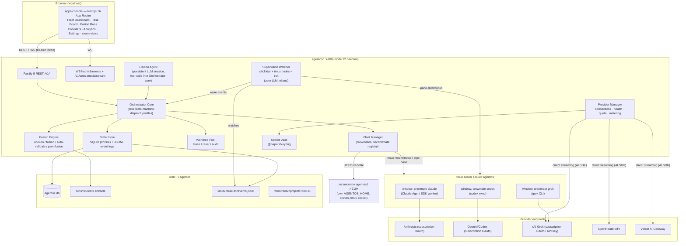
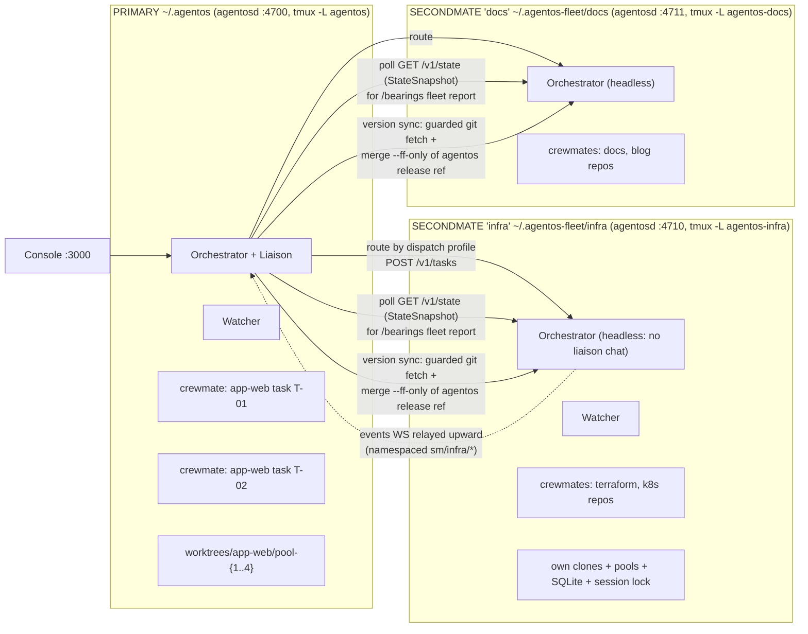

# PLAN A — Agent OS: Local-First Agentic Orchestration System

> **Plan provenance:** PLAN A of a two-plan fusion exercise, authored independently by Fable 5.
> **Status:** Proposed. **Date:** 2026-07-24.
> **Scope discipline:** This plan is opinionated and decisive. Where alternatives exist, one is chosen and justified; alternatives are noted only when the trade-off is genuinely close.

---

## Table of Contents

1. [Product Definition & Personas](#1-product-definition--personas)
2. [System Architecture](#2-system-architecture)
3. [Monorepo Layout](#3-monorepo-layout)
4. [Provider Connection Subsystem](#4-provider-connection-subsystem)
5. [Fleet Orchestration Subsystem](#5-fleet-orchestration-subsystem)
6. [Fusion Engine](#6-fusion-engine)
7. [Console UI Spec](#7-console-ui-spec)
8. [API Surface](#8-api-surface)
9. [On-Disk Data & State Model](#9-on-disk-data--state-model)
10. [Security Model](#10-security-model)
11. [Phased Delivery Roadmap](#11-phased-delivery-roadmap)
12. [Risks, Open Questions, Assumptions](#12-risks-open-questions-assumptions)

---

## 1. Product Definition & Personas

### 1.1 What Agent OS becomes

Agent OS is a **single-user, local-first agentic orchestration system**. You connect your existing AI subscriptions (Claude Max, ChatGPT/Codex, SuperGrok) and API keys (OpenRouter, Vercel AI Gateway) as **provider connections**, register your git projects, and then talk to one **Orchestrator** (the liaison agent). The Orchestrator spawns autonomous **crewmate** agents into disposable git worktrees inside visible tmux sessions, supervises them event-driven with a zero-token watcher, and fuses frontier model families at every lifecycle stage: multi-model planning with fusion, cross-family build/validate loops where the builder never grades its own homework, and attributed merge output.

The existing Next.js 16 marketing site is preserved as `apps/marketing` and a new `apps/console` (also Next.js 16 App Router, reusing the design system) becomes the localhost product UI. A standalone Node.js daemon, **`agentosd`**, owns all state and process management.

**One-line pitch:** *Firstmate's fleet discipline + fusion-harness's cross-family rigor + your existing subscriptions, behind one localhost console.*

### 1.2 What Agent OS is NOT

- **Not a SaaS.** Subscription OAuth tokens (Claude Max, Codex, Grok) are personal-use per vendor ToS. `agentosd` binds to `127.0.0.1` only, one OS user, no multi-tenancy. A future hosted variant is flagged in §12 and would be **API-key connections only**.
- **Not a chat app.** Chat exists only as the liaison surface; the deliverables are PRs, local merges, and scout reports.
- **Not a model router/proxy.** Subscription harnesses are spawned as vendor worker processes; we never extract their tokens into direct API calls.

### 1.3 Personas

| Persona | Description | Primary loops |
|---|---|---|
| **The Captain** (primary) | Senior IC/solo founder with 2–5 active repos, Claude Max + ChatGPT Plus/Pro + SuperGrok subscriptions, OpenRouter key. Wants to dispatch overnight work and wake to reviewed PRs. | Dispatch SHIP tasks, review fusion runs, `/afk`, merge PRs |
| **The Skeptic** | Same profile but burned by single-model agents hallucinating "done". Adopts Agent OS specifically for cross-family auto-validate. | SCOUT reports, gate inspection, consensus/divergence review |
| **The Fleet Operator** | Power user running 5–15 repos across domains (app, infra, docs). Needs secondmates so the primary Orchestrator doesn't become the bottleneck. | Fleet dashboard, dispatch profiles, secondmate provisioning |

There is deliberately **no** "team lead / enterprise admin" persona in v1.

### 1.4 Definition of v1 (the "it's real" bar)

v1 is shipped when all of the following are true (each is restated as a checkable gate in §11 phases):

1. All five provider kinds connect, health-check, and meter usage from the Console.
2. A SHIP task dispatched from the Console runs in a pooled worktree inside tmux, is supervised without any polling LLM tokens, and lands a PR (direct-PR mode) or a local branch (local-only mode).
3. A SCOUT task returns a structured investigation report and provably writes nothing to the project.
4. `/opinion`, `/fusion`, and `/auto-validate` work as both liaison commands and lifecycle stages, with cross-family enforcement (builder family ≠ validator family, hard).
5. Plan-fusion: a task planned by ≥2 model families produces a fused plan with attribution and a Consensus & Divergence section, visible in the Console.
6. Kill `agentosd -9` mid-task; on restart the fleet reconciles: running tmux sessions are re-adopted, orphans are classified, no task silently vanishes.
7. Zero `any` in the TypeScript codebase (`@typescript-eslint/no-explicit-any: error`), zero deprecated deps (`npm-check-updates` + `pnpm audit` clean in CI).

Secondmates are **v1.x** (Phase 7), not v1.0 — the primary orchestrator must be boringly reliable first.

---

## 2. System Architecture

### 2.1 Technology decisions (with justification)

| Concern | Decision | Justification |
|---|---|---|
| Orchestrator runtime | **Node.js ≥ 22 LTS standalone daemon (`agentosd`)**, TypeScript, ESM | Same language as Console/shared packages; first-class child-process/PTY ecosystem; Claude Agent SDK and AI SDK are TS-native. A Next.js custom server was rejected: the daemon must outlive UI dev-server restarts and own long-lived PTYs. |
| HTTP/WS server | **Fastify 5.x** + `@fastify/websocket` | Fast, actively maintained, excellent TS typing, schema-validation hooks pair with zod. Hono was the close second; Fastify wins on mature WS + plugin ecosystem for a daemon. |
| Schema/validation | **zod 4.x** in a shared `packages/protocol` | Single source of truth for REST bodies, WS events, and on-disk JSON; `z.infer` gives `any`-free types on both sides. |
| State persistence | **SQLite via `better-sqlite3` 12.x + `drizzle-orm`** for indexed state; **append-only JSONL event logs** per task/run for the event-sourced truth | SQLite = queryable snapshots (dashboard). JSONL = restart-proof audit trail and the watcher's substrate (Firstmate's "status files as append-only event logs"). DB is rebuildable from JSONL. |
| Session backend | **tmux (required dependency)**, one server socket `agentos`, one session per project, one window per crewmate; `node-pty 1.x` only for short-lived non-interactive helpers | tmux survives daemon restarts (the restart-proof property depends on it), is human-attachable (`tmux -L agentos attach`), and gives `pipe-pane` log capture + `pane-died` hooks for the watcher. |
| Process spawning | **`execa` 9.x** for helpers; `tmux new-window` + `pipe-pane` for harnesses | execa: typed, promise-based, proper env/signal handling. |
| File watching | **`chokidar` 4.x** on status dirs + tmux hooks + a 30 s deterministic tick | Event-driven supervision with zero LLM tokens. |
| Secrets | **`@napi-rs/keyring`** (OS keychain: macOS Keychain / libsecret) with an encrypted-file fallback (libsodium via `sodium-native`) | `keytar` is archived/deprecated — forbidden by constraints. |
| Direct LLM calls | **Vercel AI SDK 5.x (`ai`)** + `@openrouter/ai-sdk-provider` + AI Gateway global provider | One streaming abstraction over all API-key connections; usage accounting built in. |
| Subscription harnesses | `@anthropic-ai/claude-agent-sdk` (in-process or CLI), `codex` CLI, `grok` CLI — always as **spawned worker processes** with scrubbed env | Required by the subscription-harness model; see §4. |
| Console | **Next.js 16 App Router** (kept per constraint), React 19, Tailwind v4, Framer Motion; `xterm.js` (`@xterm/xterm`) for live terminals; direct WS to `agentosd` | UI is a pure client of the daemon; no Next API routes hold state. |
| Monorepo | **pnpm 10 workspaces + Turborepo 2.x** | Strict node_modules isolation, fast task graph. |
| Logging | **pino 9.x** with a redaction stream (§10) | Structured, fast, redactable. |
| IDs | **ULID** (`ulid` package) | Sortable IDs make JSONL logs and run dirs chronologically browsable. |

Ports: Console dev `:3000`, `agentosd` `:4700` (HTTP + WS, `127.0.0.1` only). Secondmates: `:4710+n`.

### 2.2 Component architecture (mermaid #1)



### 2.3 Task lifecycle with cross-family auto-validate (mermaid #2)

The canonical SHIP task in `pipeline` mode with the default fusion profile (plan-fusion with 2 families → single builder → cross-family auto-validate):

```mermaid
sequenceDiagram
    autonumber
    participant U as Captain (Console)
    participant L as Liaison Agent
    participant O as Orchestrator Core
    participant F as Fusion Engine
    participant P as Planner A (Claude, subscription)
    participant Q as Planner B (Kimi K3 via Gateway)
    participant V as VALIDATOR (GPT family via Codex)
    participant B as BUILDER (Claude family, tmux crewmate)
    participant W as Watcher (zero-token)
    participant G as Gate process

    U->>L: "Ship: add rate limiting to /api/ingest"
    L->>O: create_task(shape=SHIP, mode=pipeline, fusionProfile=default)
    O->>F: plan_fusion(task, families>=2)
    par independent plans
        F->>P: PLAN prompt (clean-room)
        F->>Q: PLAN prompt (clean-room)
    end
    P-->>F: plan-a.md
    Q-->>F: plan-b.md
    F->>F: FUSION agent merges → fused-plan.md<br/>[A]/[B] attribution + Consensus & Divergence
    F-->>O: fused plan artifact
    O->>V: auto-validate: write gate.ts BEFORE build
    V-->>O: gate.ts committed to run dir
    O->>G: run gate at baseline worktree
    G-->>O: RED (required) — else GATE DEFECT, back to V
    O->>B: spawn crewmate in leased worktree (tmux window)
    Note over B,W: Builder streams; Watcher tails events.jsonl,<br/>classifies PROGRESS/STALE/NEEDS_INPUT — no LLM tokens
    B-->>O: status: BUILD_COMPLETE (attempt 1)
    O->>G: run gate against worktree
    G-->>O: FAIL — 3 assertions, verbatim lines captured
    O->>B: correction message = verbatim FAIL lines (attempt 2)
    B-->>O: BUILD_COMPLETE (attempt 2)
    O->>G: run gate
    G-->>O: FAIL (attempt 3 threshold)
    O->>V: TRIAGE: classify BUILD DEFECT vs GATE DEFECT
    alt GATE DEFECT
        V-->>O: gate-repair patch → re-baseline (must fail RED pre-fix)
    else BUILD DEFECT
        O->>B: correction + triage notes
    end
    B-->>O: BUILD_COMPLETE (attempt 3)
    O->>G: run gate
    G-->>O: GREEN
    O->>O: delivery: push branch, open PR (gh),<br/>attach summary.json + fused-plan + gate transcript
    W->>O: wake: DONE
    O-->>L: task delivered
    L-->>U: "PR #142 open. Gate GREEN on attempt 3.<br/>Divergence note: planners disagreed on token-bucket vs sliding-window."
```

Halt condition: after `maxValidations` (default 6) gate runs without GREEN, the task enters `NEEDS_CAPTAIN` with the full attempt ledger.

### 2.4 Fleet / secondmate topology (mermaid #3)



Each secondmate is a **full `agentosd`** with `AGENTOS_HOME` isolation: its own SQLite DB, secrets scope, project clones (never shares the primary's working copies), tmux socket, and a `session.lock` file preventing double-start. The primary is the only component the Console talks to; secondmate state is proxied.

### 2.5 Process tree / session layout (ASCII)

```
launchd/systemd (user scope)
└── agentosd (node, :4700, AGENTOS_HOME=~/.agentos)
    ├── fastify http+ws listener (127.0.0.1:4700)
    ├── watcher (in-process: chokidar fds + 30s tick timer)
    ├── liaison session (in-process Claude Agent SDK query(), streaming)
    └── [ephemeral] execa helpers: git, gh, tmux control cmds, gate runners

tmux server  (socket: -L agentos)                # survives agentosd restarts
└── session: agentos
    ├── window 0  "ctl"          – idle shell, human attach point
    ├── window 1  "T-01k3.. app-web builder/claude"
    │     └── pane 0: node worker.mjs  (Claude Agent SDK, scrubbed env:
    │            CLAUDE_CODE_OAUTH_TOKEN=***, ANTHROPIC_API_KEY unset)
    │            cwd: ~/.agentos/worktrees/app-web/pool-2
    │            pipe-pane → ~/.agentos/tasks/T-01k3../terminal.log
    ├── window 2  "T-01k4.. app-web validator/codex"
    │     └── pane 0: codex exec --json - < role-prompt.md
    │            env: CODEX_HOME=~/.agentos/providers/openai-codex/home
    │            cwd: ~/.agentos/runs/R-01k5../gate-workspace
    └── window 3  "T-01k6.. api scout/grok"
          └── pane 0: grok --prompt-file scout.md   (read-only delivery contract)

tmux server  (socket: -L agentos-infra)          # secondmate 'infra'
└── session: agentos
    └── windows per infra crewmate ...
agentosd (:4710, AGENTOS_HOME=~/.agentos-fleet/infra)
```

Key invariant: **harness processes are children of tmux, not of `agentosd`**. The daemon can crash and restart; sessions persist; reconciliation re-adopts them (§5.8).

---

## 3. Monorepo Layout

pnpm workspaces + Turborepo. The current repo root migrates as follows: everything under `src/` moves to `apps/marketing/src/` unchanged; shared visual primitives (GlassCard, MagneticButton, animation variants, cn) are extracted to `packages/ui` and re-imported by both apps.

```
agent-os/
├── package.json                      # workspace root, engines: node>=22
├── pnpm-workspace.yaml
├── turbo.json
├── tsconfig.base.json                # strict: true, noUncheckedIndexedAccess: true
├── eslint.config.mjs                 # @typescript-eslint/no-explicit-any: error
├── .github/workflows/ci.yml          # typecheck, lint, test, dep-audit gates
├── docs/
│   └── plans/plan-a-fable.md         # this file
├── apps/
│   ├── marketing/                    # the existing site, verbatim migration
│   │   ├── package.json              # next 16.2.x, react 19.2.x
│   │   └── src/app/...               # home, agents, pricing, ... unchanged
│   ├── console/                      # NEW: the product UI (Next.js 16 App Router)
│   │   ├── package.json
│   │   └── src/
│   │       ├── app/
│   │       │   ├── layout.tsx
│   │       │   ├── page.tsx                    # Fleet Dashboard
│   │       │   ├── projects/[id]/page.tsx
│   │       │   ├── tasks/page.tsx              # Task Board
│   │       │   ├── tasks/[id]/page.tsx         # Task Detail + live fusion columns
│   │       │   ├── runs/[id]/page.tsx          # Fusion Run view
│   │       │   ├── providers/page.tsx
│   │       │   ├── analytics/page.tsx
│   │       │   └── settings/page.tsx
│   │       ├── components/           # console-specific (TerminalPane, FusionColumns…)
│   │       └── lib/
│   │           ├── client.ts         # typed REST client (generated from protocol)
│   │           └── ws.ts             # event stream hook (useOrchestratorEvents)
│   └── orchestrator/                 # NEW: agentosd daemon
│       ├── package.json              # bin: { agentosd, agentos }
│       └── src/
│           ├── main.ts               # boot: config → vault → store → reconcile → listen
│           ├── server/               # fastify routes (thin; call core)
│           ├── core/
│           │   ├── task-machine.ts   # explicit state machine (never-checked switches)
│           │   ├── dispatch.ts       # dispatch profiles → connection/model selection
│           │   └── liaison.ts        # liaison agent session + tool bridge
│           ├── fleet/
│           │   ├── crewmate.ts
│           │   ├── worktree-pool.ts
│           │   ├── tmux.ts           # typed tmux control wrapper
│           │   ├── watcher.ts        # wake queue + classification
│           │   └── secondmate.ts
│           ├── fusion/
│           │   ├── engine.ts
│           │   ├── opinion.ts
│           │   ├── fusion.ts
│           │   ├── auto-validate.ts
│           │   └── plan-fusion.ts
│           ├── providers/
│           │   ├── manager.ts
│           │   ├── anthropic-max.ts  # subscription-harness
│           │   ├── openai-codex.ts   # subscription-harness
│           │   ├── xai-grok.ts       # dual-mode
│           │   ├── openrouter.ts     # api-key
│           │   └── vercel-gateway.ts # api-key
│           ├── store/                # drizzle schema, JSONL writers, reconciler
│           └── security/             # vault, env-scrub, redaction, guarded writes
├── packages/
│   ├── protocol/                     # zod 4 schemas: REST bodies, WS events, disk JSON
│   │   └── src/{tasks,providers,fleet,fusion,events}.ts
│   ├── core-types/                   # pure domain types (no zod dep) re-exported
│   ├── ui/                           # GlassCard, MagneticButton, variants, cn — shared
│   └── harness-adapters/             # per-harness worker entrypoints + stream parsers
│       └── src/{claude-worker.ts, codex-parser.ts, grok-parser.ts}
└── tooling/
    ├── scripts/dep-audit.mjs         # fails CI on deprecated/vulnerable deps
    └── scripts/migrate-marketing.mjs # one-shot move of current src/ → apps/marketing
```

**Marketing pages:** kept fully, deployed separately (Vercel) as before; they gain a "Download / Run locally" CTA later. They never import orchestrator code. The Console reuses `packages/ui` so the product inherits the established aesthetic.

---

## 4. Provider Connection Subsystem

### 4.1 Core distinction

Every connection declares **capabilities**, not just a kind:

- **`harness`** — can act as a worker agent by spawning the vendor's CLI/SDK process. Bills a subscription. Cannot be used for arbitrary streaming completions.
- **`inference`** — can serve direct streaming LLM calls via AI SDK (planning voice, FUSION merge agent, liaison brain, opinion panels, embeddings-free summarization).

| Provider | Kind | Capabilities | Families served |
|---|---|---|---|
| Anthropic Claude Max | subscription-harness | `harness` | anthropic |
| OpenAI Codex (ChatGPT sub) | subscription-harness | `harness` | openai |
| xAI Grok (SuperGrok / Premium+) | subscription-harness (+ API fallback) | `harness`, `inference` (iff `XAI_API_KEY` set) | xai |
| OpenRouter | api-key | `inference` | 300+ models, many families |
| Vercel AI Gateway | api-key | `inference` | gateway model strings, many families |

### 4.2 Data model (TypeScript, zod-backed, no `any`)

```ts
// packages/protocol/src/providers.ts
import { z } from "zod";

export const ModelFamily = z.enum([
  "anthropic", "openai", "xai", "google", "moonshot", "deepseek", "meta", "mistral", "other",
]);
export type ModelFamily = z.infer<typeof ModelFamily>;

export const ConnectionKind = z.enum(["subscription-harness", "api-key"]);
export const Capability = z.enum(["harness", "inference"]);

export const ProviderId = z.enum([
  "anthropic-claude-max", "openai-codex", "xai-grok", "openrouter", "vercel-ai-gateway",
]);
export type ProviderId = z.infer<typeof ProviderId>;

export const ConnectionHealth = z.object({
  status: z.enum(["healthy", "degraded", "expired", "rate-limited", "unreachable", "unconfigured"]),
  checkedAt: z.string().datetime(),
  latencyMs: z.number().nullable(),
  detail: z.string(),                       // human-readable, secrets redacted
  tokenExpiresAt: z.string().datetime().nullable(), // grok 7d, claude ~1y, codex auto
});

export const QuotaWindow = z.object({
  window: z.enum(["5h", "24h", "7d", "30d"]),
  usedPct: z.number().min(0).max(100).nullable(),   // null = vendor doesn't expose
  resetsAt: z.string().datetime().nullable(),
  source: z.enum(["vendor-reported", "self-metered", "estimated"]),
});

export const UsageSample = z.object({
  connectionId: z.string().ulid(),
  taskId: z.string().ulid().nullable(),
  runId: z.string().ulid().nullable(),
  role: z.enum(["liaison", "planner", "builder", "validator", "fusion", "scout", "healthcheck"]),
  model: z.string(),
  inputTokens: z.number().int().nonnegative(),
  outputTokens: z.number().int().nonnegative(),
  cacheReadTokens: z.number().int().nonnegative().default(0),
  costUsd: z.number().nonnegative().nullable(),     // null for subscription (metered as quota, not $)
  at: z.string().datetime(),
});

export const ProviderConnection = z.object({
  id: z.string().ulid(),
  providerId: ProviderId,
  label: z.string().min(1),                 // "Lee's Claude Max", "Work OpenRouter"
  kind: ConnectionKind,
  capabilities: z.array(Capability).min(1),
  families: z.array(ModelFamily).min(1),
  secretRef: z.string().nullable(),         // keychain entry name; NEVER the secret itself
  authHome: z.string().nullable(),          // e.g. ~/.agentos/providers/openai-codex/home
  defaultModel: z.string().nullable(),
  concurrencyLimit: z.number().int().min(1),// per-connection worker cap
  health: ConnectionHealth,
  quotas: z.array(QuotaWindow),
  enabled: z.boolean(),
  createdAt: z.string().datetime(),
});
export type ProviderConnection = z.infer<typeof ProviderConnection>;
```

```ts
// apps/orchestrator/src/providers/manager.ts (interface sketch)
export interface HarnessSpawnSpec {
  readonly argv: readonly string[];        // exact command line
  readonly env: Readonly<Record<string, string>>; // FULL env (allowlist-built, not inherited)
  readonly cwd: string;
  readonly promptFile: string;             // role prompt written to run dir
  readonly streamParser: HarnessStreamParser; // vendor JSONL → normalized AgentEvent
}

export interface ProviderAdapter {
  readonly providerId: ProviderId;
  connect(input: ConnectInput): Promise<ProviderConnection>;     // per-provider auth flow
  healthCheck(conn: ProviderConnection): Promise<ConnectionHealth>;
  buildHarnessSpawn(conn: ProviderConnection, req: HarnessRequest): Promise<HarnessSpawnSpec>; // harness-capable only
  languageModel(conn: ProviderConnection, model: string): LanguageModel; // AI SDK; inference-capable only
  meter(conn: ProviderConnection, sample: UsageSample): Promise<void>;
}

export type ConnectInput =
  | { providerId: "anthropic-claude-max"; oauthToken: string }
  | { providerId: "openai-codex"; method: "browser" | "device-auth" }
  | { providerId: "xai-grok"; method: "oauth" | { apiKey: string } }
  | { providerId: "openrouter"; apiKey: string }
  | { providerId: "vercel-ai-gateway"; apiKey: string; byok: ReadonlyArray<{ family: ModelFamily; keyRef: string }> };
```

(`LanguageModel` is the AI SDK 5 type; `HarnessStreamParser` lives in `packages/harness-adapters`.)

### 4.3 Auth flows, exact commands & env vars

**Anthropic Claude Max (`anthropic-claude-max`)**
1. Console shows: run `claude setup-token` in your terminal → user pastes the resulting `sk-ant-oat01-…` token into the Console (masked field).
2. Stored in keychain as `agentos/conn/<id>/CLAUDE_CODE_OAUTH_TOKEN`. Token life ≈ 1 year; `tokenExpiresAt` recorded; Console warns at T-30d.
3. **Spawn env hygiene (critical):** `ANTHROPIC_API_KEY` **takes precedence** over the OAuth token inside Claude tooling. Spawn env is built from an allowlist (never `process.env` spread) and asserts `ANTHROPIC_API_KEY ∉ env`. Also unset: `ANTHROPIC_AUTH_TOKEN`, `ANTHROPIC_BASE_URL` unless explicitly configured.
4. Worker: in-process `@anthropic-ai/claude-agent-sdk` `query()` for the liaison; for crewmates, a dedicated `node claude-worker.mjs` child (so tmux owns it) that calls the SDK with `settingSources: []` (clean-room: no user CLAUDE.md/skills) and streams JSONL events to stdout.
5. Health check: one-turn minimal `query()` (`haiku`-tier model, `maxTurns: 1`); parse SDK `result` message usage. Quota: self-metered against the Max 5-h and weekly windows (estimated; `source: "self-metered"`).
6. ToS note surfaced in UI: personal use only; this connection can never be used by a future hosted mode.

**OpenAI Codex (`openai-codex`)**
1. Isolated home: `CODEX_HOME=~/.agentos/providers/openai-codex/home` — Agent OS never touches the user's own `~/.codex`. Auth: Console launches `CODEX_HOME=… codex login` (opens browser) or, for headless boxes, `CODEX_HOME=… codex login --device-auth` (called via `agentos connect codex --device` CLI which relays the user code to the Console).
2. Tokens live in `$CODEX_HOME/auth.json` and **auto-refresh**; the refreshed file must be preserved. Rules: (a) Agent OS never writes `auth.json`; (b) never copies it per-worker (a stale refresh token after rotation would break the canonical one); (c) **per-runner serialization**: an advisory lock (`proper-lockfile` on `$CODEX_HOME/agentos.lock`) is held during process startup and for 10 s after, serializing the refresh window; steady-state runs proceed concurrently up to `concurrencyLimit`.
3. Crewmate invocation: `codex exec --json --skip-git-repo-check -C <worktree> - < role-prompt.md`, sandbox/approval flags set per project mode (`--sandbox workspace-write` default; `--sandbox danger-full-access` only with `+yolo`).
4. Health: `codex exec --json "reply OK"` with 60 s timeout; `auth.json` mtime watched → refresh events logged.

**xAI Grok (`xai-grok`)**
1. OAuth: `grok auth login` (browser) → `~/.grok/auth.json`; we point the CLI at an isolated dir if supported (`GROK_CONFIG_DIR=~/.agentos/providers/xai-grok`), else we document use of the user file. **7-day expiry with refresh**: health check runs every 6 h; at `expired`, connection flips to `expired` and the Console shows a one-click "re-auth" instruction.
2. `XAI_API_KEY` fallback: if provided, the connection additionally gains `inference` capability (direct `xai/grok-*` calls via AI SDK) and harness spawns can fall back to key auth when OAuth is expired (flagged in the task ledger, since it shifts billing from subscription to metered).
3. Crewmate invocation: `grok --prompt-file role-prompt.md` inside the worktree.

**OpenRouter (`openrouter`)**
1. Paste key (`sk-or-…`) → keychain. Models addressed as `openrouter/<vendor>/<model>` internally; served via `@openrouter/ai-sdk-provider`.
2. Health + quota: `GET https://openrouter.ai/api/v1/key` returns limit/usage → `vendor-reported` quota. Cost: response `usage` blocks → `costUsd` per sample.

**Vercel AI Gateway (`vercel-ai-gateway`)**
1. Paste `AI_GATEWAY_API_KEY` → keychain. Models addressed with gateway strings: `moonshotai/kimi-k3` (1M context — default long-context planner), `anthropic/claude-fable-5`, `openai/gpt-5.6-sol`, etc. Zero markup; BYOK sub-keys stored as separate keychain entries referenced by `byok[]`.
2. Health: 1-token generation against a cheap model. Cost: gateway-reported per-request cost headers.

### 4.4 Env hygiene at spawn (the allowlist builder)

```ts
// apps/orchestrator/src/security/env-scrub.ts
const BASE_ALLOWLIST = ["PATH", "HOME", "SHELL", "TERM", "LANG", "LC_ALL", "TMPDIR",
  "GIT_AUTHOR_NAME", "GIT_AUTHOR_EMAIL", "GIT_COMMITTER_NAME", "GIT_COMMITTER_EMAIL"] as const;

const AI_SECRET_VARS = ["ANTHROPIC_API_KEY", "ANTHROPIC_AUTH_TOKEN", "OPENAI_API_KEY",
  "XAI_API_KEY", "OPENROUTER_API_KEY", "AI_GATEWAY_API_KEY", "CLAUDE_CODE_OAUTH_TOKEN",
  "GROK_API_KEY", "GEMINI_API_KEY", "VERCEL_TOKEN"] as const;

/** Build a worker env from scratch. Never spreads process.env. */
export function buildSpawnEnv(
  conn: ProviderConnection,
  injections: Readonly<Record<string, string>>,
): Record<string, string> {
  const env: Record<string, string> = {};
  for (const k of BASE_ALLOWLIST) {
    const v = process.env[k];
    if (v !== undefined) env[k] = v;
  }
  Object.assign(env, injections);            // e.g. CLAUDE_CODE_OAUTH_TOKEN, CODEX_HOME
  for (const k of AI_SECRET_VARS) {
    if (!(k in injections)) delete env[k];   // hard-strip all other AI secrets
  }
  assertPrecedenceHazards(conn, env);        // e.g. anthropic-max ⇒ ANTHROPIC_API_KEY must be absent
  return env;
}
```

A unit test spawns `env` under each adapter's spec and asserts the exact variable set — this is a Phase 1 gate.

### 4.5 Metering & rate-limit awareness

- Every harness stream parser extracts usage from vendor JSONL (Claude SDK `result.usage`, Codex `token_count` events, Grok summary lines) → `UsageSample` rows in SQLite.
- API-key calls meter via AI SDK `usage` + provider cost fields.
- Rate-limit signals (HTTP 429, harness "limit reached" stderr patterns per adapter regex table) flip health to `rate-limited` with `resetsAt`; the **dispatch layer treats `rate-limited` connections as ineligible**, enabling automatic family-preserving failover (e.g. Claude Max exhausted → `anthropic/claude-fable-5` via Gateway, flagged as cost-shifting).
- Analytics page aggregates per connection/role/project/day.

---

## 5. Fleet Orchestration Subsystem

### 5.1 Actors

- **Orchestrator Core** — deterministic TypeScript: task state machine, dispatch, delivery. No LLM.
- **Liaison Agent** — the one agent the Captain talks to. A persistent Claude Agent SDK session (configurable to any `inference`/`harness` connection) whose only tools are typed bridges into Orchestrator Core (`create_task`, `get_bearings`, `answer_crewmate`, `approve_delivery`, `run_opinion`, …). It never edits code itself.
- **Crewmates** — disposable worker agents (one per task-stage) in leased worktrees inside tmux windows.
- **Secondmates** — persistent second-level orchestrators owning a project domain (§5.9).
- **Watcher** — zero-token supervision loop (§5.6).

### 5.2 Task shapes

```ts
export type TaskShape = "SHIP" | "SCOUT";

export interface ShipSpec {
  readonly shape: "SHIP";
  readonly projectId: string;
  readonly prompt: string;
  readonly mode: "pipeline" | "direct-pr" | "local-only"; // project default, overridable
  readonly yolo: boolean;            // +yolo: no approval pauses, wider sandbox
  readonly fusionProfile: FusionProfileRef;   // §6.5
}
export interface ScoutSpec {
  readonly shape: "SCOUT";
  readonly projectId: string;
  readonly question: string;         // deliverable: report.md, zero writes
}
```

- **SHIP / pipeline**: run the project's configured validation pipeline (lint, typecheck, tests, then the fusion gate) before delivery; open PR on green.
- **SHIP / direct-pr**: build → fusion gate → push branch → `gh pr create` with fused-plan + gate transcript in the body.
- **SHIP / local-only**: deliver a local branch (optionally `merge --ff-only` into a captain-named integration branch); nothing leaves the machine.
- **SCOUT**: read-only investigation. Enforced by contract *and* audit: scout worktrees are leased normally, but delivery runs `git status --porcelain` + `git diff` — any dirt fails the task with `SCOUT_WROTE_FILES` and the worktree is reset. Scout harnesses are also spawned with the most restrictive sandbox the harness supports (Codex `--sandbox read-only`; Claude SDK `permissionMode` denying write tools).

### 5.3 Task state machine

```
QUEUED → PLANNING → PLAN_FUSED → GATE_AUTHORING → GATE_RED_VERIFIED
       → BUILDING ⇄ VALIDATING (attempt loop, ≤ maxValidations)
       → DELIVERING → DONE
Any state → NEEDS_CAPTAIN (escalation) → resumed or CANCELLED
Any state → FAILED (with cause enum) | SESSION_LOST → reconciled
```

Implemented as an explicit discriminated-union machine with exhaustive `switch` + `never` default (per workspace rule). Every transition appends to `tasks/<id>/events.jsonl` **before** the SQLite snapshot updates (log is the truth; DB is the index).

### 5.4 Worktree pooling (treehouse-style)

- Per project: `~/.agentos/worktrees/<projectSlug>/pool-{1..N}` (default N=4, setting).
- Provisioning: `git -C <projectClone> worktree add --detach <poolDir>`; the daemon keeps its **own bare-ish clone** per project (`~/.agentos/projects/<slug>/clone`) so user working copies are never touched.
- Lease: pool member marked `leased` in DB, branch created `ao/<taskId>-<slug>`, `git switch -c`.
- Reset protocol on release: `git switch --detach origin/<default>` → `git clean -fdx` → `git reset --hard` → verify `status --porcelain` empty → back to `idle`. Reset failures quarantine the member (`quarantined`, watcher raises `POOL_DEGRADED`).
- Pool exhaustion: tasks queue with `WAITING_WORKTREE`; the Console shows pool pressure per project.

### 5.5 Session backend contract (tmux)

Typed wrapper (`fleet/tmux.ts`) over `tmux -L agentos`:

- `newTaskWindow(taskId, cmd, env, cwd)` → `new-window -d -n <taskId> -e K=V …`
- `pipe-pane -o 'cat >> ~/.agentos/tasks/<taskId>/terminal.log'` — raw human-readable log; the structured channel is the worker's stdout JSONL redirected to `events.jsonl` by the worker wrapper script.
- Hooks: `set-hook -g pane-died 'run-shell "agentos _hook pane-died #{window_name}"'` → wake event without polling.
- Liveness: reconciliation lists `tmux list-windows -F '#{window_name} #{pane_pid} #{pane_dead}'`.
- Humans can always `tmux -L agentos attach` — visibility is a feature, and the Console's terminal view (xterm.js) tails `terminal.log` over WS rather than multiplexing tmux clients.

### 5.6 Supervision watcher (zero-token, event-driven)

**Inputs** (no LLM involvement):
1. chokidar watches `~/.agentos/tasks/*/events.jsonl` (append events) and `~/.agentos/wake/` (a drop-dir wake queue: crewmates/hooks write one JSON file per wake request; watcher consumes-and-deletes).
2. tmux `pane-died` hooks → wake files.
3. Deterministic 30 s tick for time-based checks only.

**Wake classification** (pure function `classify(event, taskSnapshot) → WakeClass`):

```ts
export type WakeClass =
  | { kind: "PROGRESS" }                      // heartbeat; update lastActivityAt, no action
  | { kind: "NEEDS_INPUT"; question: string } // crewmate asked; route to liaison → Captain
  | { kind: "BLOCKED"; reason: string }       // external dep (auth expired, network)
  | { kind: "STALE" }                         // no events for staleAfterMin (default 10)
  | { kind: "WEDGED"; evidence: string }      // loop detection: same tool-call signature ≥5× in 15 min,
                                              // or output ring-buffer similarity > 0.9
  | { kind: "BUILD_COMPLETE" } | { kind: "DONE" } | { kind: "FAILED"; cause: string }
  | { kind: "SESSION_LOST" };                 // pane died without terminal status event
```

**Escalation cadence** (per task, config `escalation.steps`):
1. `STALE` #1 → inject a nudge message into the harness (each adapter defines its interrupt mechanism; Claude SDK: streaming-input message; Codex/Grok: queued follow-up via stdin or `tmux send-keys` guarded template).
2. `STALE` #2 or `WEDGED` → snapshot context (last 200 events), kill pane, respawn same role with a "you were restarted; here is your prior state" preamble (at most 1 respawn per stage).
3. Third strike → `NEEDS_CAPTAIN`; liaison composes a one-paragraph situation report; Console notification (+ optional `terminal-notifier`).
Token cost of supervision at steady state: **zero** — LLMs are only invoked at escalation step 1+ (nudge composition is a static template, not an LLM call; only `NEEDS_CAPTAIN` summaries use the liaison).

**/afk mode:** flips escalation to autonomous defaults (auto-answer known-safe questions from a project FAQ file, extend stale thresholds, batch reports) — mirrors Firstmate `/afk`. `/ahoy` (recap), `/bearings` (fleet report), `/stow` (sweep loose knowledge from task logs into `docs/notes/` via a SHIP-lite task) are liaison commands in v1.x.

### 5.7 Dispatch profiles

Natural-language rules compiled to structured matchers at save time (the liaison converts NL → JSON; the Captain confirms):

```jsonc
// ~/.agentos/dispatch.json (excerpt)
{ "rules": [
  { "match": { "prompt": ["dependency", "upgrade", "bump"] },
    "then": { "builder": { "family": "openai", "effort": "medium" },
              "validator": { "family": "anthropic" } } },
  { "match": { "project": "infra-*" }, "then": { "routeTo": "secondmate:infra" } },
  { "match": {}, "then": { "fusionProfile": "default-cross-family" } }
] }
```

### 5.8 Restart recovery (reconciliation)

On `agentosd` boot:
1. Load SQLite snapshot; enumerate tasks in non-terminal states.
2. `tmux list-windows` on socket `agentos`; match windows ↔ tasks by window name (= taskId).
3. For each match: re-attach log tails, replay `events.jsonl` from last DB high-water mark, resume the state machine.
4. Windows without tasks → adopt as `ORPHANED_SESSION` (visible in Console, killable). Tasks without windows → emit `SESSION_LOST`; policy: BUILDING tasks respawn (once), others go `NEEDS_CAPTAIN`.
5. Worktree audit: any `leased` member without a live task is reset to `idle`.
Gate for Phase 3: `kill -9` during BUILDING; after restart the task reaches DONE without human help.

### 5.9 Secondmates

- Created via Console: name + project-domain globs + port. `agentos secondmate create infra --port 4710` provisions `~/.agentos-fleet/infra/` (own `config.json`, DB, clones, `session.lock`, tmux socket `agentos-infra`) and a launchd/systemd unit.
- **Isolation:** a secondmate never shares clones, pools, or DB with the primary. Secrets: the primary grants per-connection *capability leases* — it writes short-lived scoped entries into the secondmate's keychain namespace rather than sharing its own (revocable per secondmate).
- **Routing:** dispatch rules with `routeTo: "secondmate:<name>"`; the primary POSTs the task spec to the secondmate's `/v1/tasks` and mirrors its event stream upward namespaced `sm/<name>/…`.
- **Version sync:** secondmates run the same `agentosd` build; the primary pushes upgrades by `git fetch` + **`merge --ff-only`** of a pinned release ref inside each secondmate home's `app/` checkout, then restarts its unit. Non-ff = refuse + alert (guarded fast-forward).
- **Bearings:** primary polls `GET /v1/state` → `StateSnapshot` (zod) per secondmate; `/bearings` renders the fleet-wide roll-up.

---

## 6. Fusion Engine

### 6.1 Role model

Roles, not models (fusion-harness): **ARCHITECT** (plans, fuses, validates plans), **BUILDER** (writes code, full tools), **FUSION** (merges outputs with attribution; inference-only, no tools), **VALIDATOR** (designs and repairs the acceptance gate; never edits product code). Plus Agent-OS-native: **PLANNER[n]** (independent plan voices) and **SCOUT**.

Hard rules ("never grade your own homework"):
- `builder.family ≠ validator.family` — **hard constraint**; dispatch refuses to schedule otherwise (unless the Captain passes `--override-family-check`, which is stamped on the run artifact).
- BUILDER never runs the gate command itself as pass/fail authority (it may run tests ad hoc; only the Orchestrator's gate run counts).
- VALIDATOR has no write access to the build worktree (separate gate workspace, §6.4).
- FUSION agents receive only the role outputs + fusion instruction — clean-room, no tools, no session history.

### 6.2 Cross-family dispatch policy

Inputs: eligible connections (enabled, healthy, capability fits role, quota not exhausted), task effort tier, dispatch profile hints. Selection is a small deterministic solver:

1. Filter by capability: BUILDER/VALIDATOR need `harness` (they act on a workspace); PLANNER/FUSION prefer `inference` (cheap, streaming) but may use `harness` connections in one-shot mode.
2. Apply hard constraints: distinct families for builder/validator; plan-fusion requires ≥2 distinct families among planners.
3. Preference order (soft): (a) subscription-harness before api-key for BUILDER (flat cost); (b) api-key before subscription for high-token PLANNER work on long contexts (e.g. `moonshotai/kimi-k3` 1M ctx via Gateway); (c) architect.family ≠ builder.family preferred; (d) round-robin within ties to spread quota burn.
4. Record the resolved cast in `summary.json` (`cast: { plannerA, plannerB, builder, validator, fusion }` with connection + model + family each).

Default cast with all providers connected: PLANNER A = Claude (subscription), PLANNER B = `moonshotai/kimi-k3` (Gateway), BUILDER = Claude Agent SDK worker, VALIDATOR = Codex (openai family), FUSION = `anthropic/claude-fable-5` or `openai/gpt-5.6-sol` via Gateway (whichever family is *not* the builder's, preferred).

### 6.3 Primitives

**`/opinion`** — `opinion(prompt, casts[2])`: two clean-room one-shot runs in parallel (AI SDK streams for inference connections; `codex exec`/SDK one-shots for harness). Persist `runs/<id>/{prompt.md,a.md,b.md,summary.json}` with per-side latency/tokens/cost. Console renders side-by-side panel (§7.4).

**`/fusion`** — ARCHITECT and BUILDER answer **in parallel with full tools** in separate leased worktrees; a third FUSION agent merges per the fusion instruction. Output contract enforced by the FUSION role prompt and validated by a post-parse check:
- Inline attribution markers `[ARCHITECT]` / `[BUILDER]` on adopted spans (validated: fused output must contain ≥1 of each unless one side was empty).
- Mandatory trailing `## Consensus & Divergence` section: bullets `AGREE:` / `DIVERGE:` / `FUSION CHOICE:` with one-line rationale.

**`/auto-validate`** — the loop from §2.3, precisely:
1. VALIDATOR writes `gate/gate.ts` (executed via `node --experimental-strip-types`, or `gate.py` if the project is Python) + `gate/README.md` describing each assertion. Gates are plain scripts exiting 0/1 with `PASS:`/`FAIL:` prefixed assertion lines.
2. **RED verification**: Orchestrator runs the gate against the untouched baseline worktree. Exit 0 at baseline ⇒ `GATE DEFECT (not falsifiable)` → back to VALIDATOR (max 2 gate rewrites, then NEEDS_CAPTAIN).
3. BUILDER builds. Orchestrator runs gate. On FAIL, the **verbatim FAIL lines** (never summarized) are sent as the builder's next message.
4. Attempt 3 (configurable `triageAt`) → VALIDATOR **triage**: given the diff + FAIL lines, classify `BUILD DEFECT` (loop continues with triage notes) or `GATE DEFECT` (gate-repair path: VALIDATOR patches the gate; repaired gate must still fail RED against the pre-build baseline snapshot — kept as a git tag `ao/baseline/<taskId>`).
5. Halt at `maxValidations` (default 6) → `NEEDS_CAPTAIN` with the attempt ledger.

### 6.4 Isolation & sessions

- **Clean-room spawns:** every fusion-role process starts with no inherited skills/CLAUDE.md/context: Claude SDK `settingSources: []`, Codex `--config` pointed at a minimal generated profile inside the run dir, Grok with a bare config dir. The role prompt file is the *only* context.
- **Per-role persistent sessions** are keyed `(projectId, role, connectionId, model)` and stored under `~/.agentos/sessions/`. **Never** replay one model's transcript into another model — a session key change invalidates continuity by construction.
- VALIDATOR works in `runs/<runId>/gate-workspace/` (a read-only snapshot of the baseline: `git worktree add --detach` + chmod-guarded), physically separate from the builder's pool worktree.

### 6.5 Fusion profiles & plan-fusion in the lifecycle

Fusion is not a chat trick; it's a **task lifecycle configuration**:

```ts
export interface FusionProfile {
  readonly id: string;                          // "default-cross-family"
  readonly plan: { planners: 0 | 1 | 2 | 3; fuse: boolean };  // 2 + fuse = plan-fusion
  readonly build: { mode: "single" | "dual-fused" };          // dual-fused = /fusion on code (v1.x)
  readonly validate: { mode: "auto-validate" | "pipeline-only" | "none";
                       triageAt: number; maxValidations: number };
  readonly constraints: { builderFamilyNotEqualValidator: true; distinctPlannerFamilies: boolean };
}
```

**Plan-fusion workflow** (N-model plan → fused plan): N planners get the identical PLAN prompt (task + repo map generated by a scout pass + project conventions); each returns `plan-<x>.md`; the FUSION agent merges into `fused-plan.md` with attribution + Consensus & Divergence; the fused plan becomes the BUILDER's brief and is attached to the PR. Ship modes map: `pipeline` default profile = `{plan:{planners:2,fuse:true}, build:single, validate:auto-validate}`; `local-only +yolo` may drop to `{planners:0, validate:pipeline-only}`.

### 6.6 Artifacts schema (per run)

```
~/.agentos/runs/<runId>/
├── prompt.md                 # exact user/task prompt
├── cast.json                 # resolved roles → connection/model/family
├── planner-a.md  planner-b.md
├── fused-plan.md             # [A]/[B] attribution + Consensus & Divergence
├── gate/ {gate.ts, README.md, baseline-red.txt}
├── attempts/attempt-1/ {builder-transcript.jsonl, gate-output.txt, diffstat.txt}
├── attempts/attempt-2/ ...
├── fusion-instruction.md
└── summary.json              # zod: RunSummary
```

```ts
export const RunSummary = z.object({
  runId: z.string().ulid(), taskId: z.string().ulid(),
  kind: z.enum(["opinion", "fusion", "auto-validate", "plan-fusion"]),
  cast: z.record(z.string(), z.object({ connectionId: z.string(), model: z.string(), family: ModelFamily })),
  attempts: z.number().int(), gateResult: z.enum(["GREEN", "RED", "HALTED", "N/A"]),
  familyCheckOverridden: z.boolean(),
  perRole: z.array(z.object({ role: z.string(), latencyMs: z.number(),
    inputTokens: z.number(), outputTokens: z.number(), costUsd: z.number().nullable() })),
  divergences: z.array(z.object({ topic: z.string(), a: z.string(), b: z.string(), fusionChoice: z.string() })),
  startedAt: z.string().datetime(), endedAt: z.string().datetime(),
});
```

Attribution rendering in the Console: `[ARCHITECT]`/`[BUILDER]` spans get colored left-borders (blue/violet) with a hover chip naming connection+model; divergences render as a two-column diff card with the fusion choice pinned beneath.

---

## 7. Console UI Spec

General: dark, dense, `packages/ui` glass aesthetic; left rail nav (Fleet, Projects, Tasks, Runs, Providers, Analytics, Settings); global liaison chat drawer (⌘K) available on every page; WS-live everywhere (no manual refresh); every page renders from typed protocol data only.

### 7.1 Fleet Dashboard (`/`)

```
┌──────────────────────────────────────────────────────────────────────────────┐
│ AGENT OS ▸ Fleet                                   ⌘K Liaison   ● agentosd ✓ │
├────────────┬─────────────────────────────────────────────────────────────────┤
│ ▸ Fleet    │  FLEET HEALTH            ACTIVE 4   QUEUED 2   NEEDS YOU 1  ⚠   │
│   Projects │ ┌───────────────┬───────────────┬───────────────┬─────────────┐ │
│   Tasks    │ │ Claude Max    │ Codex (sub)   │ Grok (sub)    │ Gateway     │ │
│   Runs     │ │ ● healthy     │ ● healthy     │ ◐ token 2d ⚠  │ ● healthy   │ │
│   Providers│ │ 5h quota ▓▓░ 61%│ serialized ok │ refresh 6h ok │ $4.12 today │ │
│   Analytics│ └───────────────┴───────────────┴───────────────┴─────────────┘ │
│   Settings │  ACTIVE TASKS                                                   │
│            │ ┌──────────────────────────────────────────────────────────────┐│
│            │ │ T-9F2 SHIP app-web  "rate limit /api/ingest"                 ││
│            │ │   VALIDATING • attempt 3/6 • builder:claude vs gate:openai   ││
│            │ │   ▓▓▓▓▓▓▓░░░  last event 14s ago            [view] [attach] ││
│            │ │ T-9F4 SCOUT api    "why is startup slow?"    BUILDING  2m    ││
│            │ │ T-9F7 SHIP infra   (routed → secondmate:infra)  BUILDING     ││
│            │ │ T-9F9 SHIP app-web  WAITING_WORKTREE (pool 4/4 leased) ⚠     ││
│            │ └──────────────────────────────────────────────────────────────┘│
│            │  NEEDS YOU (1)                                                  │
│            │ ┌──────────────────────────────────────────────────────────────┐│
│            │ │ ⚑ T-9E1 crewmate asks: "OK to bump zod 4.1→4.2?"             ││
│            │ │    [answer via liaison]  [approve]  [take over in tmux]      ││
│            │ └──────────────────────────────────────────────────────────────┘│
│            │  SECONDMATES   infra ● 2 active   docs ● idle    [+ provision]  │
└────────────┴─────────────────────────────────────────────────────────────────┘
```

### 7.2 Task Detail with live fusion columns (`/tasks/[id]`)

```
┌──────────────────────────────────────────────────────────────────────────────┐
│ T-9F2 · SHIP · app-web · pipeline · profile: default-cross-family            │
│ QUEUED→PLANNING→PLAN_FUSED→GATE_RED✓→ BUILDING ⇄ VALIDATING(3/6) → …         │
├──────────────────────────┬──────────────────────────┬────────────────────────┤
│ PLANNER A [anthropic]    │ PLANNER B [moonshot]     │ FUSED PLAN             │
│ claude-fable-5 (Max sub) │ kimi-k3 (Gateway, 1M ctx)│ fusion: gpt-5.6-sol    │
│ ─ streaming done 41s ─   │ ─ streaming done 63s ─   │ [A] token bucket in    │
│ Use middleware token     │ Sliding-window counter   │  middleware…           │
│ bucket, redis-free,      │ in SQLite, per-key       │ [B] per-key limits w/  │
│ in-proc LRU…             │ limits, admin bypass…    │  admin bypass…         │
│ 8.1k tok · $0 (sub)      │ 22.4k tok · $0.31        │ ── Consensus & Diverg ─│
│                          │                          │ AGREE: middleware layer│
│                          │                          │ DIVERGE: store (LRU vs │
│                          │                          │  SQLite) → CHOSE LRU   │
├──────────────────────────┴──────────────────────────┴────────────────────────┤
│ AUTO-VALIDATE   gate: openai/codex   builder: anthropic/claude   RED✓ baseline│
│ attempt 1 ✗ FAIL: burst of 20 not throttled (expected 429, got 200)          │
│ attempt 2 ✗ FAIL: X-RateLimit-Remaining header missing                       │
│ attempt 3 ● building…   [live terminal ▾]                                    │
│ ┌ xterm ────────────────────────────────────────────────────────────────────┐│
│ │ $ pnpm vitest run rate-limit … 14 passed                                  ││
│ └───────────────────────────────────────────────────────────────────────────┘│
│ [pause] [message crewmate] [override family check] [cancel]     cost: $0.84  │
└──────────────────────────────────────────────────────────────────────────────┘
```

### 7.3 Provider Connections (`/providers`)

```
┌──────────────────────────────────────────────────────────────────────────────┐
│ PROVIDER CONNECTIONS                                        [+ add connection]│
├──────────────────────────────────────────────────────────────────────────────┤
│ ● Lee's Claude Max        subscription-harness · anthropic · harness         │
│   token sk-ant-oat01-…7f2 (keychain) · expires 2027-03-02 · ANTHROPIC_API_KEY│
│   precedence guard: ACTIVE ✓ · concurrency 2 · 5h window ▓▓▓░ 61%            │
│   [health check] [rotate token: run `claude setup-token`] [disable]          │
│ ● Codex (ChatGPT Pro)     subscription-harness · openai · harness            │
│   CODEX_HOME=~/.agentos/providers/openai-codex/home · auth.json auto-refresh │
│   last refresh 2h ago ✓ · spawn lock: idle · [re-login] [device-auth]        │
│ ◐ SuperGrok               subscription-harness · xai · harness+inference     │
│   OAuth token expires in 2d ⚠ (7-day cycle) · XAI_API_KEY fallback: set ✓    │
│   [run `grok auth login`] [health check]                                     │
│ ● OpenRouter              api-key · inference · 300+ models                  │
│   key sk-or-…9dd · vendor quota: $18.20 / $50 month ▓▓░                      │
│ ● Vercel AI Gateway       api-key · inference · BYOK: anthropic ✓            │
│   default long-context planner: moonshotai/kimi-k3 (1M) · $4.12 today        │
├──────────────────────────────────────────────────────────────────────────────┤
│ ⓘ Subscription connections are personal-use (vendor ToS). Agent OS is        │
│   single-user and will never expose these over the network.                  │
└──────────────────────────────────────────────────────────────────────────────┘
```

Add-connection is a per-provider wizard that shows the exact terminal command when a browser/CLI step is needed, then verifies with a live health check before saving.

### 7.4 Fusion Run view (`/runs/[id]`) — consensus/divergence

```
┌──────────────────────────────────────────────────────────────────────────────┐
│ RUN R-7A1 · plan-fusion · task T-9F2 · GREEN on attempt 3                    │
│ cast: A=claude-fable-5(sub) B=kimi-k3(gw) fusion=gpt-5.6-sol validator=codex │
├──────────────────────────────────────────────────────────────────────────────┤
│ FUSED OUTPUT (attribution: ▎blue=[ARCHITECT/A] ▎violet=[BUILDER/B])          │
│ ▎A 1. Add middleware `rateLimit.ts` using in-proc token bucket               │
│ ▎B 2. Key by API token, default 60 rpm, admin bypass list                    │
│ ▎A 3. Return 429 + Retry-After; expose X-RateLimit-* headers                 │
├──────────────────────────────────────────────────────────────────────────────┤
│ CONSENSUS & DIVERGENCE                                                       │
│ ✓ AGREE   middleware layer, 429 semantics, per-key limits                    │
│ ✗ DIVERGE storage:  [A] in-proc LRU        [B] SQLite table                  │
│           → FUSION CHOICE: LRU — "no persistence requirement in brief"       │
│ ✗ DIVERGE config:   [A] env vars           [B] project settings page        │
│           → FUSION CHOICE: env vars for v1                                   │
├──────────────────────────────────────────────────────────────────────────────┤
│ SIDE-BY-SIDE  [planner A ⟷ planner B]   METRICS  A: 41s/8.1k/$0 (sub)        │
│ GATE  gate.ts (5 assertions) · baseline RED ✓ · transcript per attempt ▸     │
│ B: 63s/22.4k/$0.31 · fusion: 9s/3.2k/$0.04                                   │
└──────────────────────────────────────────────────────────────────────────────┘
```

### 7.5 Settings (`/settings`)

```
┌──────────────────────────────────────────────────────────────────────────────┐
│ SETTINGS                                                                     │
├──────────────────────────────────────────────────────────────────────────────┤
│ ORCHESTRATOR   home: ~/.agentos    port: 4700    console token: ●●●● [rotate]│
│   tmux socket: agentos ✓ found (tmux 3.5a)   gh CLI ✓ authed                 │
│ FLEET          worktree pool size / project: [4]   stale after: [10] min     │
│   escalation: nudge → respawn → NEEDS_CAPTAIN   /afk defaults [edit]         │
│ FUSION         default profile: default-cross-family [edit]                  │
│   hard family check: ON (builder ≠ validator) — override requires per-task   │
│   maxValidations [6]  triageAt [3]  planners [2]  long-ctx planner: kimi-k3  │
│ DISPATCH       natural-language rules → [open dispatch.json editor]          │
│ SECONDMATES    infra :4710 ● · docs :4711 ●   [provision new]                │
│ SECURITY       secrets backend: macOS Keychain ✓ · log redaction: ON         │
│   bind: 127.0.0.1 only (locked) · scout write-audit: ON                      │
│ DANGER ZONE    [reset worktree pools] [purge run artifacts >30d] [factory]   │
└──────────────────────────────────────────────────────────────────────────────┘
```

Also specified but not wireframed: Projects (register repo path/URL, default mode, pipeline command, pool size), Task Board (kanban by state), Analytics (usage/cost by connection/role/project/day; quota burn-down), Sessions (all tmux windows incl. orphans).

---

## 8. API Surface (Console ↔ agentosd)

Base `http://127.0.0.1:4700/v1`, auth: `Authorization: Bearer <console-token>` (generated at init, stored in keychain; Console reads it via a one-time pairing step). All bodies validated by `packages/protocol` zod schemas; the REST client in `apps/console/lib/client.ts` is generated from the same schemas (`zod` + a thin typed fetch wrapper — no `any`, no codegen drift).

**REST**

| Method & path | Body → Response | Notes |
|---|---|---|
| `GET /providers` | → `ProviderConnection[]` | secrets always redacted |
| `POST /providers` | `ConnectInput` → `ProviderConnection` | runs auth flow + first health check |
| `POST /providers/:id/health` | → `ConnectionHealth` | |
| `DELETE /providers/:id` | → `{ removedSecrets: number }` | wipes keychain entries |
| `GET /projects` / `POST /projects` | `ProjectSpec` | registers clone, provisions pool |
| `GET /tasks?state=…` | → `TaskSnapshot[]` | |
| `POST /tasks` | `ShipSpec \| ScoutSpec` → `TaskSnapshot` | |
| `POST /tasks/:id/message` | `{ text: string }` | inject into crewmate |
| `POST /tasks/:id/answer` | `{ questionId: string; answer: string }` | resolves NEEDS_INPUT |
| `POST /tasks/:id/cancel` / `pause` / `resume` | | |
| `GET /runs/:id` | → `RunSummary` + artifact index | |
| `GET /runs/:id/artifacts/*` | → file stream | read-only, path-jailed to run dir |
| `POST /fusion/opinion` | `{ prompt, castA, castB }` → `{ runId }` | liaison also exposes as /opinion |
| `POST /fusion/fusion` | `{ prompt, fusionInstruction, casts }` → `{ runId }` | |
| `GET /fleet/state` | → `StateSnapshot` | includes secondmate roll-up |
| `POST /fleet/secondmates` | `SecondmateSpec` → provision | |
| `GET /analytics/usage?groupBy=…` | → `UsageAggregate[]` | |
| `GET /liaison/history` / `POST /liaison/message` | chat with liaison (SSE reply stream) | |

**WebSocket**

- `WS /v1/events` — the firehose. Every frame is one member of a discriminated union:

```ts
export const OrchestratorEvent = z.discriminatedUnion("type", [
  z.object({ type: z.literal("task.state"), taskId: z.string(), state: TaskState, at: z.string() }),
  z.object({ type: z.literal("task.event"), taskId: z.string(), event: AgentEvent }),        // normalized harness event
  z.object({ type: z.literal("run.role.delta"), runId: z.string(), role: z.string(), textDelta: z.string() }), // live fusion columns
  z.object({ type: z.literal("run.gate"), runId: z.string(), attempt: z.number(), result: z.enum(["RED","GREEN","FAIL"]), failLines: z.array(z.string()) }),
  z.object({ type: z.literal("provider.health"), connectionId: z.string(), health: ConnectionHealth }),
  z.object({ type: z.literal("fleet.wake"), taskId: z.string(), wake: WakeClassSchema }),
  z.object({ type: z.literal("needs.captain"), taskId: z.string(), summary: z.string() }),
]);
```

- `WS /v1/sessions/:taskId/stream` — raw terminal bytes (tail of `terminal.log`) for xterm.js; `{ "resize": {cols,rows} }` upstream messages are accepted only when the Captain explicitly "takes over" a pane.

The liaison's internal tool bridge uses the same core functions as REST — one behavior surface, two frontends.

---

## 9. On-Disk Data & State Model

```
~/.agentos/                              # AGENTOS_HOME (0700)
├── config.json                          # zod-validated daemon config (port, pools, fusion defaults)
├── agentos.db                           # SQLite (WAL): rebuildable index
├── dispatch.json                        # dispatch profile rules
├── wake/                                # wake-queue drop dir (consumed by watcher)
├── providers/
│   ├── openai-codex/home/               # CODEX_HOME (auth.json lives here; never copied)
│   └── xai-grok/                        # isolated grok config dir
├── projects/<slug>/
│   ├── project.json                     # { repoUrl, defaultBranch, mode, pipelineCmd, poolSize }
│   └── clone/                           # daemon-owned clone (origin = user's remote)
├── worktrees/<slug>/pool-{1..N}/        # leased/reset members
├── tasks/<taskId>/
│   ├── task.json                        # spec + resolved cast + mode (immutable after start)
│   ├── events.jsonl                     # append-only truth (AgentEvent + state transitions)
│   ├── terminal.log                     # pipe-pane raw capture
│   └── report.md                        # SCOUT deliverable
├── runs/<runId>/                        # fusion artifacts (§6.6)
├── sessions/<projectId>/<role>-<connectionId>-<model>.json  # per-role session handles
├── logs/agentosd.log                    # pino, redacted
└── daemon.lock                          # single-instance lock (port + pid)
~/.agentos-fleet/<name>/                 # secondmate homes: same layout, own everything
```

**SQLite tables (drizzle):** `connections`, `usage_samples`, `projects`, `pool_members(status: idle|leased|quarantined)`, `tasks(state, high_water_seq)`, `runs`, `secondmates`, `settings`. Every table's row types derive from protocol schemas — no hand-written duplicates.

**Event sourcing rule:** `events.jsonl` append happens first (fsync), DB snapshot second; the reconciler replays JSONL from `high_water_seq` after crashes. `AgentEvent` is the normalized union (`tool_call`, `text_delta`, `status`, `usage`, `question`, `heartbeat`) that every harness adapter's parser emits — vendor formats never leak past `packages/harness-adapters`.

---

## 10. Security Model

1. **Secrets at rest:** OS keychain via `@napi-rs/keyring`, service `agentos`, account `conn/<id>/<VAR>`. Encrypted-file fallback (libsodium secretbox, key derived via scrypt from a passphrase prompted at daemon start) only when no keychain is available (headless Linux). Secrets never appear in `config.json`, SQLite, JSONL, or REST responses (schema-level: no secret-bearing field exists on `ProviderConnection`).
2. **Secrets in flight:** injected only via `buildSpawnEnv` allowlist (§4.4); precedence hazards asserted (e.g. `ANTHROPIC_API_KEY` absent for Claude Max spawns). Unit-tested per adapter.
3. **Log redaction:** pino redaction paths + a regex scrubber (`sk-ant-oat01-\S+`, `sk-or-\S+`, `sk-proj-\S+`, bearer headers) applied to `terminal.log` tailing before WS broadcast — belt and suspenders since harness output could echo env.
4. **Network surface:** `agentosd` binds `127.0.0.1` only (not configurable in v1); Console↔daemon bearer token; CORS locked to `http://localhost:3000`. No telemetry, no phone-home; version check is a manual button.
5. **Process isolation:** crewmates run in pool worktrees under daemon-owned clones — never in the user's working copy. Harness sandbox flags per mode (Codex `--sandbox workspace-write`/`read-only`; Claude SDK permission modes; `+yolo` widens with an explicit Console confirmation). macOS optional hardening (v1.x): wrap harness panes in `sandbox-exec` profiles jailing writes to the worktree + run dir.
6. **Guarded writes:** (a) SCOUT write-audit (§5.2) — dirty worktree fails the task; (b) delivery pushes only `ao/*` branches; force-push forbidden; (c) secondmate version sync is `merge --ff-only`; (d) run-artifact file serving is path-jailed (`realpath` prefix check); (e) worktree reset protocol verifies clean state before returning members to pool.
7. **ToS guardrails:** subscription-harness connections carry `personalUseOnly: true`; any future multi-tenant mode (out of scope) is compile-time restricted to `api-key` connections — the fleet manager refuses to schedule subscription harnesses when `AGENTOS_SHARED=1`.

---

## 11. Phased Delivery Roadmap

Each phase's acceptance criteria are **gate-style**: executable checks (scriptable under `tooling/gates/phase-N.ts`), written before the phase's build starts, and required RED at phase start.

**Phase 0 — Monorepo scaffold & migration (1 wk)**
- [ ] `pnpm build` succeeds for `apps/marketing` (migrated verbatim), `apps/console` (shell), `apps/orchestrator` (boots, `/v1/health` 200).
- [ ] `eslint` passes with `no-explicit-any: error` across all packages; `tsc --noEmit` clean with `strict` + `noUncheckedIndexedAccess`.
- [ ] `tooling/scripts/dep-audit.mjs` exits 0: no deprecated (npm `deprecated` field) or EOL deps at any level.
- [ ] Marketing site renders pixel-identical smoke routes (`/`, `/pricing`) — Playwright snapshot diff < 0.1%.

**Phase 1 — Provider connections (2 wk)**
- [ ] Gate script connects all 5 provider kinds (subscription ones via recorded manual step + token fixture) and `GET /providers` shows `healthy` for each configured one.
- [ ] Env-hygiene test: spawned `env` dump for a Claude Max worker contains `CLAUDE_CODE_OAUTH_TOKEN`, lacks `ANTHROPIC_API_KEY`, and matches the exact allowlist snapshot per adapter.
- [ ] Codex serialization test: 3 concurrent spawn requests acquire the lock serially (observed via lock log); `auth.json` mtime is never regressed by Agent OS writes (inode watch).
- [ ] A `UsageSample` row is recorded for one real call per inference connection with non-null tokens.
- [ ] Secrets absent from a full-text scan of `~/.agentos` (excluding keychain) and of all REST responses.

**Phase 2 — Single crewmate SHIP (local-only) (2 wk)**
- [ ] `POST /tasks` (SHIP, local-only, fusion off) on a fixture repo produces a tmux window, a leased worktree, a passing pipeline run, and a local `ao/*` branch whose diff satisfies a fixed fixture gate.
- [ ] Worktree reset gate: after delivery, `git status --porcelain` empty on the returned pool member; 20 lease/release cycles leave 0 quarantined members.
- [ ] `terminal.log` and `events.jsonl` both non-empty and consistent (every `status` event in JSONL ≤ 2 s after its terminal echo).

**Phase 3 — Watcher, SCOUT, restart recovery (2 wk)**
- [ ] Zero-token proof: a 30-min idle supervised task records 0 LLM calls attributable to supervision (usage table filter `role != healthcheck`).
- [ ] Stale/wedge gate: a fixture crewmate scripted to loop triggers `WEDGED` within 15 min and is respawned once, then escalates `NEEDS_CAPTAIN`.
- [ ] SCOUT gate: scout task on fixture repo returns `report.md`; injected sabotage (scout writes a file) → task fails `SCOUT_WROTE_FILES` and pool member resets.
- [ ] `kill -9 agentosd` during BUILDING → restart → task reaches DONE with no human input; orphan window fixture is listed as `ORPHANED_SESSION`.

**Phase 4 — Fusion primitives (2 wk)**
- [ ] `/opinion` run persists a/b artifacts + `summary.json` with per-side latency/tokens/cost; Console renders side-by-side live.
- [ ] `/fusion` output parser gate: fused output contains ≥1 `[ARCHITECT]` and ≥1 `[BUILDER]` marker and a `## Consensus & Divergence` section, else run fails `FUSION_CONTRACT`.
- [ ] Session-key gate: forcing a model change on a persistent role session provably creates a new session file (no cross-model replay).

**Phase 5 — Auto-validate & plan-fusion in the lifecycle (3 wk)**
- [ ] RED gate: a fixture where the gate passes at baseline is auto-classified `GATE DEFECT` and returned to VALIDATOR without any builder spawn.
- [ ] Cross-family gate: dispatch with only same-family connections available refuses to schedule (`FAMILY_CONSTRAINT`) unless override flag set; override is stamped in `summary.json`.
- [ ] End-to-end: fixture task with a deliberately under-specified prompt completes plan-fusion (2 families) → build → GREEN within `maxValidations`, with verbatim FAIL lines visible in attempt artifacts.
- [ ] Triage gate: scripted 3rd failure triggers VALIDATOR triage; a seeded gate bug takes the gate-repair path and the repaired gate still fails RED at the baseline tag.

**Phase 6 — Console completion (2 wk)**
- [ ] Playwright: all 8 pages render from a seeded daemon; Fleet Dashboard reflects a state change within 1 s of the WS event (assert via test hook timestamps).
- [ ] Task Detail streams three live columns concurrently (planner A/B deltas + terminal) without dropped frames on a 10-min run (frame-sequence assertion).
- [ ] Provider wizard completes an OpenRouter add end-to-end in the browser.

**Phase 7 — Secondmates (v1.x, 3 wk)**
- [ ] Provisioning gate: `agentos secondmate create` yields an isolated home (no shared inodes with primary state, asserted), own tmux socket, unit file; double-start blocked by `session.lock`.
- [ ] Routing gate: dispatch rule `project: infra-*` routes to secondmate; primary's `/bearings` includes secondmate task within 5 s.
- [ ] Version-sync gate: divergent secondmate app checkout makes sync refuse (non-ff) with alert; clean checkout fast-forwards and restarts.

**Phase 8 — Polish, /afk-/stow skills, analytics, packaging (2 wk)**
- [ ] `/afk` fixture: NEEDS_INPUT matching the project FAQ auto-answers; non-matching batches into the return report.
- [ ] Analytics totals reconcile with raw `usage_samples` (±0) for a 3-day seeded dataset.
- [ ] One-command install gate: `pnpm dlx agent-os init` on a clean macOS VM reaches a working dashboard in < 10 min (scripted).

---

## 12. Risks, Open Questions, Assumptions

### Risks (with mitigations)

| # | Risk | Impact | Mitigation |
|---|---|---|---|
| R1 | Vendor CLI churn (codex/grok flags, auth file formats) breaks adapters | tasks fail at spawn | adapters pin tested CLI version ranges; health check validates `--version`; adapter contract tests run in CI weekly against latest CLIs |
| R2 | ToS interpretation of subscription automation shifts | connection type unusable | harness usage stays interactive-equivalent (one user, visible sessions); metering keeps burn within plan norms; API-key fallback path for every family |
| R3 | Quota exhaustion mid-task (esp. Claude Max 5-h window) | wedged fleet | dispatch checks quota pre-spawn; `rate-limited` failover to same-family Gateway model (flagged, cost-shifting confirmed by setting) |
| R4 | Gate quality: VALIDATOR writes trivial or flaky gates | false GREEN / thrash | RED-at-baseline requirement; gate README with per-assertion rationale; flaky-gate detector (same gate, differing results on unchanged tree → GATE DEFECT); triage path |
| R5 | tmux absence / Windows | product unusable | tmux is a hard v1 dependency (macOS/Linux); Windows deferred (WSL2 documented); node-pty fallback backend explicitly out of v1 |
| R6 | Secret leakage via harness echo into logs | credential exposure | dual redaction (pino paths + regex scrub on terminal tail), Phase 1 full-text scan gate, keychain-only storage |
| R7 | Worktree pool corruption (lockfiles, untracked build caches) | slow/failed leases | aggressive reset protocol + quarantine + nightly pool rebuild task |
| R8 | Long-context planner cost blowups (1M-ctx Kimi on big repos) | surprise spend | repo-map summarizer caps planner context; per-task cost ceiling setting halts at threshold |
| R9 | Cross-family constraint unsatisfiable (user has only Claude) | fusion degraded | explicit degraded modes: single-family with warning banner + `familyCheckOverridden` stamped; Console nudges to add one api-key connection |

### Open questions (for the merge agent / Captain)

1. **Liaison brain default:** Claude Max (free-feeling, subscription) vs a Gateway model (keeps Max quota for builders). Plan A default: Claude Max with automatic handoff to Gateway when the 5-h window > 80%.
2. **Gate language:** `gate.ts` via `node --experimental-strip-types` everywhere, or per-project (`gate.py` for Python repos)? Plan A: per-project, defaulting to the repo's dominant toolchain.
3. **Dual-fused BUILD** (`/fusion` on code, two builders + code-merge): powerful but merge conflicts are hard; Plan A defers to v1.x behind the `build: dual-fused` profile flag.
4. **Grok CLI config isolation:** does `grok` respect a config-dir env var? If not, we operate on `~/.grok` with documented caveats (needs verification at Phase 1).
5. **PR pipeline branding:** should `pipeline` mode integrate the user's existing `no-mistakes` CLI convention verbatim, or a built-in equivalent? Plan A: pluggable `pipelineCmd` per project, no hard dependency.

### Explicit assumptions

- macOS (primary) and Linux; Node ≥ 22; tmux ≥ 3.3; git ≥ 2.40; `gh` CLI authed for PR modes.
- The user holds active Claude Max, ChatGPT (Codex-eligible), and SuperGrok subscriptions plus OpenRouter/Gateway keys; any subset degrades gracefully.
- Single OS user; disk under `~/.agentos` is trusted (FileVault/LUKS assumed for at-rest disk threat model beyond keychain).
- `@anthropic-ai/claude-agent-sdk`, `codex`, `grok` CLIs remain installable and support non-interactive/one-shot modes as of 2026-07.
- Vendor quota introspection is partial everywhere; self-metering with `estimated` labeling is acceptable for v1.
- The marketing site remains a static showcase; no auth/user accounts anywhere in v1.

---

*End of PLAN A.*
