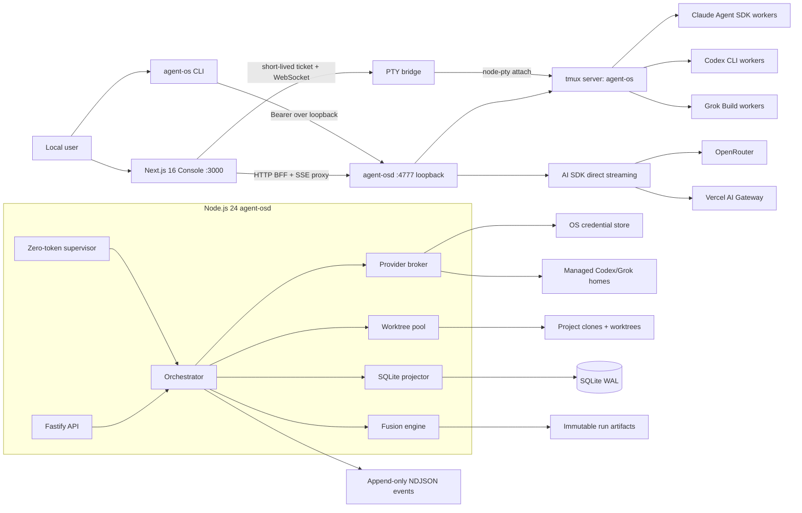
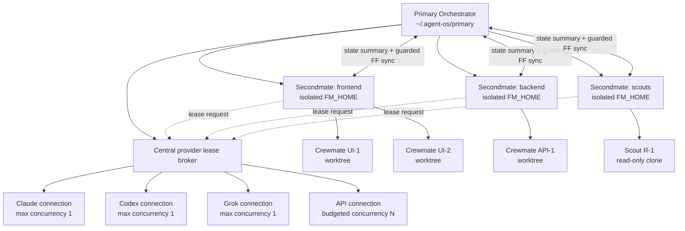

# Agent OS: Local-First Multi-Provider Orchestration Console

> **Superseded historical source.** Authoritative plan: `docs/plans/agent-os-master-plan.md` (current **[R9]**). Do not implement from this document. Marketing `/site` fold-in and related claims here are **void** — the product is local-only and has no marketing app.

## 0. Executive decision

Agent OS v1 will be a **single-user, local-only developer product**, not a hosted service. It will consist of:

1. `agent-osd`, a long-running **Node.js 24 LTS + strict TypeScript** daemon that owns process execution, provider leases, tmux sessions, worktrees, SQLite state, event projection, supervision, and fusion workflows.
2. `console`, the existing **Next.js 16 App Router + React 19 + Tailwind v4** application converted from marketing site to a localhost operations console.
3. `agent-os`, a thin local CLI for setup, doctor, daemon lifecycle, task dispatch, `/afk`, `/ahoy`, `/bearings`, `/stow`, and self-update.
4. A durable `~/.agent-os/` home containing SQLite projections, append-only event streams, run artifacts, isolated harness homes, logs, and project/worktree metadata. Secrets live in the operating-system credential store, never SQLite.

The daemon will use **Fastify 5.10.0**, **SQLite via better-sqlite3 13.0.1**, **tmux as the durable session backend**, **node-pty 1.1.0 only for browser terminal attachment**, **Server-Sent Events for typed semantic events**, and **WebSocket only for bidirectional PTY bytes**. Harness workers run in tmux and survive browser/daemon restarts. SQLite is a queryable projection; append-only NDJSON run logs and on-disk artifacts are the audit/recovery source.

The provider abstraction has a hard capability boundary:

- `SUBSCRIPTION_HARNESS`: Claude Max/Pro through Claude Agent SDK, ChatGPT through Codex CLI OAuth, and SuperGrok/X Premium+ through Grok Build OAuth. These credentials may only be consumed by the corresponding vendor harness process. They are never converted into generic API credentials.
- `DIRECT_API`: OpenRouter, Vercel AI Gateway, and explicit vendor API keys. These can perform normalized, streaming model calls for architect, fusion, and validator roles.

Cross-family validation is a scheduler invariant, not a preference. A task cannot enter BUILD if no validator from a different model family is healthy and quota-eligible.

## 1. Product definition

### 1.1 Product promise

The user tells one Orchestrator what outcome they want. Agent OS chooses healthy provider connections, dispatches clean-room agents into disposable git worktrees, fuses independent model perspectives, runs an independently authored acceptance gate, supervises execution without spending model tokens, and returns an evidence-backed PR, local merge, local change set, or scout report.

### 1.2 Personas

| Persona | Need | v1 outcome |
|---|---|---|
| Solo developer with paid AI subscriptions | Use existing Claude/ChatGPT/Grok entitlements without pretending they are API keys | Authenticated harness connections with visible health, quota state, serialized runners, and session terminals |
| Power user with API keys | Route planning/fusion/validation across many models and control spend | OpenRouter/Vercel connections, model catalog, per-role rules, budgets, token/cost analytics |
| Tech lead working across repositories | Delegate multiple changes without losing branch or session state | Projects, task board, pooled worktrees, PR/local-only modes, restart-proof session recovery |
| Researcher/reviewer | Ask multiple families, compare disagreement, and receive read-only findings | SCOUT, `/opinion`, plan fusion, consensus/divergence and attributed artifacts |

### 1.3 v1 definition

v1 is complete when one local user can:

- Register local git projects.
- Connect at least one subscription harness and one direct API provider.
- Dispatch SHIP and SCOUT tasks from web or CLI.
- Run two-model independent planning and a third-agent plan fusion.
- Enforce builder/validator family separation.
- Generate a gate before building, prove it RED on baseline, iterate corrections, and stop deterministically.
- Watch tmux-backed sessions live, restart daemon/console, and recover the same task state.
- Receive a local-only result or a prepared branch/PR with artifacts.
- Inspect usage, estimated/actual cost, health, quota blocks, consensus, divergence, and failure history.
- Operate exclusively on loopback with no Agent OS cloud account.

### 1.4 Explicit non-goals

- No multi-tenant SaaS, team account, remote subscription-token relay, or resale/sharing of personal entitlements.
- No Kubernetes, containers, remote runners, mobile client, visual workflow builder, plugin marketplace, vector database, or autonomous merge by default.
- No direct HTTP calls made with OAuth tokens extracted from Claude/Codex/Grok subscription caches.
- No attempt to normalize every harness transcript into a universal hidden chain-of-thought format.
- No Windows support in v1; target macOS 14+ and Linux with tmux 3.3+. Windows can follow with a different session backend.
- Future hosted Agent OS may accept **API-key/OIDC connections only**; subscription harness auth remains local and single-user.

## 2. Architecture

### 2.1 Component architecture



### 2.2 Process and session layout

```text
launchd/systemd
└── agent-osd (Node.js 24, one instance, ~/.agent-os/daemon.lock)
    ├── Fastify HTTP/SSE server 127.0.0.1:4777
    ├── provider lease broker
    ├── worktree pool manager
    ├── event projector + reconciliation loop
    ├── zero-token wake watcher
    └── tmux server (-L agent-os)
        ├── session primary
        │   ├── window liaison          orchestrator conversation
        │   ├── window task_01_arch_a   clean-room architect A
        │   ├── window task_01_arch_b   clean-room architect B
        │   ├── window task_01_fusion   plan-fusion agent
        │   ├── window task_01_gate     validator (artifact home, repo read-only)
        │   └── window task_01_build    builder (task worktree)
        └── session secondmate_ui
            ├── window liaison          domain orchestrator
            ├── window task_07_gate
            └── window task_07_build

next dev/start (separate process)
└── browser
    ├── SSE semantic stream
    └── WebSocket → node-pty → tmux attach (terminal only)
```

### 2.3 Cross-family task lifecycle

```mermaid
sequenceDiagram
    actor User
    participant O as Orchestrator
    participant A1 as Architect / Family A
    participant A2 as Architect / Family B
    participant F as Fusion / Family C
    participant V as Validator / Family V
    participant G as Gate runner
    participant B as Builder / Family Bld
    participant S as Zero-token supervisor

    User->>O: SHIP intent + project mode
    O->>O: Resolve dispatch; require Bld.family != V.family
    par Independent clean-room plans
      O->>A1: prompt.md + repository snapshot
      O->>A2: prompt.md + repository snapshot
    end
    A1-->>O: architect-a.md
    A2-->>O: architect-b.md
    O->>F: plans + fusion instruction
    F-->>O: fused-plan.md + consensus/divergence
    O->>V: Acceptance source + fused plan; repo read-only
    V-->>O: gate.py + gate-manifest.json
    O->>G: Run gate against untouched baseline
    G-->>O: RED with expected sentinel failures
    O->>B: Fused plan + worktree + gate contract
    loop At most maxValidationAttempts
      B-->>O: build checkpoint
      O->>G: Execute immutable gate
      alt PASS
        G-->>O: PASS evidence
        O->>O: no-mistakes/direct/local project-mode tail
      else Product failure
        G-->>O: Verbatim FAIL lines
        O->>B: Correct only reported failures
      else Suspected gate defect on configured attempt
        O->>V: Triage with evidence; builder cannot edit gate
        V-->>O: GATE_DEFECT patch or PRODUCT_DEFECT verdict
        O->>G: Re-prove revised gate RED on baseline
      end
      S-->>O: Wake on done/fail/wedge/quota/auth
    end
    O-->>User: Result, artifacts, attribution, evidence
```

Required invariants:

- Architect candidates never see one another before submitting.
- Role sessions are keyed by `{projectId, role, providerConnectionId, modelId}`. A transcript from one model is never replayed as another model's session.
- Validator has read-only repository access and write access only to its run artifact directory.
- Builder receives gate behavior and failure output but cannot modify validator artifacts.
- Baseline RED must contain one or more `EXPECTED_RED` checks named in `gate-manifest.json`; syntax errors, missing tools, or infrastructure failures are not valid RED.
- The final PASS must be from the same gate content hash that was proven RED, unless a validator repairs it and the new hash repeats baseline RED.

### 2.4 Fleet and secondmate topology



Secondmates own state, project clones, task queues, tmux sessions, and a session lock under `~/.agent-os/secondmates/<id>/`. They do not duplicate mutable subscription credential caches. They request a lease from the primary broker; the granted process receives the canonical `CODEX_HOME` or `GROK_HOME`, and only one process may use each cache at once. Version synchronization permits only signed/current-version **guarded fast-forwards** after clean-tree and ancestry checks; otherwise it emits `secondmate.sync.blocked` for human action.

## 3. Monorepo evolution

Use npm workspaces rather than adding another package manager. Require Node.js 24 LTS and npm 11; commit `package-lock.json`. Pin direct dependencies exactly during implementation and reject deprecated transitive packages in CI.

```text
.
├── apps/
│   ├── console/
│   │   ├── next.config.ts
│   │   ├── src/app/
│   │   │   ├── (console)/
│   │   │   │   ├── fleet/page.tsx
│   │   │   │   ├── projects/[projectId]/page.tsx
│   │   │   │   ├── tasks/page.tsx
│   │   │   │   ├── tasks/[taskId]/page.tsx
│   │   │   │   ├── fusion/[runId]/page.tsx
│   │   │   │   ├── providers/page.tsx
│   │   │   │   ├── analytics/page.tsx
│   │   │   │   └── settings/page.tsx
│   │   │   ├── site/                 # preserved marketing content
│   │   │   │   ├── page.tsx
│   │   │   │   ├── agents/page.tsx
│   │   │   │   ├── platform/page.tsx
│   │   │   │   └── ...
│   │   │   ├── api/                  # loopback BFF/SSE proxy
│   │   │   ├── layout.tsx
│   │   │   └── page.tsx              # redirect to /fleet
│   │   ├── src/components/
│   │   │   ├── console/
│   │   │   ├── terminal/
│   │   │   └── marketing/
│   │   └── tests/
│   │       ├── unit/
│   │       └── browser/
│   ├── daemon/
│   │   ├── src/
│   │   │   ├── main.ts
│   │   │   ├── api/
│   │   │   ├── auth/
│   │   │   ├── db/
│   │   │   ├── events/
│   │   │   ├── providers/
│   │   │   ├── fleet/
│   │   │   ├── fusion/
│   │   │   ├── worktrees/
│   │   │   ├── sessions/
│   │   │   ├── supervision/
│   │   │   └── recovery/
│   │   ├── migrations/
│   │   └── tests/
│   │       ├── integration/
│   │       └── fixtures/fake-harness/
│   └── cli/
│       ├── src/commands/
│       └── tests/
├── packages/
│   ├── contracts/                    # Zod schemas + inferred TS types
│   ├── provider-core/                # capabilities, selection, usage
│   ├── fusion-core/                  # role/state machine, no I/O
│   ├── event-store/                  # NDJSON writer + SQLite projector
│   └── test-gates/                   # deterministic gate protocol helpers
├── scripts/
│   ├── watch-session.sh              # zero-token tmux worker wrapper
│   └── verify-no-deprecated.mjs
├── docs/
│   ├── architecture/
│   ├── providers/
│   └── plans/
├── package.json
├── package-lock.json
└── tsconfig.base.json
```

Marketing treatment is deliberate: existing pages and visual components move under `/site/*` inside the same Next application, preserving them as product education without maintaining a second web build. Old public paths issue permanent redirects to `/site/...`; localhost `/` redirects to `/fleet`. Remove fictional metrics, pricing, contact promises, and “enterprise security” claims that are not true of v1. A future public marketing deployment can statically export the `/site` subtree, but that is not a v1 service.

## 4. Technology choices and dependency policy

| Area | Choice | Reason |
|---|---|---|
| Daemon runtime | Node.js 24 LTS, strict TypeScript | Same language/contracts as Next; mature child process, streams, filesystem, native add-ons |
| HTTP | Fastify `5.10.0`, `@fastify/websocket 11.3.0`, `@fastify/cors 11.3.0` | Maintained, typed, bounded schemas, lifecycle hooks, WS support |
| State | SQLite WAL through `better-sqlite3 13.0.1` | Single-writer local daemon, transactions, predictable recovery; avoid Node's still-release-candidate `node:sqlite` |
| Validation | Zod `4.4.3` | Runtime boundary validation with inferred types; no generated client required |
| Process execution | Node `child_process.spawn`; `node-pty 1.1.0` only for terminal attach | Native spawn is enough for workers; PTY is needed only for terminal fidelity |
| Session durability | tmux 3.3+ with dedicated socket `-L agent-os` | Survives daemon/browser restart and is inspectable outside UI |
| LLM API | AI SDK `7.0.37`; `@ai-sdk/openai-compatible 3.0.14` | One direct-streaming interface for Gateway/OpenRouter while retaining provider metadata |
| Claude worker | `@anthropic-ai/claude-agent-sdk 0.3.218` | Vendor-supported agent harness |
| Secrets | `@github/keytar 7.10.6` | Current maintained fork; OS Keychain/Secret Service/Credential Vault |
| Logging | Pino `10.3.1` with field redaction | Structured logs and explicit secret-field suppression |
| IDs | ULID `3.0.2` | Lexically sortable event/run IDs |
| Terminal UI | `@xterm/xterm 6.0.0`, `@xterm/addon-fit 0.11.0` | Browser terminal rendering |
| Tests | Vitest `4.1.10`, Playwright `1.61.1` | Current unit/integration and browser tests |

Versions above were queried from npm on 2026-07-24. Implementation must re-query before installation; if a listed version is deprecated or has a deprecated transitive dependency at install time, select the latest non-prerelease maintained replacement and record the decision. Gates:

```text
npm install emits zero "deprecated" warnings
npm query ':attr(deprecated)' returns []
npm audit --omit=dev has zero high/critical advisories
package-lock.json contains no package with a non-empty deprecated field
```

No `any`, explicit or implicit, is permitted. Set `strict`, `noImplicitAny`, `noUncheckedIndexedAccess`, `exactOptionalPropertyTypes`, and `useUnknownInCatchVariables`; ESLint rejects `@typescript-eslint/no-explicit-any`. Parse untrusted values as `unknown`, validate, then narrow.

## 5. Provider connection subsystem

### 5.1 Data model

```ts
type ConnectionKind = "SUBSCRIPTION_HARNESS" | "DIRECT_API";
type ProviderId = "anthropic-claude" | "openai-codex" | "xai-grok" | "openrouter" | "vercel-ai-gateway";
type ModelFamily = "anthropic" | "openai" | "xai" | "google" | "moonshot" | "meta" | "other";
type ConnectionHealth = "UNKNOWN" | "HEALTHY" | "DEGRADED" | "AUTH_REQUIRED" | "RATE_LIMITED" | "EXHAUSTED" | "OFFLINE";

interface ProviderConnection {
  id: string;
  providerId: ProviderId;
  kind: ConnectionKind;
  label: string;
  enabled: boolean;
  credentialRef: string;
  managedHome?: string;
  maxConcurrency: number;
  supportedRoles: readonly AgentRole[];
  models: readonly ModelDescriptor[];
  health: ConnectionHealth;
  quota: QuotaSnapshot;
  createdAt: string;
  updatedAt: string;
}

interface QuotaSnapshot {
  observedAt: string;
  source: "PROVIDER_HEADER" | "PROVIDER_API" | "HARNESS_OUTPUT" | "USER_LIMIT" | "UNKNOWN";
  remainingRequests?: number;
  remainingTokens?: number;
  resetsAt?: string;
  hardBudgetUsd?: number;
  spentUsd?: number;
  confidence: "EXACT" | "ESTIMATED" | "UNKNOWN";
}

interface UsageRecord {
  id: string;
  connectionId: string;
  taskId: string;
  runId: string;
  role: AgentRole;
  modelId: string;
  startedAt: string;
  finishedAt: string;
  inputTokens?: number;
  outputTokens?: number;
  cachedInputTokens?: number;
  providerCostUsd?: number;
  estimatedCostUsd?: number;
  metering: "PROVIDER_REPORTED" | "HARNESS_REPORTED" | "CATALOG_ESTIMATE" | "UNAVAILABLE";
}
```

Only metadata and `credentialRef` are in SQLite. Secret values reside under service `com.agent-os.provider`, account `<connectionId>` in the OS credential store. Codex/Grok mutable OAuth files remain in mode-`0700` managed homes; SQLite stores the path and hash/mtime health metadata, never file contents.

### 5.2 Provider adapter contracts

```ts
interface ProviderCapabilities {
  kind: ConnectionKind;
  canDirectStream: boolean;
  canSpawnHarness: boolean;
  supportsStructuredOutput: boolean;
  supportsToolUse: boolean;
  supportsPersistentSession: boolean;
  modelFamilies: readonly ModelFamily[];
}

interface SpawnContext {
  connection: ProviderConnection;
  taskId: string;
  runId: string;
  role: AgentRole;
  cwd: string;
  artifactDir: string;
  promptPath: string;
  sessionName: string;
}

interface HarnessAdapter {
  readonly providerId: ProviderId;
  capabilities(): ProviderCapabilities;
  probe(connection: ProviderConnection, signal: AbortSignal): Promise<HealthProbe>;
  buildSpawnSpec(context: SpawnContext): Promise<SpawnSpec>;
  parseEvent(line: string): HarnessEvent | undefined;
  extractUsage(events: readonly HarnessEvent[]): UsageDelta;
}

interface DirectModelAdapter {
  readonly providerId: ProviderId;
  capabilities(): ProviderCapabilities;
  probe(connection: ProviderConnection, signal: AbortSignal): Promise<HealthProbe>;
  stream(request: DirectModelRequest, signal: AbortSignal): AsyncIterable<DirectModelEvent>;
}

interface SpawnSpec {
  command: string;
  args: readonly string[];
  cwd: string;
  env: Readonly<Record<string, string>>;
  unsetEnv: readonly string[];
}
```

No generic `generate()` exists on subscription adapters. This prevents accidental use of personal OAuth as a direct API bearer.

### 5.3 Claude Max/Pro connection

Auth flow:

1. Preflight `claude --version` and SDK compatibility.
2. UI shows: run `claude setup-token` in an embedded, user-visible setup terminal.
3. The command prints a long-lived token; Agent OS captures it only after explicit confirmation and stores it in keychain as `CLAUDE_CODE_OAUTH_TOKEN`. It is not written to `.env`.
4. Probe by spawning a minimal Claude Agent SDK query with a process-local environment.

Spawn environment is built from an allowlist, not `{...process.env}`. Explicitly remove `ANTHROPIC_API_KEY`, `ANTHROPIC_AUTH_TOKEN`, `ANTHROPIC_BASE_URL`, and unrelated provider keys; then inject only `CLAUDE_CODE_OAUTH_TOKEN`. `ANTHROPIC_API_KEY` wins in non-interactive Claude execution when present, so omission is a security and billing invariant. Do not pass `--bare`, because current Claude authentication documentation says bare mode does not read `CLAUDE_CODE_OAUTH_TOKEN`.

The UI warns: subscription token usage is personal, subject to Anthropic terms, approximately one-year-lived per product assumption, and only supported on this user's machine. The product never copies it to secondmate homes or remote services.

### 5.4 Codex/ChatGPT connection

Auth flow:

- Interactive: `codex login`
- Headless: `codex login --device-auth`
- Health: `codex login status`

Create `~/.agent-os/providers/<connectionId>/codex/` mode `0700` and set `CODEX_HOME` to it. Configure `cli_auth_credentials_store = "file"` for this managed, serialized runner so refresh behavior is observable and durable; `auth.json` must be mode `0600`. The broker grants a **max-concurrency-one lease per auth file**. It never seeds the file again after creation; every Codex run may refresh it in place, and the refreshed file is preserved. On mtime/hash change, emit `provider.credential_refreshed` without reading tokens into logs.

If the user elects OS keyring storage instead, Agent OS marks the connection `EXTERNAL_HOME` and does not promise movable/recoverable auth. v1 defaults to managed file storage because the official automation guidance requires preserving the refreshed `auth.json`.

Spawn env removes `OPENAI_API_KEY`, `OPENAI_BASE_URL`, `AZURE_OPENAI_API_KEY`, and other provider keys unless this connection is explicitly API-key mode. OAuth and API-key Codex connections are distinct records.

### 5.5 Grok Build connection

Current official command is `grok login`; headless is `grok login --device-auth`. The brief's `grok auth login` appears to describe an earlier CLI shape. The adapter must inspect `grok --help` and use `grok auth login` only if that installed binary advertises it. Never guess.

Use `~/.agent-os/providers/<connectionId>/grok/` with `GROK_HOME` set to it; preserve `auth.json` mode `0600`. Current official docs describe background refresh through the stored refresh token, while older shell docs describe a seven-day token expiry. Agent OS treats seven days as the conservative nominal expiry, checks file metadata and a no-op probe daily, and relies on the CLI—not Agent OS—to refresh. One lease per mutable auth cache.

For OAuth spawn, remove `XAI_API_KEY`, `GROK_MODELS_BASE_URL`, and per-model API-key env vars so the intended session token wins. For an explicit xAI API connection, inject only `XAI_API_KEY`; that is a `DIRECT_API` record and not a SuperGrok subscription connection.

### 5.6 OpenRouter connection

- Input: OpenRouter API key stored in keychain.
- Base URL: `https://openrouter.ai/api/v1`.
- Auth: process-local `OPENROUTER_API_KEY`.
- Health: authenticated key/credits endpoint plus a model catalog refresh.
- Metering: prefer generation response usage/cost and provider endpoints; otherwise calculate from a timestamped model-price snapshot and mark `CATALOG_ESTIMATE`.
- Models retain both upstream family and route/provider metadata so “OpenRouter” is not mistaken for a model family.

### 5.7 Vercel AI Gateway connection

- Input: `AI_GATEWAY_API_KEY` stored in keychain.
- Use AI SDK model strings directly, including `moonshotai/kimi-k3` and `anthropic/claude-fable-5`.
- Health: list/perform a minimal configured model call, then cache catalog/routing metadata.
- BYOK is represented as Gateway connection settings and explicit provider credential references; request-scoped BYOK secrets are resolved from keychain just before a call.
- Meter provider-reported usage and Gateway cost fields. The UI distinguishes Gateway credits from BYOK cost and warns that failed BYOK may fall back to Gateway system credentials if configured.

### 5.8 Environment hygiene

Every process launch follows:

1. Start from `SAFE_BASE_ENV`: `PATH`, `HOME` (or managed harness home), locale, terminal fields, git identity fields approved by user, and Agent OS run identifiers.
2. Delete every known AI credential and proxy variable.
3. Add only variables declared by the selected adapter.
4. Write a redacted env manifest containing keys and value hashes, never values.
5. Spawn without a shell (`spawn(command, args, { shell: false })`) unless the command is the audited watcher script.
6. Validate cwd is the allocated worktree/artifact directory and cannot escape allowed roots.
7. On exit, release the provider lease and record usage.

Tests inject conflicting fake credentials and prove the child sees only the selected connection.

### 5.9 Health, quota, and cost

- Startup probe; scheduled probes every 15 minutes with exponential backoff; immediate probe after auth and after 401/403/429.
- Health is a finite state with reason code, last success, next retry, latency, CLI version, and remediation action.
- Scheduler excludes `AUTH_REQUIRED`, `EXHAUSTED`, and `OFFLINE`; it may use `DEGRADED` only when the dispatch profile allows fallback.
- Subscription quotas are often opaque. Parse documented harness usage/rate-limit events where available; otherwise show `UNKNOWN`, never fabricate remaining tokens or subscription “cost”.
- API calls store exact provider usage/cost when returned; estimates include price snapshot ID and confidence.
- Per-connection soft/hard USD budgets and concurrency limits are enforced before lease grant. A hard budget pauses, never silently reroutes to a more expensive connection.

## 6. Fleet orchestration

### 6.1 Orchestrator and task shapes

The Orchestrator is the sole liaison. It converts user intent into a typed `TaskSpec`, asks only blocking questions, selects a dispatch profile, and advances a persisted state machine.

```ts
type TaskShape = "SHIP" | "SCOUT";
type ProjectMode = "NO_MISTAKES" | "DIRECT_PR" | "LOCAL_ONLY";
type Autonomy = "SUPERVISED" | "YOLO";

interface TaskSpec {
  id: string;
  projectId: string;
  shape: TaskShape;
  mode: ProjectMode;
  autonomy: Autonomy;
  intent: string;
  acceptanceSource: string;
  dispatchProfileId: string;
  maxValidationAttempts: number;
  requestedAt: string;
}
```

- **SHIP** allocates a writable worktree and ends in:
  - `NO_MISTAKES`: invoke the repository's no-mistakes gate and hand back at CI-ready.
  - `DIRECT_PR`: run configured checks, commit/push/open PR.
  - `LOCAL_ONLY`: leave a verified branch/worktree and never push.
- **SCOUT** gets a clean read-only clone/worktree, cannot obtain write-capable tools, and produces `report.md`, evidence links, and optional follow-up task proposals.
- `+yolo` permits autonomous correction, commit, push, and PR creation only within selected project mode. It never permits secret export, force push, merge, destructive git operations, skipping validation, or converting SCOUT to SHIP.

### 6.2 Worktree pooling

Per project, maintain a configurable warm pool (default two) under `~/.agent-os/projects/<projectId>/worktrees/`. Pool entries are stateful: `WARM_CLEAN`, `LEASED`, `QUARANTINED`, `RECLAIMING`.

Allocation transaction:

1. Acquire project lock.
2. Fetch only if project policy allows network.
3. Verify main clone has no unexpected changes and chosen base ref exists.
4. Lease a warm worktree or create one with `git worktree add`.
5. Create `agent-os/<taskId>-<slug>` from the resolved base SHA.
6. Write lease metadata and release project lock.

Reclaim only after task artifacts and final SHA are durable. Verify no untracked/staged/uncommitted work; dirty or failed worktrees become `QUARANTINED`, never reset automatically. `git clean -fdx`, hard reset, force push, and branch deletion require explicit policy/confirmation.

### 6.3 Sessions and worker protocol

Each worker receives:

- `prompt.md`
- `role.json`
- `tool-policy.json`
- repository/worktree path
- artifact output contract
- event FIFO/path
- isolated `HOME` containing only role-approved config

The worker wrapper runs inside a named tmux window, captures pane output to a bounded log, and appends structured events to `events.ndjson`. Clean-room means no Cursor skills, shell history, unrelated MCP configuration, prior agent transcripts, or parent hidden context. The prompt contains only explicit task material and approved repository evidence.

### 6.4 Zero-token supervisor

`scripts/watch-session.sh` is deterministic shell glue around a harness process. It:

- emits `worker.started`, heartbeats, structured harness events, exit status, and artifact hashes;
- never calls a model;
- writes one complete NDJSON record via append+fsync and touches `wake/<taskId>`;
- captures the last bounded terminal activity timestamp.

The daemon watches `wake/` with `fs.watch` and runs a two-second reconciliation scan to heal missed filesystem notifications. It projects events into SQLite and classifies wakes:

| Wake class | Trigger | Action |
|---|---|---|
| `PROGRESS` | heartbeat/tool/artifact update | Update state/UI; no model call |
| `COMPLETED` | valid terminal state + required artifact | Advance workflow |
| `CORRECTABLE_FAILURE` | gate FAIL, process nonzero, test failure | Route exact evidence to owner role |
| `AUTH_OR_QUOTA` | 401/403/429, auth prompt, budget block | Pause; update provider; notify user |
| `STALE` | no activity for role threshold | Send deterministic ping or inspect process tree |
| `WEDGED` | two stale checks, no CPU/output, blocked prompt | Escalate to Orchestrator; never kill silently |
| `SECURITY` | path escape, forbidden env/tool/write | Terminate worker; quarantine worktree |

Cadence defaults: heartbeat 30s; stale after 5m for API roles and 12m for build roles; deterministic ping at first stale; pane/process inspection at second; user escalation at third. Per-role values are settings.

### 6.5 Secondmates and fleet bearings

A secondmate is a persistent domain orchestrator with:

- isolated `FM_HOME`, SQLite projection, event log, tmux session, project clone, and lock;
- a declared project/domain routing rule and capacity;
- a version and schema compatibility report;
- no direct secret value access; provider leases are granted by the primary broker.

Primary routing uses project ownership first, then domain rule, capacity, health, and locality. `/bearings` reads structured summaries, never scrapes prose: active task, phase, worker, last event, blocker, branch, worktree, provider lease, and ETA confidence.

### 6.6 Restart recovery

On daemon boot:

1. Acquire `daemon.lock`; refuse a second writer.
2. Open SQLite, run checksum-verified forward-only migrations, and integrity-check.
3. Replay NDJSON events after each projection cursor.
4. List tmux sessions/windows on the dedicated socket.
5. Reconcile DB workers to live PIDs/tmux windows and provider leases.
6. Mark vanished workers `INTERRUPTED`; adopt matching live workers.
7. Validate worktree leases against `git worktree list --porcelain`.
8. Resume deterministic workflow transitions; do not resend model prompts if an artifact/terminal event already exists.
9. Emit a recovery report visible through `/ahoy`.

Idempotency keys on dispatch and transitions prevent duplicate workers after crashes.

### 6.7 Skills

- `/afk [duration]`: switch notifications/escalation policy, continue zero-token supervision, stop at policy boundaries.
- `/ahoy`: summarize events since user's last acknowledged cursor.
- `/bearings`: fleet/project/task state report from structured projections.
- `/stow`: flush artifacts, summarize approved durable learnings into project-local markdown, and checkpoint event cursors; never write secrets.
- `agent-os update`: fetch signed release metadata, verify checksum/signature, ensure no active incompatible tasks, install, migrate, restart, reconcile; rollback binary on failed health check. No self-modifying source checkout in v1.

## 7. Fusion engine

### 7.1 Roles

```ts
type AgentRole = "ORCHESTRATOR" | "ARCHITECT" | "BUILDER" | "FUSION" | "VALIDATOR" | "SCOUT";

interface RoleAssignment {
  role: AgentRole;
  connectionId: string;
  modelId: string;
  family: ModelFamily;
  effort: "LOW" | "MEDIUM" | "HIGH";
  cleanRoom: boolean;
}
```

- ARCHITECT: independent design/plan candidate.
- BUILDER: modifies only its leased worktree.
- FUSION: merges candidate artifacts and preserves attribution.
- VALIDATOR: writes/repairs the acceptance gate, never production code.
- SCOUT: investigates read-only.

### 7.2 Dispatch profiles

Profiles are ordered natural-language predicates compiled to a typed rule list. Example:

```yaml
id: cross-family-default
rules:
  - when: "task touches UI"
    architect: ["anthropic/*", "openai/*"]
    builder: ["anthropic/*"]
    validator: ["openai/*", "google/*"]
    fusion: ["moonshot/*", "openai/*"]
    effort: high
  - when: "task is TypeScript backend"
    architect: ["openai/*", "anthropic/*"]
    builder: ["openai/*"]
    validator: ["anthropic/*", "xai/*"]
    fusion: ["anthropic/*"]
    effort: high
```

The rule evaluator produces an explanation trace. Selection filters by role capability, health, quota, budget, context requirement, project policy, and concurrency, then scores preference order and recent reliability.

Hard family rules:

- `builder.family !== validator.family`.
- Plan candidates contain at least two distinct families.
- Fusion should be a third family when available; otherwise it may match one planning family but must disclose this.
- Validator fallback cannot cross the invariant by choosing another model from the builder's provider/family.
- Provider aggregator is not family: `anthropic/...` through Vercel is still `anthropic`.
- If constraints cannot be met, task enters `BLOCKED_DISPATCH` with actionable connection choices.

### 7.3 `/opinion`

1. Resolve two healthy models from distinct families.
2. Send identical explicit context in parallel, clean-room.
3. Stream each into a separate UI column.
4. Persist `opinion-a.md`, `opinion-b.md`, timing, usage, cost, model, connection, and prompt hash.
5. Do not synthesize unless user requests; show side-by-side answer, shared claims, and raw differences generated by deterministic text comparison plus optional FUSION analysis.

### 7.4 `/fusion`

1. ARCHITECT and BUILDER-design role run independently with full role-approved tools.
2. FUSION receives their final artifacts, source labels, fusion instruction, and acceptance source—never hidden transcripts.
3. Output schema:
   - `Fused answer`
   - `Consensus`
   - `Divergence`
   - `Decisions and rationale`
   - inline `[ARCHITECT]`, `[BUILDER]`, `[FUSION]` attribution spans
   - unresolved questions.
4. Validate every attributed segment references an existing source artifact. Unattributed new synthesis is `[FUSION]`.

### 7.5 Plan fusion

Default SHIP planning is `N=2`, configurable to 3:

1. Freeze `prompt.md`, repository manifest, acceptance source, and context budget.
2. Run each family independently.
3. Require each plan to declare assumptions, architecture, migration, acceptance gates, and risks.
4. FUSION receives normalized plan artifacts and a task-specific merge instruction.
5. FUSION must choose conflicts explicitly rather than averaging them; it outputs a decision ledger mapping each major decision to source(s).
6. Optional validator performs a plan-completeness schema check before build.
7. Persist `fused-plan.md`; that exact hash becomes builder input.

### 7.6 Auto-validation

Gate protocol:

- Validator writes executable `gate.py` plus `gate-manifest.json`; Python is chosen because it can orchestrate repository-native commands without coupling the gate to the app's dependency graph.
- Manifest names acceptance criteria, expected baseline failures, timeout, required tools, read/write paths, and output parser.
- Gate output is line-oriented:
  - `PASS <criterion-id> <message>`
  - `FAIL <criterion-id> <message>`
  - `GATE_ERROR <code> <message>`
- Baseline must exit nonzero with all named `EXPECTED_RED` criteria failing for product reasons and no `GATE_ERROR`.
- Build attempts default to 3. After attempt 2, validator triages repeated or contradictory failures.
- Only validator can declare `GATE_DEFECT` and patch gate artifacts. Every patch increments gate revision, records a diff, and re-proves baseline RED.
- Builder receives verbatim FAIL lines and referenced non-secret logs. No lossy summary replaces them.
- Max attempts halt with `VALIDATION_EXHAUSTED`; +yolo does not override.
- Final result includes baseline RED evidence, each validation run, corrections, gate revisions, and final PASS/FAIL.

### 7.7 Artifact schema

```text
~/.agent-os/runs/<runId>/
├── run.json
├── prompt.md
├── context-manifest.json
├── assignments.json
├── events.ndjson
├── agents/
│   ├── architect-anthropic.md
│   ├── architect-openai.md
│   ├── builder.md
│   ├── fusion.md
│   └── validator.md
├── fusion/
│   ├── fused-plan.md
│   ├── attribution.json
│   └── consensus-divergence.json
├── gate/
│   ├── gate.py
│   ├── gate-manifest.json
│   ├── revisions/
│   └── baseline-red.log
├── validation/
│   ├── attempt-01.log
│   └── final.log
├── usage.ndjson
└── summary.json
```

Artifacts are write-once by phase. `summary.json` references SHA-256 hashes, assignment IDs, source artifact spans, final state, git SHA, and evidence. Sensitive terminal logs pass through redaction before durable storage; raw secret-bearing setup terminals are not recorded.

## 8. Console UI

### 8.1 Information architecture

- `/fleet`: overall health, active tasks, secondmates, provider pressure, wake queue.
- `/projects`: registered repositories, policies, worktree capacity, branch/remote status.
- `/tasks`: Kanban/list with SHIP/SCOUT, phase, blocker, mode, autonomy.
- `/tasks/[id]`: task intent, lifecycle, live role streams, terminal, gate attempts, artifacts.
- `/fusion/[runId]`: source columns, fused result, attribution, consensus/divergence, usage.
- `/providers`: connection setup, health, models, quota, costs, test/re-auth.
- `/analytics`: usage/cost by connection/model/role/project/task, estimate confidence.
- `/settings`: daemon/session/project defaults, dispatch profiles, limits, notifications, data controls.

Server Components render initial projections. Client components subscribe to one SSE stream and patch a normalized store. Terminal mounts only when requested, obtains a 60-second single-use WS ticket, and disconnects when hidden.

### 8.2 Fleet Dashboard wireframe

```text
┌ Agent OS ─ Fleet ─ Projects ─ Tasks ─ Fusion ─ Providers ─ Analytics ─ ⚙ ┐
│ FLEET                                            ● daemon healthy  12:48 │
│ ┌ Active 6 ┐ ┌ Waiting 2 ┐ ┌ Providers 4/5 ┐ ┌ Today $18.42 est. ┐     │
│                                                                        │
│ ACTIVE TASKS                         SECOND MATES                       │
│ ┌─────────────────────────────────┐  ┌ frontend ─ healthy ─ 2/3 ┐      │
│ │ UI-184  SHIP  VALIDATING  72%   │  │ task UI-184 / claude      │      │
│ │ Builder Anthropic ↔ Validator OA│  └───────────────────────────┘      │
│ │ gate attempt 2/3  last 18s      │  ┌ backend ─ attention ─ 1/2┐      │
│ └─────────────────────────────────┘  │ auth required: Codex       │      │
│ ┌─────────────────────────────────┐  └───────────────────────────┘      │
│ │ R-22  SCOUT  RESEARCHING        │                                    │
│ └─────────────────────────────────┘  PROVIDER PRESSURE                  │
│                                      Claude ███████░ 1 lease / ? quota │
│ WAKE QUEUE                           Codex  AUTH REQUIRED               │
│ 12:47 gate.failed UI-184             Grok   ██░░░░░░ healthy            │
│ 12:46 worker.progress R-22           Vercel $12.10 / $25 hard          │
└────────────────────────────────────────────────────────────────────────┘
```

Primary actions: New task, pause dispatch, `/afk`, `/bearings`. Red is reserved for security/auth/hard failures; unknown quota is shown as `?`, not a green status.

### 8.3 Task Detail with live fusion columns

```text
┌ UI-184 · Replace settings navigation                 SHIP / NO_MISTAKES ┐
│ PLAN ✓  GATE RED ✓  BUILD ●  VALIDATE  PR   [Pause] [Open terminal]     │
├──────────────────────┬──────────────────────┬───────────────────────────┤
│ ARCHITECT · Anthropic│ ARCHITECT · OpenAI   │ FUSED PLAN · Moonshot     │
│ 42s · 18k tok · sub  │ 37s · 12k · $0.44   │ 19s · 8k · $0.21          │
│                      │                      │                           │
│ Proposes route group │ Proposes shell split │ DECISION: preserve App    │
│ and SSE store...     │ and daemon BFF...   │ Router; split daemon...   │
│                      │                      │ [A] route ownership        │
│                      │                      │ [B] token boundary         │
├──────────────────────┴──────────────────────┴───────────────────────────┤
│ VALIDATION  attempt 2/3                                                 │
│ FAIL AC-UI-03 mobile navigation traps focus  [verbatim]                 │
│ Builder correcting…  last output 8s                 [View gate evidence]│
├──────────────────────────────────────────────────────────────────────────┤
│ Timeline · Artifacts · Git diff · Usage · Terminal                       │
└──────────────────────────────────────────────────────────────────────────┘
```

Columns stream independently without jumping scroll position. Every status has a timestamp/source. User can inspect raw artifact, but not hidden reasoning.

### 8.4 Provider Connections wireframe

```text
┌ PROVIDER CONNECTIONS                                      [+ Connect]   ┐
│ Harness subscriptions                 Direct APIs                       │
│ ┌ Claude Max ─ HEALTHY ─ 1/1 lease ┐  ┌ Vercel Gateway ─ HEALTHY ┐      │
│ │ Claude Agent SDK 0.3.218          │  │ 24 models · $12/$25      │      │
│ │ token age 41d · quota unknown     │  │ last probe 22ms           │      │
│ │ [Test] [Rotate token] [Disable]   │  │ [Models] [Budget] [Test]  │      │
│ └───────────────────────────────────┘  └───────────────────────────┘      │
│ ┌ Codex ChatGPT ─ AUTH REQUIRED ───┐  ┌ OpenRouter ─ DEGRADED ────┐     │
│ │ auth.json last refresh 9d        │  │ 429; retry 12:56           │     │
│ │ [codex login --device-auth]      │  │ $3.20 actual today         │     │
│ └───────────────────────────────────┘  └───────────────────────────┘      │
│                                                                          │
│ ⚠ Subscription connections are personal and local-only. Never shared.   │
└──────────────────────────────────────────────────────────────────────────┘
```

Connection wizard always shows kind, billing source, exact command, credential location, concurrency, family/capability, ToS warning, and a test result before save.

### 8.5 Fusion Run wireframe

```text
┌ FUSION RUN 01J...   plan-fusion   COMPLETE   3 families   $0.91 + subs ┐
│ [Fused result] [Sources] [Consensus & Divergence] [Attribution] [JSON]  │
│                                                                          │
│ CONSENSUS (5)                         DIVERGENCE (2)                      │
│ ✓ Separate Node daemon                Session transport                  │
│ ✓ SQLite projection + event logs      A: all WS  B: SSE + PTY WS         │
│ ✓ tmux persistence                    FUSION: SSE + PTY WS — lower risk   │
│                                                                          │
│ FUSED RESULT                                                             │
│ Keep Next.js as the UI [A][B]. Run orchestration in a dedicated Node     │
│ daemon [A]. Use SSE for semantic events [F] and WS only for PTY [B]...   │
│                                                                          │
│ Latency  A 42s | B 37s | F 19s     Tokens 38k     Cost confidence 83%    │
└──────────────────────────────────────────────────────────────────────────┘
```

Clicking `[A]` highlights exact source spans. Divergence records chosen option, rejecting rationale, and who decided.

### 8.6 Settings wireframe

```text
┌ SETTINGS                                                                ┐
│ General | Dispatch | Supervision | Git & PR | Storage | Security         │
│                                                                          │
│ DAEMON   bind 127.0.0.1:4777   [healthy]                                 │
│ SESSIONS tmux socket agent-os   max workers [ 8 ]                        │
│ WORKTREES warm/project [ 2 ]    quarantine dirty [✓]                     │
│                                                                          │
│ CROSS-FAMILY POLICY                                                      │
│ [✓] Builder and validator must differ     max attempts [3]               │
│ Plan families [2]   Prefer third-family fusion [✓]                       │
│ [Edit dispatch profile] [Validate profile]                               │
│                                                                          │
│ SUPERVISION heartbeat 30s  stale build 12m  escalation 3 checks          │
│ DESTRUCTIVE GIT  force push [never]  auto-merge [never]                  │
│                                                                          │
│ [Save]  Changes are validated before activation                          │
└──────────────────────────────────────────────────────────────────────────┘
```

Invalid profiles show exactly which roles/families cannot be satisfied before activation.

## 9. Console ↔ daemon API

### 9.1 Transport and authentication

- Daemon binds only `127.0.0.1:4777`; non-loopback bind is rejected in v1.
- A random 256-bit daemon token is generated on first run and stored in OS credential storage.
- Next Route Handlers act as BFF for REST and SSE and attach the token server-side. The browser never receives it.
- Terminal uses a daemon-minted, single-use, scope-limited ticket (`sessionId`, `cols`, `rows`, expiry ≤60s); exact Console origin is required.
- Mutations require `Idempotency-Key`; API errors use typed codes and never include raw child env/output secrets.

### 9.2 Routes

| Method | Route | Request/response |
|---|---|---|
| GET | `/v1/status` | `DaemonStatus` |
| GET/POST | `/v1/projects` | `Project[]` / `CreateProjectInput → Project` |
| GET/PATCH | `/v1/projects/:id` | project detail/policy |
| GET/POST | `/v1/tasks` | filters / `CreateTaskInput → Task` |
| GET | `/v1/tasks/:id` | `TaskDetail` |
| POST | `/v1/tasks/:id/actions` | pause/resume/cancel/retry/approve |
| GET | `/v1/tasks/:id/artifacts` | artifact manifest, no arbitrary path input |
| GET/POST | `/v1/providers` | metadata / create connection |
| POST | `/v1/providers/:id/auth-session` | visible setup terminal descriptor |
| POST | `/v1/providers/:id/probe` | `HealthProbe` |
| GET/PATCH | `/v1/dispatch-profiles` | typed profiles |
| POST | `/v1/fusion/opinion` | start opinion run |
| POST | `/v1/fusion/runs` | start plan/answer fusion |
| GET | `/v1/fusion/runs/:id` | result + attribution |
| GET | `/v1/analytics/usage` | bucketed usage/cost |
| GET | `/v1/fleet/bearings` | primary + secondmate summaries |
| POST | `/v1/sessions/:id/ticket` | one-use PTY ticket |
| GET | `/v1/events?cursor=` | SSE replay then live |
| WS | `/v1/terminal/:sessionId?ticket=` | binary/text PTY frames |

All path params use generated Next `RouteContext` types where applicable. Route handlers are dynamic; no Console operational response is cached.

### 9.3 Event contract

```ts
type EventPayloadByType = {
  "task.state.changed": { taskId: string; from: TaskState; to: TaskState; reason?: string };
  "worker.output": { taskId: string; workerId: string; sequence: number; text: string };
  "worker.wake": { taskId: string; workerId: string; classification: WakeClass };
  "provider.health.changed": { connectionId: string; health: ConnectionHealth; reasonCode: string };
  "provider.usage.recorded": { connectionId: string; usageRecordId: string };
  "fusion.artifact.ready": { runId: string; artifactId: string; sha256: string };
  "validation.attempt.finished": { taskId: string; attempt: number; result: "PASS" | "FAIL" | "GATE_ERROR" };
  "fleet.secondmate.changed": { secondmateId: string; state: SecondmateState };
};

type AgentOsEvent<T extends keyof EventPayloadByType = keyof EventPayloadByType> = {
  id: string;
  type: T;
  occurredAt: string;
  aggregateId: string;
  aggregateVersion: number;
  payload: EventPayloadByType[T];
};
```

SSE `id` is the event ULID. Reconnect sends `Last-Event-ID`; daemon replays from the durable event log/projection. If retention no longer covers the cursor, return `409 CURSOR_EXPIRED` and the Console refetches snapshots.

## 10. Data and state on disk

```text
~/.agent-os/
├── config.json                         # non-secret, schema-versioned
├── agent-os.sqlite3                    # WAL projection
├── agent-os.sqlite3-wal
├── daemon.lock
├── logs/daemon.ndjson
├── events/
│   ├── primary.ndjson
│   └── secondmate-<id>.ndjson
├── providers/<connectionId>/
│   ├── codex/{auth.json,config.toml}
│   └── grok/{auth.json,config.toml}
├── projects/<projectId>/
│   ├── clone/
│   ├── worktrees/
│   ├── leases/
│   └── quarantine/
├── runs/<runId>/...
└── secondmates/<id>/
    ├── config.json
    ├── state.sqlite3
    ├── events.ndjson
    └── projects/
```

Permissions: home/provider/run directories `0700`, OAuth files `0600`, non-secret artifacts default `0600`. A startup permissions audit blocks use of over-broad credential files.

SQLite tables:

- `schema_migrations`
- `projects`, `project_policies`
- `tasks`, `task_transitions`
- `workers`, `sessions`, `provider_leases`
- `provider_connections`, `provider_models`, `provider_health_samples`
- `usage_records`, `price_snapshots`, `budgets`
- `worktrees`, `worktree_leases`
- `fusion_runs`, `role_assignments`, `artifacts`, `attribution_spans`
- `validation_attempts`, `gate_revisions`
- `secondmates`, `secondmate_bearings`
- `event_projection_cursors`, `idempotency_keys`
- `user_ack_cursors`

JSON columns are validated at read/write boundaries with versioned Zod schemas. Migrations are forward-only SQL files with checksum; before migration, daemon checkpoints WAL and creates a timestamped local backup. Event NDJSON uses one record per line, append+fsync, monotonic aggregate versions, and SHA-256 artifact references. SQLite transactions enforce legal state transitions and unique active leases.

## 11. Security model

### 11.1 Trust boundary

The user and registered local repositories are trusted inputs; model output, repository scripts, provider responses, browser requests, artifact paths, and child output are untrusted. v1 provides process/worktree isolation, not a hardened hostile-code sandbox. This limitation is shown during onboarding and SHIP confirmation.

### 11.2 Controls

- Loopback only; random daemon bearer; exact origin; single-use terminal tickets; no telemetry by default.
- Keychain-backed secret values; mutable OAuth caches mode-restricted; no secrets in SQLite, task prompts, events, artifacts, crash reports, or URLs.
- Pino redaction for known key names and token patterns; setup terminals are live-only and excluded from scrollback recording.
- Spawn allowlist and environment denylist; `shell: false`; absolute executable resolution recorded at connection setup.
- Repository path is canonicalized; symlink/path traversal checks on every artifact/file API.
- Role tool policies: validator repo read-only, scout read-only, fusion artifacts-only, builder one worktree, orchestrator no arbitrary production writes.
- Git guardrails: no force push, hard reset, clean, merge, branch deletion, or credential-helper mutation without explicit permitted action; +yolo does not weaken these.
- Process limits: timeout, output cap, max descendants, max concurrent workers, cancellation grace then SIGTERM/SIGKILL with event record.
- Artifact content security: render markdown as escaped/sanitized content; never execute HTML/scripts; terminal escape handling delegated to xterm with link opening disabled by default.
- Dependency gate: lockfile, provenance where available, zero deprecated metadata, audit, license allowlist, and scheduled update PRs.
- Provider ToS boundary: subscription auth remains local, personal, and harness-only. Export/remote mode rejects those connection IDs.
- Backups omit credential homes by default; encrypted export of non-secret state only in v1.

### 11.3 Guarded writes

Every write-capable role receives an allowlist root and write intent. File operations outside the worktree/run artifact roots trigger `SECURITY`. PR creation, push, and local merge are separate capabilities. A model cannot expand its own capability file. Human approvals are durable events with action hash and expiry.

## 12. Delivery roadmap and executable acceptance

Each phase is a vertical, gateable increment. Do not begin the next phase until all current gates pass.

### Phase 0 — Repository and architecture baseline

Deliver:

- npm-workspace monorepo; move current app to `apps/console`.
- Strict shared TypeScript configuration and contracts package.
- Preserve marketing at `/site`, Console shell at `/fleet`.
- Dependency and deprecation guard.

Gates:

- `npm ci`, typecheck, lint, and current marketing smoke tests pass.
- A scanner finds zero explicit/implicit TypeScript `any`.
- `npm query ':attr(deprecated)'` is empty and install emits no deprecated warnings.
- `/` redirects to `/fleet`; `/site` renders preserved marketing; old public routes redirect.
- No fictional pricing/contact action is presented as a functioning product service.

### Phase 1 — Daemon, persistence, and live Console

Deliver:

- Fastify daemon, loopback auth, SQLite migrations, append-only events, SSE.
- Project registration and Fleet/Projects shell.
- launchd and systemd service templates; CLI doctor/start/stop.

Gates:

- Non-loopback bind configuration is rejected.
- Unauthorized requests return 401; valid BFF requests succeed without exposing daemon token to browser JS.
- Kill/restart daemon after 100 events; SQLite projection and SSE resume produce exactly one copy of each event.
- Corrupt/truncated final NDJSON line is quarantined without losing prior records.
- Browser Fleet status updates through SSE within 500ms locally.

### Phase 2 — Provider connections

Deliver:

- Keychain integration and metadata model.
- Claude, Codex, Grok harness adapters.
- OpenRouter and Vercel direct adapters.
- Health, leases, quotas, usage, budget UI.

Gates:

- Fake child with polluted parent env sees only selected provider variables.
- Claude OAuth process cannot see `ANTHROPIC_API_KEY`.
- Two simultaneous Codex lease requests serialize; refreshed fixture `auth.json` remains after process exit.
- Grok adapter chooses command based on advertised CLI help and preserves managed home.
- Secret-pattern scan across DB/logs/events/artifacts finds no seeded test secret.
- 401→`AUTH_REQUIRED`, 429→`RATE_LIMITED`, hard budget→`EXHAUSTED`, with deterministic scheduler exclusion.
- Direct API usage stores actual provider usage when supplied and visibly labels estimates otherwise.

### Phase 3 — Fleet execution and restart recovery

Deliver:

- tmux backend, node-pty attachment, worker wrapper, worktree pool, SHIP/SCOUT.
- Wake watcher, stale/wedge escalation, recovery reconciler.
- Task board/detail and terminal.

Gates:

- Dispatch fake SHIP; worker runs in named tmux window and writable leased worktree.
- Dispatch SCOUT; attempted repository write fails and emits `SECURITY`.
- Disconnect browser and restart daemon while worker runs; reattach to same tmux window and continue event sequence.
- Dirty worktree reclaim enters `QUARANTINED` and no destructive git command runs.
- Missed filesystem notification is recovered by reconciliation scan.
- Replaying dispatch idempotency key creates one worker and one worktree.

### Phase 4 — Fusion primitives

Deliver:

- Role sessions, dispatch profiles, `/opinion`, `/fusion`, plan fusion, attribution.
- Fusion Run UI and cost/latency panels.

Gates:

- Two plan agents receive byte-identical prompts and cannot read each other's output before completion.
- Assigning builder and validator to same family fails before spawn.
- Aggregator routes retain upstream family identity.
- Fused output includes consensus, divergence, decision ledger, and valid source-span attribution.
- Restart mid-fusion resumes missing role only and never replays one model's transcript under another model key.
- Opinion columns show latency/token/cost/metering confidence independently.

### Phase 5 — Cross-family auto-validation

Deliver:

- Validator gate authoring, baseline RED proof, build/correct loop, gate triage/repair, halt policy.
- Validation evidence UI.

Gates:

- Gate syntax/tool failure yields `GATE_ERROR`, not accepted RED.
- Known-broken fixture produces named `EXPECTED_RED` failures before builder starts.
- Builder cannot write gate directory; validator cannot write production worktree.
- Verbatim FAIL lines delivered to builder match gate output hashes.
- Gate revision cannot run on candidate until revised hash re-proves RED on baseline.
- Known-good implementation passes; unresolved fixture halts exactly at configured maximum.
- Same-family builder/validator is impossible through API, CLI, profile import, and recovery path.

### Phase 6 — Secondmates and operations

Deliver:

- Persistent secondmates, fleet routing/bearings, provider broker leases, `/afk`, `/ahoy`, `/stow`.
- Guarded fast-forward sync and signed self-update.

Gates:

- Two secondmates have isolated state/session/clone paths and primary reads structured bearings.
- Concurrent secondmate requests for one subscription cache serialize through central broker.
- Version sync fast-forwards a clean descendant and blocks dirty/non-descendant states.
- Restart primary and one secondmate; both reconcile without duplicate workers.
- `/ahoy` reports only events after acknowledgment cursor.
- Failed update health check restores previous binary and reconciles active sessions.

### Phase 7 — Shipping hardening

Deliver:

- Full browser evidence, security review, accessibility, analytics, backup/export, docs, installers.
- no-mistakes validation and provider ToS disclosures.

Gates:

- Browser acceptance pack proves provider setup, SHIP, SCOUT, fusion, RED→PASS, terminal reconnect, and mobile/desktop Console layouts.
- WCAG keyboard/focus/contrast checks pass on all operational pages.
- 24-hour soak with simulated workers has no lost events, leaked leases, duplicate transitions, or unbounded memory/log growth.
- Seeded-secret canary does not appear in any durable non-credential path.
- Fresh macOS install can complete onboarding and first local-only task from documented steps.
- Dependency/deprecation/security gates pass from a clean lockfile install.

## 13. Testing strategy

- **Unit:** state machines, dispatch scoring, family invariants, event parsing, path validation, pricing calculation, redaction, schema migrations.
- **Integration:** daemon with real SQLite/tmp git repos/tmux and deterministic fake harness binaries; provider APIs via local HTTP fixtures.
- **Contract:** every REST/event schema round-trips through `packages/contracts`; Console and daemon compile against one package.
- **Recovery/fault injection:** SIGKILL daemon/workers, truncate logs, hold SQLite lock, miss fs watch, mutate auth file, exhaust quota, dirty worktree, stale tmux pane.
- **Security:** env contamination, traversal/symlink escape, token canaries, unauthorized origins, replayed tickets, command-argument injection.
- **Browser:** Playwright desktop/mobile workflows with screenshots/video mapped to phase acceptance criteria.
- **Real-provider smoke:** opt-in, never CI by default, minimal-cost probes with explicit user confirmation; subscription probes use vendor harness only.

## 14. Risks and mitigations

| Risk | Consequence | Mitigation |
|---|---|---|
| Subscription automation terms change | Connection becomes unsupported | Adapter capability flag, explicit ToS disclosure, versioned health probe, disable without data loss; no token extraction/direct HTTP |
| CLI auth/cache format changes | Auth/recovery failure | Treat files as opaque, invoke vendor CLI for refresh, inspect only presence/mtime/mode, version-gated adapter |
| Opaque subscription quota/cost | Misleading analytics | Display unknown; separate usage from cost; never invent remaining quota |
| tmux/native PTY installation friction | Onboarding fails | `doctor` verifies tmux/build prerequisites; worker execution does not require PTY; only terminal view does |
| SQLite and event log diverge | Incorrect UI/recovery | Event aggregate versions, projection cursors, replay on startup, integrity checks |
| Model-authored gate is wrong | False pass/fail | Baseline semantic RED, independent validator ownership, gate hashes, defect triage, manual evidence |
| “Clean room” leaks user config | Biased/capability-escalated child | Isolated HOME, allowlisted files/env/tools, no inherited extensions/MCP/skills |
| Worktree cleanup destroys work | Data loss | Quarantine dirty trees, no automatic hard reset/clean, durable lease/final SHA |
| Provider aggregators obscure family | Invalid cross-family claim | Canonical model-family registry based on model origin, not connection provider |
| Secondmates race mutable OAuth cache | Token corruption/revocation | Central broker lease, one process per cache, no auth-file copies |
| Local model execution runs hostile repo code | Host compromise | Honest v1 trust warning, tool policy, path/process limits; future opt-in sandbox runner |
| Package deprecation appears transitively | Violates hard constraint | lockfile scanner and install-warning gate on every update |

## 15. Open questions

These do not block the architecture but must be resolved before the named phase:

1. **Supported OS in first public beta:** plan assumes macOS 14+ and Linux; confirm whether Linux must ship with Phase 7 or can follow.
2. **GitHub integration:** direct-PR/no-mistakes needs `gh`; decide whether v1 requires it or supports branch-only fallback.
3. **Default fusion spend:** choose user-facing defaults for two-plan vs three-plan fusion and direct API hard budget.
4. **Claude subscription eligibility:** confirm exact Anthropic plan/ToS language at implementation/release time; product should not claim all Max accounts support automation.
5. **Grok CLI command/version:** current official docs use `grok login`, contrary to the brief's `grok auth login`; retain runtime capability detection until minimum supported CLI is pinned.
6. **Linux credential store:** decide whether absence of Secret Service blocks provider setup (recommended) or permits a passphrase-encrypted file fallback.
7. **Gate language availability:** Python 3 is assumed. If not guaranteed, ship a small signed gate runner or use Node; do not silently skip.

## 16. Explicit assumptions

- The machine is controlled by one user; repositories and configured tools are trusted enough to execute locally.
- Git, Node.js 24, npm 11, and tmux are installable; Python 3 is available for gates.
- Provider subscriptions/keys are independently obtained and the user is responsible for their provider agreements.
- Direct API access is available for at least one architect/fusion/validator role; if only subscription harnesses exist, harness roles may generate artifacts, but Agent OS still enforces distinct families and will block unsupported normalized roles.
- Existing visual language may be reused, but product truth, operational clarity, accessibility, and dense status readability take precedence over marketing animation.
- No task is “done” from model prose alone; durable artifacts, legal state transitions, and phase-specific gates determine completion.

## 17. Decision record

Alternatives considered:

- **Embed orchestration in Next.js Route Handlers:** rejected because dev reloads, request lifetimes, and web deployment semantics are inappropriate for durable local child processes.
- **All WebSocket transport:** rejected; SSE provides replayable ordered semantic events with native reconnect, while WS remains appropriate for bidirectional PTY bytes.
- **node-pty as the session backend:** rejected; PTYs are not durable. tmux is the source of session persistence; node-pty is only an attachment bridge.
- **Postgres/Redis:** rejected for single-user local v1. SQLite plus append-only artifacts is sufficient and easier to recover.
- **Electron:** rejected for v1. Localhost Next preserves the existing app and avoids a second desktop runtime; OS keychain access is supplied by the daemon.
- **Containers for every worker:** deferred. Worktrees + role policies meet v1's trusted-local target; containers would add substantial cross-platform/auth/git complexity without being a true hostile-code boundary on macOS.
- **Separate marketing application:** rejected for v1. A `/site` subtree preserves work with one build; split only when a public deployment is actually needed.

The selected architecture scores highest on requirement coverage, restart durability, subscription credential correctness, and incremental migration while keeping the number of long-running services to one daemon plus one existing Next application.

## Sources

- [Claude Code authentication](https://code.claude.com/docs/en/authentication)
- [Claude Agent SDK overview](https://code.claude.com/docs/en/agent-sdk/overview.md)
- [OpenAI Codex authentication](https://developers.openai.com/codex/auth)
- [Maintaining Codex account auth](https://developers.openai.com/codex/auth/ci-cd-auth)
- [Codex CLI reference](https://developers.openai.com/codex/cli/reference.md)
- [Grok Build authentication](https://github.com/xai-org/grok-build/blob/main/crates/codegen/xai-grok-pager/docs/user-guide/02-authentication.md)
- [Grok Build CLI reference](https://docs.x.ai/build/cli/reference)
- [Vercel AI Gateway](https://vercel.com/docs/ai-gateway.md)
- [Vercel AI Gateway BYOK](https://vercel.com/docs/ai-gateway/authentication-and-byok/byok)
- [Kimi K3 on AI Gateway](https://vercel.com/ai-gateway/models/kimi-k3)
- [Claude Fable 5 on AI Gateway](https://vercel.com/ai-gateway/models/claude-fable-5)
- [Next.js 16 Route Handlers](https://nextjs.org/docs/app/getting-started/route-handlers)
- [node-pty](https://github.com/microsoft/node-pty)
- [Node.js SQLite API stability](https://github.com/nodejs/node/blob/d90d9d55/doc/api/sqlite.md)
